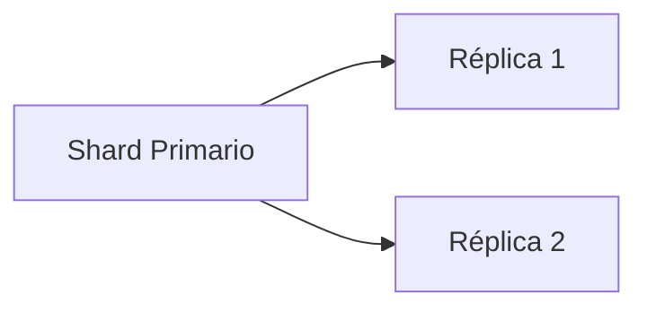
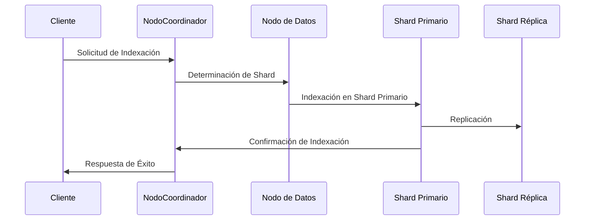
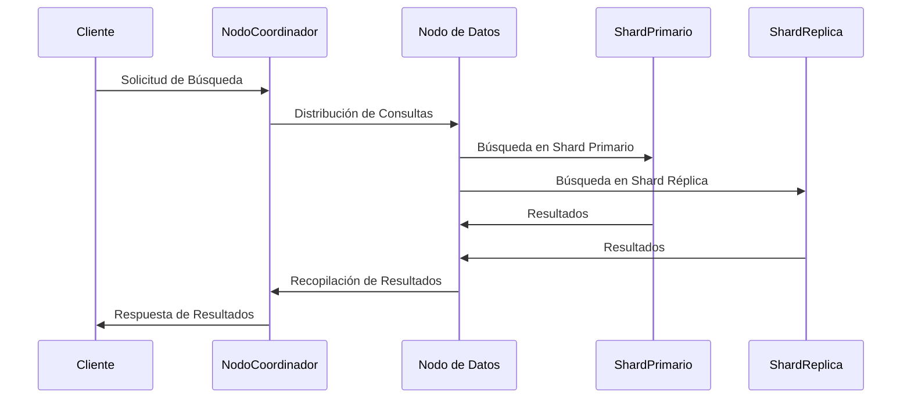
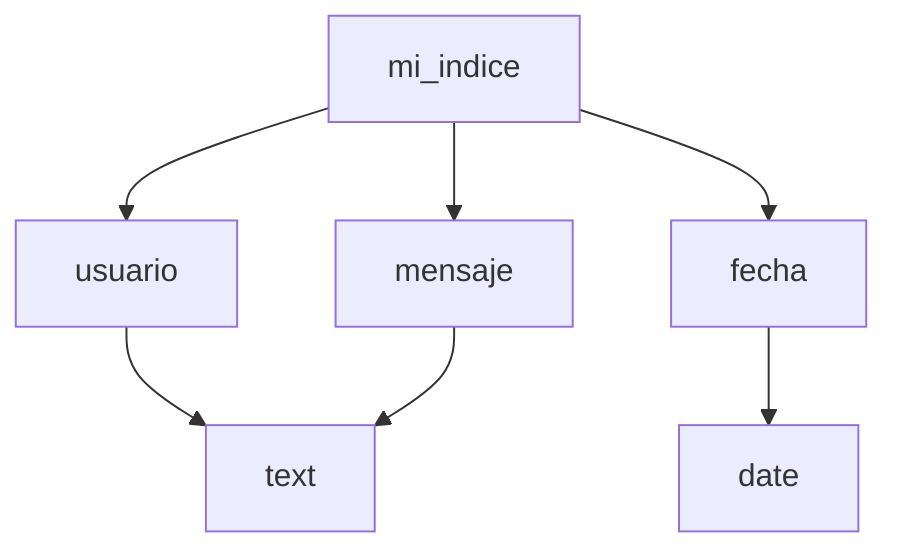
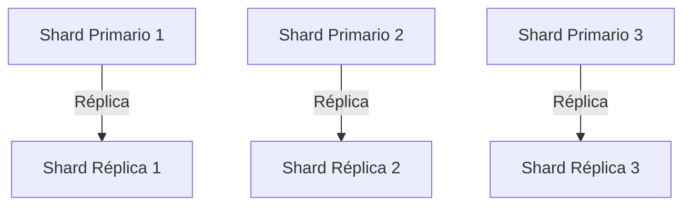
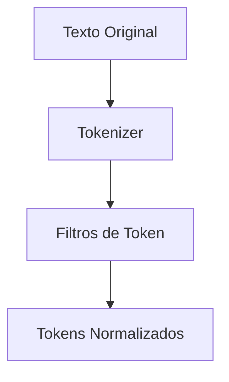
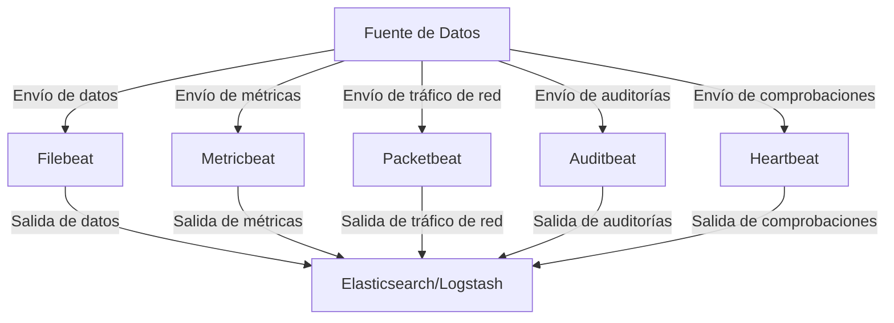

### Introducción a Elastic Search y Configuración

---

#### Desarrollando el Tema: La Arquitectura de Elasticsearch

---

### La Arquitectura de Elasticsearch

En esta sección nos concentraremos en la arquitectura de Elasticsearch. Entender esta arquitectura es crucial para aprovechar al máximo las capacidades de Elasticsearch y para diseñar soluciones que sean robustas y escalables. Elasticsearch sigue un modelo distribuido y de escalamiento horizontal, lo que le permite manejar grandes volúmenes de datos y ofrecer respuestas rápidas a consultas complejas.

---

#### 1. Componentes Principales

Elasticsearch está compuesto de varios elementos clave, cada uno de los cuales desempeña un papel vital en su funcionamiento y rendimiento. Los elementos básicos de la arquitectura de Elasticsearch incluyen nodos, índices, shards y réplicas. Profundicemos en cada uno de estos componentes.

---

##### a. Nodos

Un nodo es una instancia de Elasticsearch que almacena datos y participa en el clúster para realizar operaciones como indexación y búsqueda. Cada nodo tiene una identidad única y desempeña uno o varios roles.

**Tipos de nodos en Elasticsearch**:

1. **Nodo Maestro**: Responsable de tareas administrativas, como el seguimiento de los nodos del clúster y la gestión de cambios en la configuración del clúster. Es recomendable tener más de un nodo maestro para garantizar la alta disponibilidad.
   
   ```mermaid
   graph TD;
       A[Cluster] -->B[Nodo Maestro 1]
       A --> C[Nodo Maestro 2]
       A --> D[Nodo Maestro 3]
   ```

2. **Nodo de Datos**: Maneja la indexación, búsqueda y almacenamiento de datos. Los nodos de datos tienden a tener más recursos de CPU y memoria debido a la carga de trabajo que manejan.
   
   ```mermaid
   graph TD;
       A[Cluster] -->B[Nodo de Datos 1]
       A --> C[Nodo de Datos 2]
   ```

3. **Nodo Coordinador**: Actúa como un intermediario que maneja las solicitudes de búsqueda de los clientes y las distribuye a los nodos de datos. Este nodo ayuda a balancear la carga y optimizar el rendimiento de las consultas.
   
   ```mermaid
   graph TD;
       A[Cluster] -->B[Nodo Coordinador 1]
       A --> C[Nodo Coordinador 2]
   ```

4. **Nodo Ingestor**: Este nodo puede aplicar una serie de transformaciones al documento antes de indexarlo, mediante pipelines de ingestión. Es útil para realizar preprocesamiento.

5. **Nodo de Máquina Cliente**: Se suele utilizar en entornos más grandes donde se quiere separar completamente las funciones de ingreso de datos del almacenamiento y procesamiento.

---

##### b. Índices

Un índice en Elasticsearch es una colección de documentos que comparten características similares. Cada índice tiene un nombre único que lo identifica dentro del clúster.

- **Estructura de un Índice**:
  - **Documento**: La unidad básica de información que se puede indexar y buscar.
  - **Tipo**: Una forma de categorizar documentos dentro de un índice. Desde Elasticsearch 7.0, el concepto de tipos ha sido eliminado.
  - **Campos**: Los campos son a los documentos como las columnas son a una fila de base de datos.

---

##### c. Shards

Para manejar grandes volúmenes de datos, Elasticsearch divide un índice en múltiples partes llamadas shards.

- **Sharding**: La técnica que permite dividir un índice en múltiples shards, permitiendo distribuir los datos y las capacidades de consulta a través de múltiples nodos.
  
  ```mermaid
  graph TD;
      A[Índice] --> B[Shard 1]
      A --> C[Shard 2]
      A --> D[Shard 3]
      A --> E[Shard 4]
      A --> F[Shard 5]
  ```

**Ventajas de Sharding**:
  - **Escalabilidad**: Permite manejar y distribuir grandes volúmenes de datos.
  - **Paralelismo**: Las consultas pueden ser ejecutadas en paralelo, lo que mejora el rendimiento.

---

##### d. Réplicas

Cada shard puede tener cero o más réplicas. Las réplicas son copias de los shards primarios y ofrecen redundancia para alta disponibilidad y recuperación de desastres.

- **Ventajas de Réplicas**:
  - **Alta Disponibilidad**: Si un nodo que contiene un shard primario falla, el clúster puede utilizar los shards de réplica.
  - **Balanceo de Carga**: Las réplicas pueden atender consultas de lectura, distribuyendo así la carga de trabajo.



---

#### 2. Funcionamiento Interno de Elasticsearch

Elasticsearch sigue un diseño maître-d, en el que ciertos nodos asumen roles específicos para realizar diversas tareas. Este diseño asegura que las operaciones complejas de búsqueda y análisis se manejen de manera eficiente.

##### a. Proceso de Indexación

1. **Solicitud de Indexación**: Un cliente envía una solicitud de indexación a un nodo de entrada (coordinador).
2. **Distribución de Shards**: El nodo de entrada utiliza un algoritmo de hashing para determinar en cuál shard debe residir el documento.
3. **Confirmación de Indexación**: El documento se indexa en el shard primario correspondiente y luego se replica en los shards de réplica.



---

##### b. Proceso de Búsqueda

1. **Consulta de Búsqueda**: Un cliente envía una consulta de búsqueda a un nodo de entrada.
2. **Difusión de Consultas**: El nodo distribuye la consulta a todos los shards (primarios y réplicas).
3. **Recopilación de Resultados**: Los nodos que poseen los shards recopilan resultados y los envían de vuelta al nodo de entrada.
4. **Agregación de Resultados**: El nodo de entrada agrega los resultados y los envía de vuelta al cliente.



---

### Conclusión

La arquitectura de Elasticsearch está diseñada para ser distribuida, escalable y de alto rendimiento, permitiendo manejar grandes volúmenes de datos con eficiencia. Esta estructura flexible y robusta es la base de su capacidad para proporcionar búsquedas rápidas y precisas, así como análisis en tiempo real. Entender esta arquitectura es esencial para cualquier profesional que aspire a maximizar el potencial de Elasticsearch en sus proyectos. En las próximas secciones, continuaremos explorando configuraciones avanzadas y casos de uso específicos para profundizar aún más en el uso de Elasticsearch.

### Curso Completo de Elastic Search

---

## Capítulo: Introducción a Elastic Search y Configuración

---

### Instalación y Configuración del Entorno

---

#### Introducción y Objetivos de Aprendizaje

En esta unidad aprenderemos cómo instalar y configurar Elasticsearch en un entorno de desarrollo y producción. A lo largo del capítulo, cubriremos los pasos necesarios para poner en marcha una instancia de Elasticsearch, configurarla adecuadamente y realizar una serie de pruebas iniciales para asegurarnos de que el sistema está funcionando correctamente.

**Objetivos de Aprendizaje:**

1. Entender y ejecutar la instalación de Elasticsearch en diferentes sistemas operativos.
2. Configurar Elasticsearch para un entorno de desarrollo y producción.
3. Realizar pruebas iniciales para validar la instalación.
4. Aprender buenas prácticas para la configuración del entorno de producción.

---

#### 1. Requisitos Previos y Consideraciones Iniciales

Antes de comenzar, asegúrese de que su entorno cumpla con los siguientes requisitos:

- **Java Development Kit (JDK)**: Elasticsearch requiere JDK 8 o una versión superior. Es importante tener el JDK correctamente instalado y configurado.
- **Espacio de almacenamiento**: Datos suficientes para almacenamiento de índices y logs.
- **Memoria RAM**: Al menos 4 GB de memoria RAM para tareas básicas y carga mínima.

   ```mermaid
   graph LR
      A[JDK Instalado] --> B[Espacio de Almacenamiento]
      B --> C[Memoria RAM]
   ```

#### 2. Instalación

La instalación de Elasticsearch varía según el sistema operativo. A continuación, se detalla el proceso para los sistemas operativos Unix/Linux, macOS y Windows.

##### a. Instalación en Unix/Linux

1. **Descargar e instalar el paquete DEB/RPM**:

   ```sh
   # Para distribuciones basadas en Debian (Ubuntu, etc.)
   wget https://artifacts.elastic.co/downloads/elasticsearch/elasticsearch-7.10.1-amd64.deb
   sudo dpkg -i elasticsearch-7.10.1-amd64.deb

   # Para distribuciones basadas en Red Hat (CentOS, etc.)
   wget https://artifacts.elastic.co/downloads/elasticsearch/elasticsearch-7.10.1-x86_64.rpm
   sudo rpm -ivh elasticsearch-7.10.1-x86_64.rpm
   ```

2. **Iniciar Elasticsearch**:

   ```sh
   sudo systemctl start elasticsearch
   sudo systemctl enable elasticsearch
   ```

##### b. Instalación en macOS

1. **Usar Homebrew para instalar Elasticsearch**:

   ```sh
   brew tap elastic/tap
   brew install elasticsearch-full
   ```

2. **Iniciar Elasticsearch**:

   ```sh
   brew services start elasticsearch-full
   ```

##### c. Instalación en Windows

1. **Descargar el archivo ZIP** desde [https://www.elastic.co/downloads/elasticsearch](https://www.elastic.co/downloads/elasticsearch).

2. **Extraer el contenido del archivo ZIP** en una ubicación conveniente y navegue al directorio `bin`.

3. **Ejecutar Elasticsearch**:

   ```sh
   bin\elasticsearch.bat
   ```

---

#### 3. Configuración Básica de Elasticsearch

Una vez que Elasticsearch está instalado, es necesario configurarlo adecuadamente. Todos los archivos de configuración están ubicados en el directorio `config` de la instalación de Elasticsearch.

##### a. Configuración del archivo `elasticsearch.yml`

El archivo de configuración principal es `elasticsearch.yml`. Algunas de las configuraciones más importantes incluyen:

- **Cluster Name**:

  Defina el nombre del clúster para diferenciar múltiples instancias.

  ```yaml
  cluster.name: mi_cluster
  ```

- **Node Name**:

  Nombre del nodo para facilitar la administración.

  ```yaml
  node.name: nodo_1
  ```

- **Path Settings**:

  Directorios para almacenar datos y logs.

  ```yaml
  path.data: /var/lib/elasticsearch
  path.logs: /var/log/elasticsearch
  ```

- **Network Settings**:

  Configuración de las interfaces de red y puertos.

  ```yaml
  network.host: 0.0.0.0
  http.port: 9200
  ```

##### b. Configuración de memoria y JVM

El archivo `jvm.options` define las opciones de la JVM que se utilizarán al iniciar Elasticsearch.

```text
-Xms2g
-Xmx2g
```

Es recomendable establecer `Xms` y `Xmx` al mismo valor para evitar problemas de memoria.

##### c. Configuración de plugins

Los plugins proporcionan funcionalidades adicionales a ElasticSearch. Para instalar plugins, use el script `elasticsearch-plugin`:

```sh
bin/elasticsearch-plugin install [nombre_del_plugin]
```

---

#### 4. Pruebas Iniciales y Verificación

Una vez configurado, es importante verificar que Elasticsearch está funcionando correctamente.

##### a. Verificar el estado del clúster

Para comprobar el estado del clúster, puede usar una herramienta de línea de comandos como `curl` o una GUI como Kibana.

```sh
curl -X GET "localhost:9200/_cluster/health?pretty"
```

Debe recibir una respuesta JSON con el estado del clúster.

##### b. Crear un índice de prueba

Para asegurarse de que la indexación funciona correctamente, puede crear un índice de prueba.

```sh
curl -X PUT "localhost:9200/mi_indice?pretty"
```

##### c. Indexar un documento y realizar una búsqueda

```sh
curl -X PUT "localhost:9200/mi_indice/_doc/1?pretty" -H 'Content-Type: application/json' -d'
{
  "usuario": "juan",
  "mensaje": "Hola mundo!"
}
'
```

Buscar el documento recién indexado:

```sh
curl -X GET "localhost:9200/mi_indice/_doc/1?pretty"
```

---

#### 5. Configuración para Entornos de Producción

Para entornos de producción, es crucial optimizar Elasticsearch para manejar una gran cantidad de datos y tráfico. Aquí hay algunas mejores prácticas:

##### a. Seguridad

- **Seguridad del Transporte**: Configurar TLS para cifrar la comunicación entre nodos.
- **Autenticación y Autorización**: Implementar sistemas de autenticación como LDAP o Kerberos.
- **Firewall**: Asegúrese de que solo los puertos necesarios estén abiertos.

##### b. Backups y Recuperación

Configure snapshots periódicos para asegurar la recuperación de datos en caso de fallo.

```yaml
path.repo: ["/mnt/backups"]
```

##### c. Monitoreo y Alertas

Use herramientas como Kibana y X-Pack para supervisar el rendimiento y crear alertas.

---

#### 6. Mejores Prácticas y Consideraciones de Diseño

Al configurar el entorno de Elasticsearch, tenga en cuenta las siguientes mejores prácticas:

##### a. Provisión de Hardware

- **CPU y Memoria**: Asegúrese de proporcionar suficiente RAM y CPU para su carga de trabajo.
- **Almacenamiento**: Utilice discos SSD para mejorar el rendimiento de E/S.

##### b. Configuración de JVM

- **Heap Size**: No asigne más del 50% de la memoria del sistema a la heap de JVM.
- **Garbage Collection**: Configure adecuadamente los parámetros de Garbage Collection para mejorar el rendimiento.

##### c. Gestión de Shards

- **Número de Shards**: No configure un número excesivo de shards, puede afectar negativamente el rendimiento.
- **Replica Shards**: Ajuste la configuración de réplica según la necesidad de disponibilidad y rendimiento.

---

### Conclusión

La instalación y configuración de Elasticsearch es un primer paso crucial para cualquier proyecto basado en búsqueda y análisis de datos. En esta unidad, hemos cubierto los aspectos fundamentales de la instalación en diferentes sistemas operativos, la configuración básica y avanzada para entornos de desarrollo y producción, así como las mejores prácticas para asegurarse de que su instancia de Elasticsearch es segura, eficiente y escalable. Con esto, está bien posicionado para utilizar Elasticsearch de manera efectiva en sus proyectos. En las siguientes unidades, profundizaremos en el uso de Elasticsearch para búsquedas y análisis avanzados, lo que le permitirá aprovechar al máximo todas sus funcionalidades.

### Curso Completo de Elastic Search

---

## Capítulo: Introducción a Elastic Search y Configuración

---

### Conceptos Básicos: Índices, Documentos y Shards

En esta unidad, profundizaremos en los conceptos fundamentales de Elasticsearch: índices, documentos y shards. Estos elementos son la base sobre la cual se construyen las poderosas capacidades de búsqueda y análisis de Elasticsearch. Comprender estos conceptos es esencial para diseñar y optimizar sus soluciones de búsqueda y almacenamiento de datos.

---

#### Introducción y Objetivos de Aprendizaje

En esta unidad, se explorarán en detalle los siguientes elementos fundamentales de Elasticsearch:

1. **Índices**: Estructura y gestión.
2. **Documentos**: Formato y operaciones básicas.
3. **Shards**: Funcionalidad y administración.

**Objetivos de Aprendizaje:**

1. Comprender la estructura y la función de los índices en Elasticsearch.
2. Aprender a manejar documentos: creación, actualización y eliminación.
3. Entender cómo los shards permiten la escalabilidad y distribución de los datos.
4. Explorar técnicas para gestionar y optimizar índices y shards.

---

#### 1. Índices en Elasticsearch

Un **índice** en Elasticsearch es una colección de documentos que comparten características similares. Cada índice tiene un nombre único que lo identifica dentro del clúster y se puede comparar con una base de datos en sistemas RDBMS (Relational Database Management System).

##### a. Estructura de los Índices

La estructura de un índice está definida por un **mapeo** (mapping) que describe los tipos de documentos y las propiedades que pueden contener.

**Ejemplo de mapeo:**

```json
PUT /mi_indice
{
  "mappings": {
    "properties": {
      "usuario": {
        "type": "text"
      },
      "mensaje": {
        "type": "text"
      },
      "fecha": {
        "type": "date"
      }
    }
  }
}
```

###### i. Propiedades y Tipos de Datos

- **text**: Campo de texto analizado, utilizado para búsquedas de texto completo.
- **keyword**: Campo de texto no analizado, utilizado para búsquedas exactas.
- **date**: Campo de fecha.
- **numeric**: Tipos numéricos como `integer`, `long`, `float`, `double`.

**Visualización de las propiedades:**



##### b. Operaciones Básicas en Índices

###### i. Creación de Índices

La creación de índices se puede realizar mediante una solicitud PUT:

```sh
PUT /mi_indice
{
  "mappings": {
    "properties": {
      "campo1": {
        "type": "text"
      }
    }
  }
}
```

###### ii. Actualización de Índices

La actualización de un índice, incluyendo su mapeo, generalmente no se puede realizar directamente. Algunos cambios pueden requerir la reindexación.

###### iii. Eliminación de Índices

Para eliminar un índice, utilice la solicitud DELETE:

```sh
DELETE /mi_indice
```

###### iv. Análisis y Mapeo

El mapeo define la estructura del índice y determina cómo se almacenan y analizan los datos.

**Ejemplo de configuración de un analizador personalizado:**

```json
PUT /mi_indice
{
  "settings": {
    "analysis": {
      "analyzer": {
        "mi_analizador": {
          "type": "custom",
          "tokenizer": "standard",
          "filter": ["lowercase", "asciifolding"]
        }
      }
    },
    "mappings": {
      "properties": {
        "campo1": {
          "type": "text",
          "analyzer": "mi_analizador"
        }
      }
    }
  }
}
```

---

#### 2. Documentos en Elasticsearch

Un **documento** es la unidad básica de información en Elasticsearch, equivalente a una fila en una base de datos relacional. Los documentos están representados en formato JSON (JavaScript Object Notation).

##### a. Estructura de los Documentos

Cada documento tiene campos que almacenan distintos tipos de información. La versatilidad del formato JSON permite que los documentos sean jerárquicos y contengan arrays y objetos anidados.

**Ejemplo de documento:**

```json
{
  "usuario": "juan",
  "mensaje": "Hola mundo!",
  "fecha": "2023-01-01T12:00:00",
  "ubicacion": {
    "lat": 40.12,
    "lon": -71.34
  }
}
```

##### b. Operaciones Básicas con Documentos

###### i. Indexación de Documentos

Para indexar (crear o actualizar) un documento, utilice la solicitud PUT o POST:

```sh
POST /mi_indice/_doc/1
{
  "usuario": "juan",
  "mensaje": "Hola mundo!"
}
```

###### ii. Recuperación de Documentos

Para recuperar un documento:

```sh
GET /mi_indice/_doc/1
```

###### iii. Actualización de Documentos

Para actualizar parcialmente un documento, utilice la solicitud POST con `_update`:

```sh
POST /mi_indice/_update/1
{
  "doc": {
    "mensaje": "Hola de nuevo!"
  }
}
```

###### iv. Eliminación de Documentos

Para eliminar un documento:

```sh
DELETE /mi_indice/_doc/1
```

##### c. Búsqueda y Consultas

Elasticsearch permite realizar búsquedas utilizando una variedad de consultas detalladas en el lenguaje de consulta.

**Búsqueda simple**:

```sh
GET /mi_indice/_search
{
  "query": {
    "match": {
      "mensaje": "Hola"
    }
  }
}
```

**Búsqueda con filtros**:

```json
GET /mi_indice/_search
{
  "query": {
    "bool": {
      "must": {
        "match": {
          "mensaje": "Hola"
        }
      },
      "filter": {
        "range": {
          "fecha": {
            "gte": "2023-01-01",
            "lte": "2023-12-31"
          }
        }
      }
    }
  }
}
```

---

#### 3. Shards en Elasticsearch

**Shards** son segmentos o fragmentos en los que se divide un índice. Cada shardse puede almacenar y consultar de manera independiente. Esto permite que Elasticsearch sea escalable y distribuido.

#### a. Creación de Shards

Cuando se crea un índice, se puede especificar el número de shards (primarios) y réplicas que contendrá:

```sh
PUT /mi_indice
{
  "settings": {
    "number_of_shards": 5,
    "number_of_replicas": 1
  }
}
```

#### b. Ventajas de Sharding

##### i. Escalabilidad

Sharding permite manejar volúmenes de datos más grandes distribuyéndolos en múltiples nodos.

##### ii. Paralelismo

Permite que las consultas sean manejadas en paralelo por diferentes shards, mejorando el rendimiento.

#### c. Administración de Shards

##### i. Reubicación y Rebalanceo

Los shards pueden ser reubicados automáticamente para balancear la carga entre los diferentes nodos del clúster.

##### ii. Réplicas y Alta Disponibilidad

Cada shard primario puede tener cero o más réplicas para asegurar la alta disponibilidad y redundancia de los datos.

**Diagrama de shards y réplicas**:



##### iii. Salud del Índice y Monitoreo

Es crucial monitorear el estado y la salud de los índices y los shards utilizando herramientas como Kibana.

```sh
GET /_cat/indices?v
```

Esto devuelve un resumen del estado de los índices en el clúster.

#### d. Reindexación y Optimización de Shards

##### i. Reindexación

Reindexar un índice es necesario cuando requiere cambios significativos en la estructura de su mapeo o configuración.

```json
POST /_reindex
{
  "source": {
    "index": "indice_antiguo"
  },
  "dest": {
    "index": "indice_nuevo"
  }
}
```

##### ii. Optimización mediante ForceMerge

La operación `forcemerge` reduce el número de segmentos en los shards, mejorando la eficiencia de las búsquedas:

```sh
POST /mi_indice/_forcemerge?max_num_segments=1
```

---

### Conclusión

En esta unidad, hemos profundizado en los componentes fundamentales de Elasticsearch: índices, documentos y shards. Estos conceptos son esenciales para entender cómo Elasticsearch almacena y manipula datos para realizar búsquedas eficientes y escalables. Con este conocimiento, está bien equipado para diseñar y administrar índices de manera efectiva, aprovechando al máximo la capacidad de Elasticsearch para manejar grandes volúmenes de información y realizar búsquedas complejas. En las próximas secciones, continuaremos explorando funciones y características avanzadas, utilizándolos como base para construir aplicaciones de búsqueda poderosas.

### Curso Completo de Elastic Search

---

## Capítulo: Introducción a Elastic Search y Configuración

---

### RESTful API y Métodos HTTP en Elasticsearch

---

#### Introducción y Objetivos de Aprendizaje

En esta unidad nos enfocaremos en la RESTful API que utiliza Elasticsearch y en cómo interactuar con ella utilizando los métodos HTTP. Entender cómo funcionan estos métodos y cómo se mapean a diferentes operaciones en Elasticsearch es fundamental para aprovechar al máximo su capacidad de búsqueda y análisis.

**Objetivos de Aprendizaje:**

1. Comprender la estructura y funcionamiento de la RESTful API de Elasticsearch.
2. Familiarizarse con los diferentes métodos HTTP (GET, POST, PUT, DELETE).
3. Aprender a realizar operaciones básicas y avanzadas utilizando estos métodos HTTP.
4. Explorar ejemplos prácticos de uso de la API para tareas comunes.

---

#### 1. RESTful API de Elasticsearch

Elasticsearch utiliza una API RESTful para comunicarse y realizar operaciones. Esta API sigue el estilo arquitectónico REST (REpresentational State Transfer), lo cual significa que se aprovechan las capacidades del protocolo HTTP, como métodos, URIs y códigos de estado.

##### a. Estructura de la URI

La URI (Uniform Resource Identifier) es la dirección que identifica de manera única un recurso en Elasticsearch.

Formato general de una URI en Elasticsearch:

```
http://<host>:<port>/<índice>/<tipo>/<id>
```

- `<host>` y `<port>`: Dirección IP y puerto en los que Elasticsearch está escuchando (por defecto, host es `localhost` y puerto es `9200`).
- `<índice>`: El nombre del índice al que desea acceder.
- `<tipo>`: Tipo de documento (siguiendo siendo necesario sólo para versiones previas a Elasticsearch 7.0).
- `<id>`: Identificador único del documento.

Ejemplo:

```
http://localhost:9200/mi_indice/_doc/1
```

En este ejemplo, estamos accediendo al documento con `id=1` del índice `mi_indice`.

---

#### 2. Métodos HTTP en Elasticsearch

Elasticsearch utiliza varios métodos HTTP para interactuar con los datos. Estos métodos corresponden a operaciones CRUD (Create, Read, Update, Delete).

##### a. Método GET

El método GET se utiliza para recuperar información de Elasticsearch. Puede aplicarse tanto para la recuperación de documentos individuales como para la búsqueda.

###### Ejemplo 1: Obtener un documento por su ID

```sh
GET /mi_indice/_doc/1
```
Respuesta esperada:

```json
{
  "_index": "mi_indice",
  "_type": "_doc",
  "_id": "1",
  "_version": 1,
  "found": true,
  "_source": {
    "usuario": "juan",
    "mensaje": "Hola mundo!"
  }
}
```

###### Ejemplo 2: Búsqueda de documentos

```sh
GET /mi_indice/_search
{
  "query": {
    "match": {
      "mensaje": "Hola mundo!"
    }
  }
}
```
Respuesta esperada:

```json
{
  "took": 10,
  "timed_out": false,
  "_shards": {
    "total": 5,
    "successful": 5,
    "skipped": 0,
    "failed": 0
  },
  "hits": {
    "total": {
      "value": 1,
      "relation": "eq"
    },
    "max_score": 1.0,
    "hits": [
      {
        "_index": "mi_indice",
        "_type": "_doc",
        "_id": "1",
        "_score": 1.0,
        "_source": {
          "usuario": "juan",
          "mensaje": "Hola mundo!"
        }
      }
    ]
  }
}
```

##### b. Método POST

El método POST se utiliza principalmente para la creación de documentos y para realizar búsquedas avanzadas como agregaciones.

###### Ejemplo 1: Crear un documento sin especificar un ID (ID generado automáticamente)

```sh
POST /mi_indice/_doc
{
  "usuario": "maria",
  "mensaje": "¡Hola a todos!"
}
```
Respuesta esperada:

```json
{
  "_index": "mi_indice",
  "_type": "_doc",
  "_id": "12345",
  "_version": 1,
  "result": "created",
  "_shards": {
    "total": 2,
    "successful": 1,
    "failed": 0
  },
  "_seq_no": 0,
  "_primary_term": 1
}
```

###### Ejemplo 2: Realizar una búsqueda avanzada

```sh
POST /mi_indice/_search
{
  "query": {
    "bool": {
      "must": {
        "match": {
          "mensaje": "Hola"
        }
      },
      "filter": {
        "range": {
          "fecha": {
            "gte": "2023-01-01",
            "lte": "2023-12-31"
          }
        }
      }
    }
  }
}
```
Respuesta esperada:

```json
{
  "took": 5,
  "timed_out": false,
  "_shards": {
    "total": 5,
    "successful": 5,
    "skipped": 0,
    "failed": 0
  },
  "hits": {
    "total": {
      "value": 1,
      "relation": "eq"
    },
    "max_score": 1.0,
    "hits": [
      {
        "_index": "mi_indice",
        "_type": "_doc",
        "_id": "1",
        "_score": 1.0,
        "_source": {
          "usuario": "juan",
          "mensaje": "Hola mundo!",
          "fecha": "2023-01-01"
        }
      }
    ]
  }
}
```

##### c. Método PUT

El método PUT se utiliza para crear o reemplazar un documento con un ID especificado. También se utiliza para crear índices o actualizar configuraciones específicas.

###### Ejemplo 1: Crear o reemplazar un documento

```sh
PUT /mi_indice/_doc/2
{
  "usuario": "luis",
  "mensaje": "¡Buenos días!"
}
```
Respuesta esperada:

```json
{
  "_index": "mi_indice",
  "_type": "_doc",
  "_id": "2",
  "_version": 1,
  "result": "created",
  "_shards": {
    "total": 2,
    "successful": 1,
    "failed": 0
  },
  "_seq_no": 1,
  "_primary_term": 1
}
```

###### Ejemplo 2: Crear un índice con configuración personalizada

```sh
PUT /mi_nuevo_indice
{
  "settings": {
    "number_of_shards": 3,
    "number_of_replicas": 1
  },
  "mappings": {
    "properties": {
      "usuario": {
        "type": "text"
      },
      "mensaje": {
        "type": "text"
      }
    }
  }
}
```
Respuesta esperada:

```json
{
  "acknowledged": true,
  "shards_acknowledged": true,
  "index": "mi_nuevo_indice"
}
```

##### d. Método DELETE

El método DELETE se utiliza para eliminar documentos o índices.

###### Ejemplo 1: Eliminar un documento por su ID

```sh
DELETE /mi_indice/_doc/2
```
Respuesta esperada:

```json
{
  "_index": "mi_indice",
  "_type": "_doc",
  "_id": "2",
  "_version": 2,
  "result": "deleted",
  "_shards": {
    "total": 2,
    "successful": 1,
    "failed": 0
  },
  "_seq_no": 2,
  "_primary_term": 1
}
```

###### Ejemplo 2: Eliminar un índice

```sh
DELETE /mi_indice
```
Respuesta esperada:

```json
{
  "acknowledged": true
}
```

---

#### 3. Ejemplos Prácticos de Uso de la API

Ahora que hemos cubierto los métodos básicos, exploremos algunos ejemplos prácticos para tareas comunes utilizando la RESTful API de Elasticsearch.

##### a. Indexar múltiples documentos (Bulk API)

La Bulk API permite realizar múltiples operaciones en una sola solicitud, lo que es especialmente útil para la indexación masiva.

```sh
POST /_bulk
{ "index": { "_index": "mi_indice", "_id": "3" } }
{ "usuario": "ana", "mensaje": "¡Buenas tardes!" }
{ "index": { "_index": "mi_indice", "_id": "4" } }
{ "usuario": "pablo", "mensaje": "¡Buen día!" }
```

##### b. Actualización parcial de documentos

El método `_update` permite realizar actualizaciones parciales en un documento, dejando el resto del documento intacto.

```sh
POST /mi_indice/_update/4
{
  "doc": {
    "mensaje": "¡Buen día a todos!"
  }
}
```

##### c. Uso de Plantillas (Templates)

Las plantillas de índices permiten crear configuraciones predefinidas que se aplican automáticamente cuando se crean índices que coinciden con ciertos patrones.

```sh
PUT /_template/mi_plantilla
{
  "index_patterns": ["*log*"],
  "settings": {
    "number_of_shards": 1
  },
  "mappings": {
    "properties": {
      "fecha": {
        "type": "date"
      },
      "mensaje": {
        "type": "text"
      }
    }
  }
}
```

##### d. Agregaciones

Las agregaciones permiten resumir, analizar y explorar los datos de manera eficaz.

```sh
GET /mi_indice/_search
{
  "size": 0,
  "aggs": {
    "usuarios": {
      "terms": {
        "field": "usuario.keyword"
      }
    }
  }
}
```
Respuesta esperada:

```json
{
  "took": 2,
  "timed_out": false,
  "_shards": {
    "total": 5,
    "successful": 5,
    "skipped": 0,
    "failed": 0
  },
  "hits": {
    "total": {
      "value": 4,
      "relation": "eq"
    },
    "max_score": null,
    "hits": []
  },
  "aggregations": {
    "usuarios": {
      "doc_count_error_upper_bound": 0,
      "sum_other_doc_count": 0,
      "buckets": [
        {
          "key": "juan",
          "doc_count": 1
        },
        {
          "key": "maria",
          "doc_count": 1
        },
        {
          "key": "ana",
          "doc_count": 1
        },
        {
          "key": "pablo",
          "doc_count": 1
        }
      ]
    }
  }
}
```

---

#### 4. Códigos de Estado HTTP en Elasticsearch

A medida que se interactúa con la API, es importante comprender los códigos de estado HTTP que se devuelven en las respuestas, ya que estos indican el éxito o falla de las operaciones.

##### a. Códigos Comunes

- **200 OK**: La solicitud se completó con éxito.
- **201 Created**: Un recurso se ha creado con éxito.
- **400 Bad Request**: La solicitud es inválida o malformada.
- **404 Not Found**: El recurso solicitado no se encontró.
- **500 Internal Server Error**: Ocurrió un error en el servidor.

---

#### 5. Mejores Prácticas y Consideraciones de Diseño

##### a. Uso de nombres descriptivos para índices

Utilice nombres claros y descriptivos para sus índices para facilitar la administración y el mantenimiento.

##### b. Realizar validaciones antes de indexar

Valide los datos antes de indexarlos para asegurarse de que cumplen con la estructura y los requisitos esperados.

##### c. Utilizar capas de seguridad

Implemente autenticación, autorización y cifrado para proteger sus datos y APIs.

---

### Conclusión

En esta unidad, hemos explorado en profundidad la RESTful API de Elasticsearch y cómo utilizar los métodos HTTP para realizar operaciones fundamentales y avanzadas. Con esta comprensión, puede interactuar efectivamente con Elasticsearch, realizar búsquedas, crear y modificar índices y manejar documentos con facilidad. En la próxima unidad, exploraremos técnicas avanzadas de búsqueda y análisis que aprovechan al máximo las capacidades de Elasticsearch.

### Curso Completo de Elastic Search

---

## Capítulo: Operaciones CRUD y Búsqueda Básica

---

### Tema: Creación y Gestión de Índices en Elasticsearch

---

#### Introducción y Objetivos de Aprendizaje

En esta sección se detallará cómo se pueden crear y gestionar índices en Elasticsearch a un nivel más profundo. Un índice en Elasticsearch es análogo a una base de datos en un sistema relacional, pero con capacidades de búsqueda y análisis mucho más avanzadas. Aquí se estudiarán las diferentes operaciones que se pueden realizar sobre índices, incluyendo su creación, actualización, eliminación y configuración avanzada. Este tema es crucial para cualquier desarrollador o administrador que desea utilizar Elasticsearch de manera efectiva.

**Objetivos de Aprendizaje:**

1. Explorar técnicas avanzadas para la creación de índices.
2. Entender cómo gestionar y actualizar los índices.
3. Aprender a configurar índices para análisis y búsquedas avanzadas.
4. Examinar prácticas recomendadas para la administración de índices.

---

#### 1. Creación de Índices Avanzados

Anteriormente, se cubrió la creación básica de un índice. En esta sección, vamos a profundizar en aspectos avanzados como configuraciones personalizadas, plantillas de índices y la utilización de alias.

##### a. Configuración Personalizada de Índices

Al crear un índice, se puede especificar una variedad de configuraciones que afectan cómo se almacena y busca la información. Aquí algunos de los aspectos avanzados que se pueden configurar:

**Número de Shards y Réplicas:**

```json
PUT /mi_indice_personalizado
{
  "settings": {
    "number_of_shards": 3,
    "number_of_replicas": 2
  },
  "mappings": {
    "properties": {
      "usuario": {
        "type": "text"
      },
      "mensaje": {
        "type": "text"
      },
      "fecha": {
        "type": "date"
      }
    }
  }
}
```

**Configuración de Análisis y Mapeo:**

Se puede definir analizadores personalizados y mapeos complejos:

```json
PUT /mi_indice_con_analizador
{
  "settings": {
    "analysis": {
      "analyzer": {
        "mi_analizador_personalizado": {
          "type": "custom",
          "tokenizer": "whitespace",
          "filter": ["lowercase", "stop"]
        }
      }
    }
  },
  "mappings": {
    "properties": {
      "titulo": {
        "type": "text",
        "analyzer": "mi_analizador_personalizado"
      },
      "contenido": {
        "type": "text",
        "analyzer": "standard"
      }
    }
  }
}
```

##### b. Plantillas de Índices

Las plantillas de índices permiten predefinir configuraciones que se aplicarán automáticamente a nuevos índices que coincidan con un patrón de nombre.

**Creación de una Plantilla de Índice:**

```json
PUT /_template/mi_plantilla
{
  "index_patterns": ["mi_indice_*"],
  "settings": {
    "number_of_shards": 2
  },
  "mappings": {
    "properties": {
      "usuario": {
        "type": "text"
      }
    }
  }
}
```

Cuando se crea un índice llamado `mi_indice_nuevo`, la configuración de esta plantilla se aplicará automáticamente.

##### c. Uso de Alias

Los alias son nombres alternativos que se pueden utilizar para referenciar a uno o más índices. Esto es útil para enrutamiento de consultas, actualizaciones sin interrupciones y combinaciones de índices.

**Creación y Administración de Alias:**

```json
POST /_aliases
{
  "actions": [
    {
      "add": {
        "index": "mi_indice_v1",
        "alias": "mi_indice_actual"
      }
    },
    {
      "remove": {
        "index": "mi_indice_v0",
        "alias": "mi_indice_actual"
      }
    }
  ]
}
```

---

#### 2. Gestión de Índices

Una vez que los índices están en uso, la gestión eficaz es crucial para mantener la salud y el rendimiento del clúster.

##### a. Actualización de Configuraciones

Se pueden modificar ciertas configuraciones de un índice en tiempo de ejecución, aunque algunas configuraciones requieren el cierre del índice temporalmente.

**Actualización de Ajustes Dinámicos:**

```json
PUT /mi_indice_personalizado/_settings
{
  "settings": {
    "number_of_replicas": 1,
    "refresh_interval": "30s"
  }
}
```

**Actualización de Mappings:**

Las modificaciones a los mappings pueden ser limitadas y a menudo requerirán la creación de un nuevo índice y la reindexación de datos.

```json
PUT /mi_indice_personalizado/_mapping
{
  "properties": {
    "nuevo_campo": {
      "type": "text"
    }
  }
}
```

##### b. Facetas de Salud del Ínidice

Es crucial monitorear el estado de los índices para asegurar su rendimiento y disponibilidad. Elasticsearch ofrece APIs para este propósito.

**Verificación del Estado del Índice:**

```json
GET /_cluster/health/mi_indice_personalizado?pretty
```

**Información del Índice:**

```json
GET /mi_indice_personalizado/_stats
```

**Análisis del Segmento:**

```json
GET /mi_indice_personalizado/_segments
```

##### c. Reindexación

Reindexar un índice puede ser necesario para aplicar nuevas configuraciones, corregir mappings, o migrar datos.

```json
POST /_reindex
{
  "source": {
    "index": "mi_indice_antiguo"
  },
  "dest": {
    "index": "mi_indice_nuevo"
  }
}
```

##### d. Eliminación de Índices

Eliminar índices puede ser necesario cuando ya no son requeridos. Sin embargo, es una acción irreversible.

```json
DELETE /mi_indice_personalizado
```

**Nota:** Implementar políticas de snapshots y backups antes de eliminar un índice para evitar pérdida de datos.

---

#### 3. Configuración Avanzada de Índices

Además de las configuraciones básicas, hay ajustes avanzados que pueden optimizar tanto la indexación como la búsqueda.

##### a. Refresh Intervals y Merge Configurations

Estos parámetros afectan el rendimiento y deben ajustarse según el caso de uso.

```json
PUT /mi_indice_personalizado/_settings
{
  "settings": {
    "refresh_interval": "10s",
    "index.merge.policy.max_merged_segment": "5gb"
  }
}
```

##### b. Policy Management

**Índice de Políticas de Gestión de Ciclo de Vida (ILM):**

```json
PUT _ilm/policy/mi_politica
{
  "policy": {
    "phases": {
      "hot": {
        "actions": {
          "rollover": {
            "max_size": "50gb"
          }
        }
      },
      "delete": {
        "min_age": "30d",
        "actions": {
          "delete": {}
        }
      }
    }
  }
}
```

**Asociación de la Política con un Índice:**

```json
PUT /mi_indice_personalizado
{
  "settings": {
    "index.lifecycle.name": "mi_politica",
    "index.lifecycle.rollover_alias": "mi_alias"
  }
}
```

---

#### 4. Mejores Prácticas y Consideraciones de Diseño

En la administración de índices en Elasticsearch, hay varias mejores prácticas y consideraciones de diseño para asegurar un rendimiento y un mantenimiento óptimos.

##### a. Planificación de Shards

- **Sub-Sharding Evitable**: No cree demasiados shards pequeños.
- **Evaluación de Requisitos**: Defina cuidadosamente los requisitos de shards y réplicas según el volumen de datos y necesidades de disponibilidad.

##### b. Gestión del Ciclo de Vida de Índices

**Regular Monitoring**: Utilize herramientas integradas como Kibana para monitorear el estado del clúster y los índices.

**Snapshots Regulares**: Automice la toma de snapshots para asegurar la recuperación de datos.

##### c. Uso de Alias y Plantillas de Índices

- **Alias para Enrutamiento de Consultas**: Use alias para una fácil transición entre versiones de índices.
- **Plantillas para Consistencia**: Defina plantillas de índices para asegurar una configuración consistente en todos los nuevos índices.

---

#### Conclusión

La creación y gestión de índices son aspectos esenciales de administrar un entorno Elasticsearch. En esta unidad, hemos explorado técnicas avanzadas para crear y personalizar índices, gestionar su configuración y optimizar su funcionamiento. Con estos conocimientos, podrá diseñar índices que no solo almacenan datos con eficiencia, sino que también ofrecen un rendimiento de búsqueda óptimo. En las siguientes unidades, seguiremos abordando más aspectos prácticos y avanzados del uso de Elasticsearch.

---

Esta sección tiene como objetivo proporcionar una comprensión profunda y detallada de la creación y gestión de índices en Elasticsearch, abordando tanto aspectos básicos como avanzados. Con esto, está bien posicionado para manejar de manera eficaz los índices en su clúster de Elasticsearch y optimizar su rendimiento y capacidad de búsqueda.

### Curso Completo de Elastic Search

---

## Capítulo: Operaciones CRUD y Búsqueda Básica

---

### Tema: Indexación de Documentos en Elasticsearch

---

#### Introducción y Objetivos de Aprendizaje

La indexación de documentos es una de las operaciones más fundamentales y cruciales en Elasticsearch. Permite que los datos se almacenen y sean accesibles para las consultas de búsqueda. La indexación adecuada de documentos asegura que la información sea recuperable de manera eficiente y precisa. En esta unidad, profundizaremos en todos los aspectos de la indexación de documentos, cubriendo desde los conceptos básicos hasta técnicas avanzadas y mejores prácticas.

**Objetivos de Aprendizaje:**

1. Comprender los fundamentos de la indexación de documentos.
2. Aprender a indexar, actualizar y eliminar documentos.
3. Entender cómo manejar la concurrencia y versionado en la indexación.
4. Explorar las mejores prácticas para la indexación eficiente y efectiva.

---

#### 1. Fundamentos de la Indexación

Indexar un documento significa registrar su contenido en un índice de Elasticsearch para que pueda ser consultado rápidamente. Un documento en Elasticsearch está representado en formato JSON, y cada documento se almacena en un índice específico.

##### a. Estructura de un Documento JSON

Un documento JSON en Elasticsearch es una colección de pares clave-valor. Las claves son los nombres de los campos y los valores pueden ser de diferentes tipos de datos, como texto, números, fechas, arrays, objetos anidados, etc.

**Ejemplo de documento JSON:**

```json
{
  "usuario": "juan",
  "mensaje": "Hola mundo!",
  "fecha": "2023-01-01T12:00:00",
  "ubicacion": {
    "lat": 40.12,
    "lon": -71.34
  }
}
```

##### b. Métodos para Indexar Documentos

En Elasticsearch, hay varios métodos HTTP que se pueden utilizar para indexar documentos:

- **PUT**: Utilizado para crear o actualizar un documento con un ID especificado.
- **POST**: Utilizado para crear un documento sin especificar un ID, permitiendo que Elasticsearch lo genere automáticamente.

###### i. Creación de Documentos con PUT

```sh
PUT /mi_indice/_doc/1
{
  "usuario": "juan",
  "mensaje": "Hola mundo!"
}
```

En este ejemplo, estamos creando un documento con ID `1`.

###### ii. Creación Automática de Documentos con POST

```sh
POST /mi_indice/_doc
{
  "usuario": "maria",
  "mensaje": "¡Hola a todos!"
}
```

En este caso, Elasticsearch asignará automáticamente un ID al documento.

---

#### 2. Actualización y Eliminación de Documentos

Además de la creación, existen operaciones para actualizar y eliminar documentos, las cuales son igualmente esenciales para gestionar el contenido de un índice de Elasticsearch.

##### a. Actualización de Documentos

La actualización de documentos se puede realizar de dos maneras principales:

- **PUT**: Reemplaza todo el documento, incluso si se cambian solo uno o pocos campos.
- **POST _update**: Modifica solo los campos específicos sin reemplazar el documento completo.

###### i. Reemplazo Completo con PUT

```sh
PUT /mi_indice/_doc/1
{
  "usuario": "juan",
  "mensaje": "Hola de nuevo!"
}
```

###### ii. Actualización Parcial con POST _update

```sh
POST /mi_indice/_update/1
{
  "doc": {
    "mensaje": "Hola de nuevo a todos!"
  }
}
```

##### b. Eliminación de Documentos

La eliminación de un documento también es una operación común y se realiza utilizando el método DELETE:

```sh
DELETE /mi_indice/_doc/1
```

Este comando elimina el documento con ID `1` del índice `mi_indice`.

---

#### 3. Concurrencia y Versionado

Elasticsearch maneja la concurrencia y versionado de varias maneras para asegurar la integridad de los datos y evitar conflictos al actualizar documentos.

##### a. Control de Versiones

Cada documento en Elasticsearch tiene un número de versión que se incrementa automáticamente cada vez que el documento se actualiza. Esto asegura que solo la versión más reciente del documento sea almacenada.

###### i. Versión Automática

Elasticsearch maneja internamente las versiones de los documentos, asegurando que las actualizaciones sean procesadas en orden secuencial.

##### b. Optimistic Concurrency Control (OCC)

Elasticsearch utiliza el control de concurrencia optimista (OCC) para asegurar que las actualizaciones concurrentes no sobrescriban datos inadvertidamente.

###### i. Actualización con Versionado Específico

Para actualizar un documento solo si su versión coincide con una versión específica:

```sh
PUT /mi_indice/_doc/1?version=2
{
  "usuario": "juan",
  "mensaje": "Actualización con control de versión"
}
```

Si la versión especificada (`2` en este caso) no coincide con la versión actual del documento, la operación fallará, evitando así sobrescritura accidental.

---

#### 4. Indexación Masiva (Bulk API)

Para mejorar la eficiencia y el rendimiento, especialmente al manejar grandes volúmenes de datos, Elasticsearch proporciona la Bulk API. Esta API permite realizar múltiples operaciones de indexación, actualización y eliminación en una sola solicitud.

##### a. Formato de la Solicitud Bulk

La solicitud Bulk consta de múltiples acciones y sus respectivos datos, en un formato específico:

```sh
POST /_bulk
{ "index": { "_index": "mi_indice", "_id": "1" } }
{ "usuario": "juan", "mensaje": "Hola mundo!" }
{ "index": { "_index": "mi_indice", "_id": "2" } }
{ "usuario": "maria", "mensaje": "¡Hola a todos!" }
```

Cada línea debe seguir el orden de acción-meta/datos.

##### b. Ejecución de Operaciones Masivas

```sh
POST /_bulk
{ "index": { "_index": "mi_indice", "_id": "3" } }
{ "usuario": "ana", "mensaje": "¡Buenas tardes!" }
{ "delete": { "_index": "mi_indice", "_id": "2" } }
{ "update": { "_index": "mi_indice", "_id": "1" } }
{ "doc": { "mensaje": "Hola, actualizado!" } }
```

##### c. Manejo de Errores en Bulk API

Es esencial manejar adecuadamente las respuestas y errores cuando se usa la Bulk API, ya que solo una parte de las operaciones puede fallar:

```json
{
  "took": 30,
  "errors": true,
  "items": [
    {
      "index": {
        "_index": "mi_indice",
        "_id": "3",
        "status": 201,
        "result": "created"
      }
    },
    {
      "delete": {
        "_index": "mi_indice",
        "_id": "2",
        "status": 200,
        "result": "deleted"
      }
    },
    {
      "update": {
        "_index": "mi_indice",
        "_id": "1",
        "status": 200,
        "result": "updated"
      }
    }
  ]
}
```

Revise siempre el campo `"errors"` y maneje los errores adecuadamente en su aplicación.

---

#### 5. Mejores Prácticas para la Indexación

Para garantizar una indexación eficiente y efectiva, es crucial seguir ciertas mejores prácticas.

##### a. Optimización del Rendimiento

- **Uso de la Bulk API**: Utilice la Bulk API para realizar operaciones masivas y reducir la sobrecarga de red y el tiempo de latencia.
- **Ajuste de la Configuración del Índice**: Configure parámetros como `refresh_interval` y `number_of_replicas` durante la indexación masiva para mejorar el rendimiento.

##### b. Gestión de Shards

- **Asignación de Shards**: Asegúrese de que el número de shards y réplicas esté adecuadamente configurado para su volumen de datos y requerimientos de disponibilidad.
- **Rebalanceo de Shards**: Monitoree y rebalancee los shards regularmente para evitar sobrecargas en nodos específicos.

##### c. Validación y Limpieza de Datos

- **Estandarización**: Estandarice los datos antes de la indexación para asegurar consistencia.
- **Limpieza**: Elimine datos duplicados y corrija errores antes de indexarlos.

##### d. Monitorización y Alertas

- **Monitorización Proactiva**: Use herramientas como Kibana para monitorear la salud del clúster y de los índices.
- **Configuración de Alertas**: Configure alertas para detectar y responder rápidamente a cualquier problema potencial.

---

### Conclusión

La indexación de documentos es una operación central en Elasticsearch y tiene un impacto directo en la eficiencia de las búsquedas y la manipulación de datos. Esta unidad ha cubierto en profundidad todos los aspectos relacionados con la indexación, desde los fundamentos hasta técnicas avanzadas, incluyendo la gestión de concurrencia y el uso de la Bulk API. Al seguir las mejores prácticas y técnicas presentadas, puede asegurarse de que sus operaciones de indexación sean efectivas y conduzcan a un rendimiento óptimo en su implementación de Elasticsearch. En las siguientes unidades, continuaremos explorando aspectos más avanzados y casos de uso específicos para maximizar el potencial de Elasticsearch en sus proyectos.

### Curso Completo de Elastic Search

---

## Capítulo: Operaciones CRUD y Búsqueda Básica

---

### Tema: Recuperación y Actualización de Documentos en Elasticsearch

---

#### Introducción y Objetivos de Aprendizaje

En esta unidad, profundizaremos en las operaciones de recuperación y actualización de documentos en Elasticsearch. Estas operaciones son fundamentales para cualquier sistema de búsqueda y análisis, ya que permiten acceder y modificar la información almacenada en tiempo real. Exploraremos diversas técnicas y métodos disponibles en Elasticsearch para llevar a cabo estas operaciones de manera eficiente.

**Objetivos de Aprendizaje:**

1. Comprender los métodos y técnicas para recuperar documentos.
2. Aprender a realizar actualizaciones parciales y totales de documentos.
3. Conocer las diferencias entre métodos de actualización y cuándo utilizar cada uno.
4. Comprender cómo manejar la concurrencia durante las actualizaciones.
5. Implementar mejores prácticas para la emisión y manejo de actualizaciones y recuperaciones.

---

#### 1. Recuperación de Documentos

Recuperar documentos almacenados es una de las acciones más comunes que se realizan en Elasticsearch. La flexibilidad y la rapidez de esta operación la hacen adecuada para varios casos de uso, desde simples consultas de datos hasta análisis complejos.

##### a. Métodos Básicos de Recuperación

###### i. Recuperación por ID

El método más eficiente para recuperar un documento específico es mediante su ID único. Para realizar esto, se usa el método HTTP GET.

```sh
GET /mi_indice/_doc/1
```

Este comando recupera el documento con ID `1` del índice `mi_indice`.

###### ii. Recuperación Masiva

Para recuperar múltiples documentos, se puede usar la función `_mget`.

```sh
GET /mi_indice/_mget
{
  "ids": ["1", "2", "3"]
}
```

Este método permite obtener varios documentos en una sola solicitud.

##### b. Técnicas de Búsqueda Avanzada

Elasticsearch proporciona una poderosa API de búsqueda que permite realizar consultas complejas.

###### i. Búsqueda Simple

Para realizar una búsqueda simple:

```sh
GET /mi_indice/_search
{
  "query": {
    "match": {
      "mensaje": "Hola mundo!"
    }
  }
}
```

###### ii. Búsqueda con Filtros

El uso de filtros mejora el rendimiento al reducir el conjunto de datos antes de la búsqueda.

```sh
GET /mi_indice/_search
{
  "query": {
    "bool": {
      "must": {
        "match": {
          "mensaje": "Hola"
        }
      },
      "filter": {
        "range": {
          "fecha": {
            "gte": "2023-01-01",
            "lte": "2023-12-31"
          }
        }
      }
    }
  }
}
```

###### iii. Recuperación Condicional

Se puede buscar documentos que cumplan ciertas condiciones específicas:

```sh
GET /mi_indice/_search
{
  "query": {
    "bool": {
      "must": [
        { "match": { "usuario": "juan" } },
        { "match": { "mensaje": "Hola mundo!" } }
      ]
    }
  }
}
```

##### c. Recuperación de Campos Específicos

Se puede limitar la recuperación a ciertos campos específicos para optimizar el rendimiento.

```sh
GET /mi_indice/_search
{
  "_source": ["usuario", "fecha"],
  "query": {
    "match": {
      "mensaje": "Hola mundo!"
    }
  }
}
```

---

#### 2. Actualización de Documentos

Actualizar documentos es una operación crítica que puede ser manejada de diversas maneras en Elasticsearch. Dependiendo de la necesidad, se pueden realizar actualizaciones completas o parciales.

##### a. Actualización Completa con PUT

La actualización completa de un documento reemplaza el contenido existente con el nuevo.

```sh
PUT /mi_indice/_doc/1
{
  "usuario": "juan",
  "mensaje": "Hola de nuevo!"
}
```

##### b. Actualización Parcial con POST _update

La actualización parcial permite modificar solo ciertos campos sin reemplazar el documento completo.

```sh
POST /mi_indice/_update/1
{
  "doc": {
    "mensaje": "Hola de nuevo a todos!"
  }
}
```

##### c. Actualización por Script

Elasticsearch permite ejecutar scripts para actualizar documentos. Esto es útil para realizar modificaciones basadas en valores existentes.

```sh
POST /mi_indice/_update/1
{
  "script": {
    "source": "ctx._source.mensaje = 'Actualizado: ' + ctx._source.mensaje",
    "lang": "painless"
  }
}
```

##### d. Upserts (Update or Insert)

Los Upserts permiten especificar una operación de actualización con una opción de inserción si el documento no existe.

```sh
POST /mi_indice/_update/2
{
  "script": {
    "source": "ctx._source.contador += 1",
    "lang": "painless"
  },
  "upsert": {
    "contador": 1
  }
}
```

En este ejemplo, si el documento con ID `2` no existe, será creado con un campo `contador` inicializado en `1`.

---

#### 3. Control de Concurrencia y Versionado

El control de concurrencia es esencial para garantizar la integridad de los datos cuando se realizan actualizaciones concurrentes.

##### a. Optimistic Concurrency Control (OCC)

Elasticsearch utiliza OCC para prevenir sobrescrituras de datos debido a actualizaciones concurrentes. Cada documento tiene un número de versión y se puede especificar cuál es la versión que se espera actualizar.

```sh
PUT /mi_indice/_doc/1?if_seq_no=36&if_primary_term=1
{
  "usuario": "juan",
  "mensaje": "versión controlada"
}
```

Si el número de versión no coincide con el actual, la actualización fallará.

##### b. Manejo de Errores de Concurrencia

Es importante manejar los errores de concurrencia adecuadamente en la lógica de la aplicación.

**Ejemplo de manejo de error:**

```json
{
  "error": {
    "type": "version_conflict_engine_exception",
    "reason": "[mi_indice][1]: version conflict, current version [2] is different than the one provided [1]"
  },
  "status": 409
}
```

En el código de la aplicación, es posible manejar este error reintentando la operación de actualización.

---

#### 4. Mejores Prácticas para Recuperación y Actualización

Implementar mejores prácticas garantiza operaciones eficientes y minimiza problemas de rendimiento y consistencia.

##### a. Uso Eficiente de la API de Búsqueda

- **Uso de Filtros**: Prefiera los filtros sobre las consultas cuando sea posible.
- **Paginación**: Use la paginación para manejar grandes volúmenes de datos evitando cargas masivas de memoria.

##### b. Optimización de Actualizaciones

- **Batch Updates**: Use la Bulk API para realizar múltiples actualizaciones en una sola solicitud, lo que mejora la eficiencia.

```sh
POST /_bulk
{ "update": { "_id": "1", "_index": "mi_indice" } }
{ "doc": { "mensaje": "Nuevo mensaje!" } }
{ "update": { "_id": "2", "_index": "mi_indice" } }
{ "doc": { "mensaje": "Otro nuevo mensaje!" } }
```

- **Evitar Sobrecargas**: Evite actualizaciones de cargas masivas que puedan sobrecargar el clúster.

##### c. Monitorización y Alertas

- **Uso de Kibana**: Monitoree y visualice las operaciones de búsqueda y actualización en Kibana para identificar posibles cuellos de botella.
- **Alertas Proactivas**: Configure alertas en Kibana para identificar problemas de concurrencia y rendimiento.

---

### Conclusión

La recuperación y actualización de documentos son funciones críticas en Elasticsearch que permiten manejar y consultar datos de manera eficiente y flexible. En esta unidad, hemos profundizado en los métodos y técnicas avanzadas para recuperar y actualizar documentos, así como en las mejores prácticas para asegurar un rendimiento óptimo y evitar problemas de concurrencia. Equipados con este conocimiento, pueden implementar soluciones robustas que aprovechen al máximo las capacidades de Elasticsearch. En las próximas unidades, continuaremos explorando otros aspectos avanzados del uso de Elasticsearch en sus proyectos.

### Curso Completo de Elastic Search

---

## Capítulo: Operaciones CRUD y Búsqueda Básica

---

### Tema: Eliminación de Documentos e Índices en Elasticsearch

---

#### Introducción y Objetivos de Aprendizaje

La eliminación de documentos e índices es una operación básica pero esencial en el manejo de datos en Elasticsearch. Asegura que los datos obsoletos o innecesarios no ocupen espacio en el sistema y permite mantener la base de datos organizada y eficiente. En esta unidad, vamos a profundizar en los aspectos técnicos y prácticos de la eliminación de documentos e índices, explorando desde los métodos básicos hasta consideraciones avanzadas y mejores prácticas para llevar a cabo estas operaciones.

**Objetivos de Aprendizaje:**

1. Comprender las operaciones básicas para la eliminación de documentos y índices.
2. Familiarizarse con las técnicas avanzadas para la eliminación eficiente.
3. Conocer las implicaciones y mejores prácticas para la eliminación segura y efectiva de datos.
4. Aprender a manejar errores y excepciones durante el proceso de eliminación.

---

#### 1. Eliminación de Documentos en Elasticsearch

Eliminar documentos específicos cuando ya no son necesarios ayuda a mantener la base de datos limpia y evita el uso innecesario de espacio de almacenamiento.

##### a. Método Básico de Eliminación

La forma más común y directa de eliminar un documento de Elasticsearch es utilizando el método HTTP `DELETE`. Este método elimina un documento identificado por su ID.

**Ejemplo de eliminación de un documento:**

```sh
DELETE /mi_indice/_doc/1
```

Este comando elimina el documento con ID `1` del índice `mi_indice`. La respuesta indicará si la operación fue exitosa:

```json
{
  "_index": "mi_indice",
  "_type": "_doc",
  "_id": "1",
  "_version": 2,
  "result": "deleted",
  "_shards": {
    "total": 2,
    "successful": 1,
    "failed": 0
  },
  "_seq_no": 2,
  "_primary_term": 1
}
```

##### b. Eliminación Masiva de Documentos (Bulk API)

En algunas situaciones, es necesario eliminar múltiples documentos a la vez. Para esto, Elasticsearch ofrece la Bulk API, que permite realizar varias operaciones de eliminación en una sola solicitud.

**Ejemplo de eliminación masiva de documentos:**

```sh
POST /_bulk
{ "delete": { "_index": "mi_indice", "_id": "1" } }
{ "delete": { "_index": "mi_indice", "_id": "2" } }
{ "delete": { "_index": "mi_indice", "_id": "3" } }
```

La respuesta de la Bulk API incluirá el estado de cada operación individual, indicando si cada documento fue eliminado con éxito o si hubo algún error.

##### c. Eliminación por Condición (Delete by Query)

La eliminación por consulta (`Delete by Query`) permite eliminar documentos que coincidan con una consulta especificada. Esto es útil cuando se necesita eliminar documentos basados en ciertas condiciones.

**Ejemplo de eliminación por condición:**

```sh
POST /mi_indice/_delete_by_query
{
  "query": {
    "match": {
      "usuario": "juan"
    }
  }
}
```

En este ejemplo, todos los documentos en el índice `mi_indice` que tengan el campo `usuario` igual a `juan` serán eliminados.

**Nota:** La eliminación por consulta puede ser una operación costosa, especialmente en índices grandes, ya que necesita escanear todos los documentos para identificar los que deben ser eliminados.

---

#### 2. Eliminación de Índices en Elasticsearch

Eliminar índices completos es una tarea más drástica que la eliminación de documentos individuales, pero es necesaria cuando un índice es obsoleto o no se necesita más. La eliminación de un índice borra todos los documentos contenidos en él.

##### a. Eliminación Básica de Índices

La eliminación de un índice se realiza utilizando el método HTTP `DELETE`.

**Ejemplo de eliminación de un índice:**

```sh
DELETE /mi_indice
```

Esta operación elimina todo el índice `mi_indice` y todos los documentos que contiene. La respuesta confirmará la eliminación exitosa:

```json
{
  "acknowledged": true
}
```

##### b. Consideraciones de Seguridad

Eliminar un índice es una operación irreversible y es importante asegurarse de que realmente no se necesita más. Afortunadamente, Elasticsearch ofrece algunas herramientas para evitar eliminaciones accidentales.

###### i. Protección contra Eliminación Accidental

Se pueden configurar ciertos ajustes en `elasticsearch.yml` para proteger índices críticos contra eliminaciones accidentales.

**Configuración para evitar eliminaciones accidentales:**

```yaml
action.destructive_requires_name: true
```

Con esta configuración, no se permite el uso de patrones que puedan coincidir con múltiples índices (como `*` o `_all`) en operaciones destructivas.

##### c. Eliminación de Múltiples Índices

Es posible eliminar múltiples índices en una sola solicitud especificando un patrón que coincida con los nombres de los índices.

**Ejemplo de eliminación de múltiples índices:**

```sh
DELETE /index_2021*,index_2022*
```

Este comando eliminará todos los índices cuyo nombre comience con `index_2021` o `index_2022`.

---

#### 3. Consideraciones Avanzadas y Mejoras Prácticas

Para realizar eliminaciones de manera óptima y evitar problemas, es importante considerar varias prácticas avanzadas y recomendaciones.

##### a. Auditoría y Logs

Mantener registros de todas las operaciones de eliminación ayuda a rastrear qué documentos e índices han sido eliminados y cuándo. Elasticsearch permite configurar logs detallados para este propósito.

```
logger.action: TRACE
```

##### b. Uso de Snapshots

Antes de eliminar documentos o índices importantes, considere crear un snapshot (copia de seguridad) que pueda ser restaurada si es necesario.

**Ejemplo de creación de un snapshot:**

```sh
PUT /_snapshot/mi_repo/snapshot_1
{
  "indices": "mi_indice",
  "ignore_unavailable": true,
  "include_global_state": false
}
```

##### c. Monitoreo y Alertas

Configurar alertas y monitoreo para operaciones de eliminación puede ayudar a prevenir errores y a tomar acciones rápidas si ocurre algo inesperado.

**Ejemplo de integración con Kibana:**

- Monitorear el uso de la API de eliminación.
- Configurar alertas para operaciones de eliminación inesperadas o frecuentes.

##### d. Manejo de Errores y Excepciones

Siempre maneje adecuadamente los errores y excepciones que pueden surgir durante las operaciones de eliminación. Al interactuar con la REST API, capture y loggee las respuestas de error.

**Ejemplo de manejo de errores:**

```json
{
  "error": {
    "root_cause": [
      {
        "type": "index_not_found_exception",
        "reason": "no such index [mi_indice]"
      }
    ],
    "type": "index_not_found_exception",
    "reason": "no such index [mi_indice]"
  },
  "status": 404
}
```

##### e. Políticas de Retención de Datos

Implemente políticas de retención para definir con claridad cuándo y cómo se deben eliminar los datos. Esto asegura que los datos se conservan solo el tiempo necesario y se eliminan de manera sistemática.

**Ejemplo de política de retención:**

- Retener logs por 90 días.
- Eliminar datos de usuarios inactivos después de un año.

---

### Conclusión

La eliminación de documentos e índices en Elasticsearch es una operación crucial que debe manejarse con cuidado y precisión. En esta unidad, hemos explorado las técnicas básicas y avanzadas para eliminar documentos e índices, incluido el uso de delete by query y la Bulk API. También hemos discutido mejores prácticas, consideraciones de seguridad y manejo de errores para asegurar que estas operaciones se realicen de manera eficiente y segura. Con estos conocimientos, puede mantener su base de datos Elasticsearch organizada y optimizada, mientras minimiza el riesgo de eliminar datos importantes por error. En futuras unidades, seguiremos explorando otros aspectos avanzados de Elasticsearch, incluido el análisis de datos y las técnicas de búsqueda avanzada.


### Curso Completo de Elastic Search

---

## Capítulo: Operaciones CRUD y Búsqueda Básica

---

### Tema: Búsquedas Simples y Filtros Básicos en Elasticsearch

---

#### Introducción y Objetivos de Aprendizaje

En esta unidad, profundizaremos en las búsquedas simples y el uso de filtros básicos en Elasticsearch. La funcionalidad de búsqueda es uno de los pilares de Elasticsearch, capaz de manejar consultas complejas y ofrecer resultados en tiempo real. Entender cómo realizar búsquedas simples y aplicar filtros es esencial para cualquier proyecto que utilice Elasticsearch como motor de búsqueda o análisis de datos.

**Objetivos de Aprendizaje:**

1. Comprender las búsquedas simples utilizando la API de búsqueda de Elasticsearch.
2. Aprender a aplicar filtros básicos para refinar los resultados de búsqueda.
3. Conocer las diferencias entre consultas y filtros y cuándo utilizar cada uno.
4. Implementar ejemplos prácticos de búsquedas y filtros en diferentes escenarios.

---

#### 1. Búsquedas Simples en Elasticsearch

Las búsquedas simples permiten encontrar documentos en un índice que coincidan con ciertos criterios. Elasticsearch utiliza una poderosa API de búsqueda que permite realizar varias tipos de consultas y recupera los resultados de manera eficiente.

##### a. Realización de Búsquedas Simples

###### i. Búsquedas Básicas con `match`

La consulta `match` es una de las consultas más comunes y básicas en Elasticsearch. Busca documentos que contengan el texto especificado en un campo determinado.

**Ejemplo de búsqueda con `match`:**

```json
GET /mi_indice/_search
{
  "query": {
    "match": {
      "mensaje": "Hola mundo"
    }
  }
}
```

Esta consulta buscará todos los documentos en el índice `mi_indice` donde el campo `mensaje` contenga las palabras "Hola mundo".

###### ii. Búsquedas con `match_all`

La consulta `match_all` devuelve todos los documentos de un índice. Esto es útil para obtener una lista completa de documentos cuando no se requiere ningún criterio específico de búsqueda.

**Ejemplo de búsqueda con `match_all`:**

```json
GET /mi_indice/_search
{
  "query": {
    "match_all": {}
  }
}
```

###### iii. Búsquedas con `multi_match`

La consulta `multi_match` extiende la funcionalidad de `match` permitiendo buscar en múltiples campos.

**Ejemplo de búsqueda con `multi_match`:**

```json
GET /mi_indice/_search
{
  "query": {
    "multi_match": {
      "query": "Hola mundo",
      "fields": ["mensaje", "comentarios"]
    }
  }
}
```

En este ejemplo, Elasticsearch buscará los términos "Hola mundo" tanto en el campo `mensaje` como en el campo `comentarios`.

---

#### 2. Uso de Filtros Básicos en Elasticsearch

Los filtros mejoran la eficiencia de las búsquedas al limitar el conjunto de datos antes de realizar la consulta completa. Los filtros son útiles debido a su eficiencia, ya que no se analizan ni se cuentan para el scoring de relevancia, lo que permite operaciones rápidas y eficientes.

##### a. Aplicación de Filtros Básicos

###### i. Uso de `term` Filter

El filtro `term` busca documentos que contengan un valor exacto en un campo.

**Ejemplo de filtro con `term`:**

```json
GET /mi_indice/_search
{
  "query": {
    "bool": {
      "filter": {
        "term": {
          "estado": "activo"
        }
      }
    }
  }
}
```

Esta consulta busca documentos donde el campo `estado` sea exactamente "activo".

###### ii. Uso de `range` Filter

El filtro `range` permite buscar documentos dentro de un rango específico de valores, como fechas o números.

**Ejemplo de filtro con `range`:**

```json
GET /mi_indice/_search
{
  "query": {
    "bool": {
      "filter": {
        "range": {
          "fecha": {
            "gte": "2023-01-01",
            "lte": "2023-12-31"
          }
        }
      }
    }
  }
}
```

Esta consulta busca documentos en el índice `mi_indice` donde el campo `fecha` esté entre el 1 de enero de 2023 y el 31 de diciembre de 2023.

###### iii. Uso de `exists` Filter

El filtro `exists` encuentra documentos que contienen un campo específico.

**Ejemplo de filtro con `exists`:**

```json
GET /mi_indice/_search
{
  "query": {
    "bool": {
      "filter": {
        "exists": {
          "field": "comentarios"
        }
      }
    }
  }
}
```

Esta consulta busca documentos donde el campo `comentarios` exista.

##### b. Combinaciones de Filtros

Los filtros pueden combinarse utilizando el operador booleano `bool` para crear consultas más precisas.

**Ejemplo de combinación de filtros:**

```json
GET /mi_indice/_search
{
  "query": {
    "bool": {
      "must": [
        {
          "match": {
            "mensaje": "Hola mundo"
          }
        }
      ],
      "filter": [
        {
          "term": {
            "estado": "activo"
          }
        },
        {
          "range": {
            "fecha": {
              "gte": "2023-01-01",
              "lte": "2023-12-31"
            }
          }
        }
      ]
    }
  }
}
```

En este ejemplo, se realiza una búsqueda de documentos donde el campo `mensaje` contenga "Hola mundo" y adicionalmente se filtren aquellos documentos donde `estado` sea "activo" y `fecha` esté en el rango especificado.

---

#### 3. Diferencias entre Consultas y Filtros

Es crucial entender las diferencias entre consultas y filtros en Elasticsearch para usarlos adecuadamente:

- **Consultas** contribuyen al scoring y relevancia de los resultados. Por ejemplo, una consulta `match` buscará documentos relevantes basados en la coincidencia de términos dentro del campo especificado.
  
- **Filtros** no afectan el scoring ni la relevancia, solo limitan el conjunto de documentos antes de que la consulta sea hecha. Filtran documentos basados en condiciones booleanas y son más eficientes ya que no deben hacer cálculos de relevancia.

El sharding y caching de Elasticsearch aprovechan a los filtros para la eficiencia en las consultas repetitivas o comunes.

**Ejemplo de cómo se complementan consultas y filtros:**

```json
GET /mi_indice/_search
{
  "query": {
    "bool": {
      "must": {
        "match": {
          "mensaje": "Elasticsearch"
        }
      },
      "filter": {
        "term": {
          "estado": "publicado"
        }
      }
    }
  }
}
```
Aquí, la consulta `match` busca por relevancia mientras que el filtro `term` asegura que solo los documentos `publicado` sean considerados.

---

#### 4. Ejemplos Prácticos de Búsquedas y Filtros

##### a. Búsqueda y Filtrado en E-commerce

En un entorno de comercio electrónico, la combinación de consultas y filtros es esencial para devolver resultados relevantes a los usuarios.

**Ejemplo: búsqueda de productos con consultas y filtros:**

```json
GET /productos/_search
{
  "query": {
    "bool": {
      "must": [
        {
          "match": {
            "nombre": "camiseta"
          }
        }
      ],
      "filter": [
        {
          "term": {
            "disponibilidad": "en_stock"
          }
        },
        {
          "range": {
            "precio": {
              "gte": 20,
              "lte": 50
            }
          }
        }
      ]
    }
  }
}
```

Esta consulta busca productos con `nombre` que contengan "camiseta", filtrando solamente productos en stock y con un precio entre 20 y 50 unidades monetarias.

##### b. Filtrado de Logs de Aplicación

En sistemas de monitoreo, filtrar logs es una operación frecuente para identificar problemas específicos sin revisar todos los logs generados.

**Ejemplo: filtrado de logs de errores:**

```json
GET /logs/_search
{
  "query": {
    "bool": {
      "filter": [
        {
          "term": {
            "nivel": "ERROR"
          }
        },
        {
          "range": {
            "timestamp": {
              "gte": "now-1d/d",
              "lte": "now/d"
            }
          }
        }
      ]
    }
  }
}
```

Esta consulta filtra logs que son de nivel `ERROR` generados en las últimas 24 horas, proporcionando una manera rápida de identificar errores recientes en la aplicación.

##### c. Búsqueda y Filtrado en Datos de Usuarios

Para analizar datos de usuarios, se pueden combinar búsquedas textuales y filtros.

**Ejemplo: búsqueda de usuarios activos con nombre específico:**

```json
GET /usuarios/_search
{
  "query": {
    "bool": {
      "must": {
        "match": {
          "nombre": "juan"
        }
      },
      "filter": {
        "term": {
          "estado": "activo"
        }
      }
    }
  }
}
```

Esta consulta busca usuarios con `nombre` que contenga "juan" y filtra por aquellos que están en `estado` "activo".

---

### Conclusión

La capacidad de realizar búsquedas simples y aplicar filtros básicos es fundamental para maximizar el potencial de Elasticsearch. Esta unidad ha cubierto las distintas consultas que permiten realizar búsquedas y cómo los filtros pueden refinar y optimizar estas búsquedas para obtener resultados relevantes y eficientes. Con estos conocimientos, está mejor preparado para implementar búsquedas robustas y precisas en sus proyectos. Este enfoque sobre la combinación de filtros y búsquedas permite una experiencia de usuario más eficaz y un manejo más ordenado de los datos. En las siguientes unidades, se explorarán temas avanzados de búsquedas y análisis que permiten aprovechar aún más las capacidades de Elasticsearch en escenarios complejos.

### Curso Completo de Elastic Search

---

## Capítulo: Búsqueda Avanzada y Análisis de Texto

---

### Tema: Query DSL: Construcción de Consultas Complejas

---

#### Introducción y Objetivos de Aprendizaje

El Query DSL (Domain Specific Language) de Elasticsearch es una poderosa herramienta que permite realizar consultas avanzadas y complejas de manera eficiente. A través de su sintaxis JSON, los desarrolladores pueden construir consultas detalladas que filtran, agrupan y ordenan los datos de manera precisa. En esta unidad, nos centraremos en la construcción de consultas complejas utilizando Query DSL, explorando sus componentes esenciales y las prácticas recomendadas.

**Objetivos de Aprendizaje:**

1. Comprender la estructura y los componentes básicos del Query DSL.
2. Aprender a construir consultas complejas que combinen diferentes tipos de queries.
3. Explorar las funcionalidades avanzadas de Query DSL como agregaciones y puntuación personalizada.
4. Implementar ejemplos prácticos de consultas avanzadas para diferentes escenarios.

---

#### 1. Fundamentos del Query DSL

El Query DSL es una forma declarativa de construir consultas en Elasticsearch utilizando JSON. Es extremadamente flexible y permite a los usuarios combinar diferentes tipos de consultas (queries) y filtros para obtener resultados precisos.

##### a. Estructura Básica del Query DSL

Cada consulta en Query DSL se configura dentro de una estructura JSON. El elemento principal es el objeto `query`, que puede contener varias subconsultas.

**Ejemplo de estructura básica:**

```json
GET /mi_indice/_search
{
  "query": {
    "match_all": {}
  }
}
```

##### b. Tipos de Consultas Básicas

###### i. `match`

La consulta `match` es utilizada para realizar búsquedas de texto completo en un campo específico. Internamente, Elasticsearch analiza el texto de búsqueda y lo compara con los documentos.

**Ejemplo:**

```json
GET /mi_indice/_search
{
  "query": {
    "match": {
      "campo": "valor"
    }
  }
}
```

###### ii. `term`

La consulta `term` busca un valor exacto sin ningún tipo de análisis.

**Ejemplo:**

```json
GET /mi_indice/_search
{
  "query": {
    "term": {
      "estado": "activo"
    }
  }
}
```

###### iii. `range`

La consulta `range` permite especificar un rango de valores para un campo numérico o de fecha.

**Ejemplo:**

```json
GET /mi_indice/_search
{
  "query": {
    "range": {
      "edad": {
        "gte": 30,
        "lte": 40
      }
    }
  }
}
```

###### iv. `bool`

El tipo `bool` permite combinar múltiples condiciones. Dentro de una consulta `bool`, se pueden usar cláusulas como `must`, `should` y `must_not`.

**Ejemplo:**

```json
GET /mi_indice/_search
{
  "query": {
    "bool": {
      "must": [
        { "match": { "campo1": "valor1" } },
        { "range": { "edad": { "gte": 30 } } }
      ],
      "should": [
        { "term": { "estado": "activo" } }
      ],
      "must_not": [
        { "range": { "edad": { "lt": 18 } } }
      ]
    }
  }
}
```

---

#### 2. Estructuras de Consultas Completas

Ahora que hemos visto los componentes básicos, podemos combinarlos para formar consultas complejas.

##### a. Combinando Consultas

###### i. Uso de `bool` para Consultas Compuestas

La consulta `bool` permite combinar diferentes tipos de consultas usando las cláusulas `must`, `should`, `filter` y `must_not`.

**Ejemplo Combinado:**

```json
GET /mi_indice/_search
{
  "query": {
    "bool": {
      "must": {
        "match": { "descripcion": "Elasticsearch" }
      },
      "filter": {
        "range": { "fecha": { "gte": "now-30d/d" } }
      },
      "must_not": {
        "term": { "estado": "obsoleto" }
      }
    }
  }
}
```

###### ii. Filtrado con `filter`

La cláusula `filter` en una consulta `bool` es utilizada para aplicar filtros que no afectan el puntaje de los documentos.

**Ejemplo de `filter`:**

```json
GET /mi_indice/_search
{
  "query": {
    "bool": {
      "must": {
        "match": { "mensaje": "Elasticsearch" }
      },
      "filter": {
        "term": { "usuario": "juan" }
      }
    }
  }
}
```

###### iii. Búsquedas Condicionales con `must` y `should`

Las cláusulas `must` y `should` permiten construir búsquedas más precisas y condicionales.

**Ejemplo con `must` y `should`:**

```json
GET /mi_indice/_search
{
  "query": {
    "bool": {
      "must": [
        { "match": { "mensaje": "Elasticsearch" } }
      ],
      "should": [
        { "term": { "estado": "activo" } },
        { "range": { "edad": { "gte": 30 } } }
      ],
      "minimum_should_match": 1
    }
  }
}
```

En este ejemplo, un documento debe coincidir con la cláusula `must` y al menos una de las condiciones `should`.

---

#### 3. Funcionalidades Avanzadas del Query DSL

Además de las consultas básicas y combinadas, Elasticsearch proporciona funcionalidades avanzadas para maximizar la flexibilidad y precisión de las búsquedas.

##### a. Puntuación Personalizada con `function_score`

La consulta `function_score` permite personalizar la puntuación de los documentos. Es útil para influir en el ranking de los resultados de búsqueda.

**Ejemplo de `function_score`:**

```json
GET /mi_indice/_search
{
  "query": {
    "function_score": {
      "query": {
        "match": { "mensaje": "Elasticsearch" }
      },
      "functions": [
        {
          "filter": { "term": { "estado": "activo" } },
          "weight": 2
        },
        {
          "gauss": {
            "fecha": {
              "origin": "now",
              "scale": "10d",
              "offset": "5d",
              "decay": 0.5
            }
          }
        }
      ],
      "boost_mode": "multiply"
    }
  }
}
```

En este ejemplo, los documentos con `estado` "activo" reciben un impulso (peso) adicional.

##### b. `dis_max` para Búsquedas Múltiples

La consulta `dis_max` permite combinar el puntaje de múltiples consultas y utiliza solo el puntaje más alto.

**Ejemplo de `dis_max`:**

```json
GET /mi_indice/_search
{
  "query": {
    "dis_max": {
      "queries": [
        { "match": { "titulo": "Elasticsearch" } },
        { "match": { "contenido": "Elasticsearch" } }
      ],
      "tie_breaker": 0.3
    }
  }
}
```

##### c. `boosting` para Dar Prioridad a Ciertos Documentos

La consulta `boosting` permite aumentar la relevancia de ciertos documentos mientras se reduce la relevancia de otros.

**Ejemplo de `boosting`:**

```json
GET /mi_indice/_search
{
  "query": {
    "boosting": {
      "positive": {
        "match": { "mensaje": "Elasticsearch" }
      },
      "negative": {
        "term": { "estado": "obsoleto" }
      },
      "negative_boost": 0.5
    }
  }
}
```

##### d. Consultas de Paginación y Ordenación

Las consultas de Elasticsearch permiten paginar y ordenar resultados para manejar grandes volúmenes de datos y presentar resultados ordenados.

###### i. Paginación

**Ejemplo de paginación:**

```json
GET /mi_indice/_search
{
  "from": 0,
  "size": 10,
  "query": {
    "match_all": {}
  }
}
```

###### ii. Ordenación

**Ejemplo de ordenación:**

```json
GET /mi_indice/_search
{
  "sort": [
    { "fecha": { "order": "desc" } }
  ],
  "query": {
    "match_all": {}
  }
}
```

---

### Conclusión

El Query DSL de Elasticsearch es una herramienta potente y flexible que permite construir consultas complejas y precisas. Esta unidad ha cubierto los componentes esenciales del Query DSL, desde los tipos básicos de consultas hasta formas avanzadas de combinarlas y personalizarlas. Con este conocimiento, está mejor preparado para diseñar y ejecutar búsquedas sofisticadas que maximicen el potencial de Elasticsearch en sus proyectos. En las siguientes unidades, continuaremos explorando otros aspectos avanzados de búsqueda y análisis de texto en Elasticsearch, permitiendo un uso más profundo y efectivo de este robusto motor de búsqueda.

### Curso Completo de Elastic Search

---

## Capítulo: Búsqueda Avanzada y Análisis de Texto

---

### Tema: Búsqueda de Texto Completo y Relevancia

---

#### Introducción y Objetivos de Aprendizaje

La búsqueda de texto completo y la relevancia son puntos fuertes de Elasticsearch, que lo distinguen como una poderosa herramienta para manejar información textual. A través de, la búsqueda de texto completo permite a las aplicaciones encontrar rápidamente información específica dentro de grandes volúmenes de datos, mientras que la relevancia asegura que los resultados más útiles y pertinentes aparezcan en primer lugar. En esta unidad, desglosaremos estos conceptos y aprenderemos cómo implementarlos y optimizarlos en Elasticsearch.

**Objetivos de Aprendizaje:**

1. Comprender la búsqueda de texto completo y cómo se implementa en Elasticsearch.
2. Conocer los mecanismos de cálculo de relevancia y cómo influir en ellos.
3. Aprender a utilizar análisis de texto para mejorar la precisión de las búsquedas.
4. Explorar técnicas avanzadas de boosting y puntuación personalizada.
5. Implementar ejemplos prácticos de búsqueda de texto completo y ajuste de relevancia.

---

#### 1. Fundamentos de la Búsqueda de Texto Completo

La búsqueda de texto completo en Elasticsearch utiliza técnicas de análisis de texto para identificar y concordar términos dentro de un documento. Al contrario de las búsquedas exactas, donde se busca una coincidencia precisa de un término, la búsqueda de texto completo analiza y busca términos dentro de un contexto más amplio.

##### a. Análisis de Texto

El análisis de texto en Elasticsearch transforma el texto de los documentos y las consultas en tokens (términos) que pueden ser comparados entre sí. Este proceso incluye varias etapas:

###### Etapas del Análisis de Texto:

1. **Tokenizer**: Divide el texto en palabras individuales.
2. **Filters**: Ajustan los tokens, por ejemplo, convirtiéndolos a minúsculas o eliminando stop words.

**Ejemplo de Análisis de Texto Personalizado:**

```json
PUT /mi_indice
{
  "settings": {
    "analysis": {
      "analyzer": {
        "mi_analizador": {
          "type": "custom",
          "tokenizer": "standard",
          "filter": ["lowercase", "stop"]
        }
      }
    }
  },
  "mappings": {
    "properties": {
      "contenido": {
        "type": "text",
        "analyzer": "mi_analizador"
      }
    }
  }
}
```

En este ejemplo, `mi_analizador` transformará el texto en tokens de palabras individuales, convertirá cada palabra en minúscula y eliminará las stop words comunes.

##### b. Consultas de Texto Completo

###### i. `match`

La consulta `match` analiza el texto de búsqueda y lo compara con los documentos. Es un componente clave en la búsqueda de texto completo.

**Ejemplo de uso de `match`:**

```json
GET /mi_indice/_search
{
  "query": {
    "match": {
      "contenido": "búsqueda de texto completo"
    }
  }
}
```

Esta consulta buscará documentos cuyo campo `contenido` contenga los términos "búsqueda", "de", "texto" y "completo", después del análisis de texto.

###### ii. `multi_match`

La consulta `multi_match` permite buscar un texto en múltiples campos a la vez. Es útil cuando se necesita buscar en varios campos de un documento.

**Ejemplo de uso de `multi_match`:**

```json
GET /mi_indice/_search
{
  "query": {
    "multi_match": {
      "query": "Elasticsearch",
      "fields": ["titulo", "contenido"]
    }
  }
}
```

Esta consulta buscará el término "Elasticsearch" tanto en los campos `titulo` como `contenido`.

###### iii. `match_phrase`

La consulta `match_phrase` es útil para búsquedas de frases específicas donde el orden de las palabras es importante.

**Ejemplo de uso de `match_phrase`:**

```json
GET /mi_indice/_search
{
  "query": {
    "match_phrase": {
      "contenido": "texto completo"
    }
  }
}
```

Esta consulta buscará documentos donde los términos "texto" y "completo" aparezcan juntos y en ese orden en el campo `contenido`.

---

#### 2. Relevancia y Scoring

En una búsqueda, la relevancia determina qué tan bien un documento corresponde a la consulta y se refleja en el puntaje (score) asignado a cada documento. Elasticsearch utiliza el modelo de valor TF-IDF (Term Frequency-Inverse Document Frequency) junto con otras técnicas para calcular la relevancia.

##### a. Entendiendo TF-IDF

El modelo TF-IDF mide la importancia de un término en un documento en relación con todos los documentos en el índice. Se compone de dos factores:

- **Term Frequency (TF)**: La frecuencia con la que un término aparece en un documento.
- **Inverse Document Frequency (IDF)**: La importancia del término en el corpus entero.

**Cálculo de TF-IDF:**

\[\text{TF-IDF}(t) = \text{TF}(t) \times \text{IDF}(t)\]

Donde:

\[
\text{TF}(t) = \frac{\text{Número de veces que el término } t \text{ aparece en el documento}}{\text{Número total de términos en el documento}}
\]

\[
\text{IDF}(t) = \log\left(\frac{\text{Número total de documentos}}{\text{Número de documentos que contienen el término } t}\right)
\]

##### b. Modelo BM25

El modelo BM25 es una mejora sobre el modelo TF-IDF y es ampliamente utilizado en Elasticsearch para calcular la relevancia.

**Ejemplo de configuración BM25:**

```json
PUT /mi_indice/_settings
{
  "index": {
    "similarity": {
      "default": {
        "type": "BM25"
      }
    }
  }
}
```

##### c. Boosting y Pesado de Campos

Boosting permite dar más peso a ciertos campos o términos específicos para influir en la relevancia de los resultados.

###### i. `boost` en Campos

Se puede aplicar `boost` a campos específicos en una consulta `multi_match`.

**Ejemplo de uso de `boost`:**

```json
GET /mi_indice/_search
{
  "query": {
    "multi_match": {
      "query": "Elasticsearch",
      "fields": ["titulo^2", "contenido"]
    }
  }
}
```

En este ejemplo, el campo `titulo` tiene el doble de peso (`^2`) comparado con el campo `contenido`.

###### ii. Función `function_score`

La consulta `function_score` permite ajustar el puntaje de manera dinámica usando varias funciones.

**Ejemplo de `function_score`:**

```json
GET /mi_indice/_search
{
  "query": {
    "function_score": {
      "query": {
        "match": { "contenido": "búsqueda de texto completo" }
      },
      "boost": "5",
      "functions": [
        {
          "filter": { "term": { "estado": "activo" } },
          "weight": 2
        },
        {
          "field_value_factor": {
            "field": "popularidad",
            "modifier": "log1p",
            "factor": 1
          }
        }
      ],
      "score_mode": "sum",
      "boost_mode": "multiply"
    }
  }
}
```

---

#### 3. Técnicas Avanzadas de Análisis y Búsqueda de Texto Completo

Para optimizar la búsqueda de texto completo, Elasticsearch proporciona varias técnicas avanzadas que mejoran la relevancia y precisión de los resultados.

##### a. Sinónimos y Stemming

###### i. Uso de Sinónimos

El uso de sinónimos permite que términos similares sean tratados como equivalentes en la búsqueda.

**Ejemplo de configuración de sinónimos:**

```json
PUT /mi_indice
{
  "settings": {
    "analysis": {
      "filter": {
        "sinonimo_filtro": {
          "type": "synonym",
          "synonyms": [
            "rápido, veloz",
            "automóvil, coche, carro"
          ]
        }
      },
      "analyzer": {
        "mi_analizador": {
          "tokenizer": "standard",
          "filter": ["lowercase", "sinonimo_filtro"]
        }
      }
    }
  },
  "mappings": {
    "properties": {
      "descripcion": {
        "type": "text",
        "analyzer": "mi_analizador"
      }
    }
  }
}
```

###### ii. Stemming

El stemming reduce las palabras a sus raíces, mejorando la coincidencia entre términos variantes.

**Ejemplo de uso de stemming:**

```json
PUT /mi_indice
{
  "settings": {
    "analysis": {
      "analyzer": {
        "stem_analizador": {
          "tokenizer": "standard",
          "filter": ["lowercase", "porter_stem"]
        }
      }
    }
  },
  "mappings": {
    "properties": {
      "contenido": {
        "type": "text",
        "analyzer": "stem_analizador"
      }
    }
  }
}
```

---

#### 4. Ejemplos Prácticos y Casos de Uso

Apliquemos lo aprendido en ejemplos prácticos y casos de uso reales.

##### a. Búsqueda en Aplicaciones de E-commerce

En una aplicación de e-commerce, es fundamental ofrecer resultados de búsqueda relevantes para mejorar la experiencia del usuario.

**Ejemplo de búsqueda en productos:**

```json
GET /productos/_search
{
  "query": {
    "bool": {
      "must": [
        { "match": { "nombre": "camiseta" } }
      ],
      "filter": [
        { "term": { "disponibilidad": "en_stock" } }
      ]
    }
  },
  "sort": [
    { "_score": "desc" },
    { "precio": "asc" }
  ]
}
```

##### b. Búsqueda en Aplicaciones de Noticias

En una aplicación de noticias, se puede usar `match_phrase` para encontrar artículos que contengan frases específicas.

**Ejemplo de búsqueda en noticias:**

```json
GET /noticias/_search
{
  "query": {
    "match_phrase": {
      "contenido": "inteligencia artificial"
    }
  }
}
```

##### c. Búsqueda en Documentación Técnica

Para la documentación técnica, el uso de sinónimos y stemming garantiza que los usuarios encuentren artículos relevantes independientemente de las variaciones de términos.

**Ejemplo de configuración avanzada:**

```json
PUT /documentacion
{
  "settings": {
    "analysis": {
      "filter": {
        "sinonimos_tecnicos": {
          "type": "synonym",
          "synonyms": [
            "autenticación, login, srp",
            "cifrado, encriptación"
          ]
        }
      },
      "analyzer": {
        "analizador_tecnico": {
          "tokenizer": "whitespace",
          "filter": ["lowercase", "sinonimos_tecnicos"]
        }
      }
    }
  },
  "mappings": {
    "properties": {
      "contenido": {
        "type": "text",
        "analyzer": "analizador_tecnico"
      }
    }
  }
}
```

**Búsqueda en documentación técnica:**

```json
GET /documentacion/_search
{
  "query": {
    "match": {
      "contenido": "autenticación"
    }
  }
}
```

En este ejemplo, la búsqueda encontrará términos sinónimos de autenticación, mejorando la relevancia de los resultados.

---

### Conclusión

La búsqueda de texto completo y la relevancia son componentes esenciales en cualquier sistema de búsqueda eficaz. Esta unidad ha desglosado estos conceptos clave y ha mostrado cómo implementarlos y optimizarlos en Elasticsearch. Con las técnicas presentadas, desde el uso básico de consultas de texto completo hasta técnicas avanzadas de análisis y ajuste de relevancia, usted podrá mejorar significativamente la precisión y la utilidad de los resultados de búsqueda en sus aplicaciones. En las siguientes unidades, continuaremos explorando otros aspectos avanzados del análisis de texto y la búsqueda en Elasticsearch, permitiéndole sacar el máximo provecho de esta potente herramienta.

### Curso Completo de Elastic Search

---

## Capítulo: Búsqueda Avanzada y Análisis de Texto

---

### Tema: Analizadores y Tokenización

---

#### Introducción y Objetivos de Aprendizaje

El análisis de texto es una característica fundamental de Elasticsearch que permite transformar el texto de los documentos y consultas en tokens que se pueden indexar y buscar de manera eficiente. Los analizadores y la tokenización juegan un papel crucial en este proceso, permitiendo que Elasticsearch entienda e interprete el texto en varios idiomas y estructuras. En esta unidad, profundizaremos en los aspectos clave de los analizadores y la tokenización, explorando sus componentes, configuraciones y aplicaciones en diferentes escenarios.

**Objetivos de Aprendizaje:**

1. Comprender la función de los analizadores y la tokenización en el análisis de texto.
2. Conocer los diferentes tipos de analizadores y cómo configurarlos.
3. Aprender a diseñar y personalizar analizadores para necesidades específicas.
4. Implementar técnicas avanzadas de análisis y tokenización para mejorar la precisión de búsqueda.
5. Explorar ejemplos prácticos de uso de analizadores y tokenización en la búsqueda de texto completo.

---

#### 1. Fundamentos de los Analizadores y la Tokenización

Antes de profundizar en las configuraciones avanzadas y los tipos de analizadores, es importante entender qué son y cómo funcionan los analizadores y la tokenización en Elasticsearch.

##### a. Qué es un Analizador?

Un analizador es un conjunto de componentes que trabaja en conjunto para transformar el texto en tokens que Elasticsearch puede indexar y buscar. El proceso de análisis general implica tres etapas principales: **tokenización**, **filtros de normalización** y **filtros de análisis**.

**Estructura de un Analizador:**

1. **Tokenizer**: Divide el texto en unidades más pequeñas, llamadas tokens.
2. **Filtros de Token**: Transforman, modifican o eliminan tokens.
3. **Filtros de Carácter (opcional)**: Modifican el texto antes de que sea tokenizado.



##### b. Tokenización

El primer paso del análisis es la tokenización. Durante este proceso, el texto es dividido en unidades más pequeñas, llamados tokens, que servirán como base para la búsqueda.

###### i. Ejemplo de Tokenización

Consideremos el siguiente texto:

```
"Elasticsearch es un motor de búsqueda distribuido."
```

El proceso de tokenización podría dividirlo en:

- Elasticsearch
- es
- un
- motor
- de
- búsqueda
- distribuido

---

#### 2. Tipos de Analizadores en Elasticsearch

Elasticsearch proporciona una variedad de analizadores predeterminados, pero también permite definir analizadores personalizados para satisfacer necesidades específicas.

##### a. Analizadores Predeterminados

Elasticsearch incluye varios analizadores predeterminados que son adecuados para una variedad de casos de uso comunes.

###### i. `standard` Analizador

El analizador `standard` es el analizador predeterminado. Utiliza el tokenizer `standard` y los filtros de token `lowercase` y `stop`.

**Ejemplo de configuración:**

```json
PUT /mi_indice
{
  "settings": {
    "analysis": {
      "analyzer": {
        "mi_analizador_standard": {
          "type": "standard"
        }
      }
    }
  },
  "mappings": {
    "properties": {
      "contenido": {
        "type": "text",
        "analyzer": "mi_analizador_standard"
      }
    }
  }
}
```

###### ii. `simple` Analizador

El analizador `simple` tokeniza el texto basado en caracteres no alfabéticos y convierte todos los tokens a minúsculas.

**Ejemplo de configuración:**

```json
PUT /mi_indice
{
  "settings": {
    "analysis": {
      "analyzer": {
        "mi_analizador_simple": {
          "type": "simple"
        }
      }
    }
  },
  "mappings": {
    "properties": {
      "contenido": {
        "type": "text",
        "analyzer": "mi_analizador_simple"
      }
    }
  }
}
```

###### iii. `whitespace` Analizador

El analizador `whitespace` divide el texto en tokens usando espacios en blanco como delimitadores.

**Ejemplo de configuración:**

```json
PUT /mi_indice
{
  "settings": {
    "analysis": {
      "analyzer": {
        "mi_analizador_whitespace": {
          "type": "whitespace"
        }
      }
    }
  },
  "mappings": {
    "properties": {
      "contenido": {
        "type": "text",
        "analyzer": "mi_analizador_whitespace"
      }
    }
  }
}
```

###### iv. `keyword` Analizador

El analizador `keyword` no tokeniza el texto. Se utiliza para tratar todo el texto como un solo token, lo que es útil para campos como identificadores.

**Ejemplo de configuración:**

```json
PUT /mi_indice
{
  "settings": {
    "analysis": {
      "analyzer": {
        "mi_analizador_keyword": {
          "type": "keyword"
        }
      }
    }
  },
  "mappings": {
    "properties": {
      "identificador": {
        "type": "text",
        "analyzer": "mi_analizador_keyword"
      }
    }
  }
}
```

---

#### 3. Personalización de Analizadores

Elasticsearch permite definir analizadores personalizados específicos para cumplir con los requisitos únicos de su aplicación. Esto incluye la selección de tokenizers específicos y la adición de varios filtros de token.

##### a. Creación de un Analizador Personalizado

###### i. Definición de un Tokenizer

El primer paso para crear un analizador personalizado es seleccionar un tokenizer adecuado. Elasticsearch proporciona varios tokenizers, como `standard`, `keyword`, `pattern` y más.

###### ii. Añadir Filtros de Token

Después de tokenizar el texto, se pueden aplicar varios filtros de token para modificar o refinar los tokens.

**Ejemplo de un Analizador Personalizado:**

```json
PUT /mi_indice
{
  "settings": {
    "analysis": {
      "tokenizer": {
        "mi_tokenizer": {
          "type": "pattern",
          "pattern": "\\W+"
        }
      },
      "filter": {
        "mi_filtro_lowercase": {
          "type": "lowercase"
        },
        "mi_filtro_sinonimos": {
          "type": "synonym",
          "synonyms": [
            "rápido, veloz",
            "automóvil, coche, carro"
          ]
        }
      },
      "analyzer": {
        "mi_analizador_personalizado": {
          "type": "custom",
          "tokenizer": "mi_tokenizer",
          "filter": [
            "mi_filtro_lowercase",
            "mi_filtro_sinonimos"
          ]
        }
      }
    }
  },
  "mappings": {
    "properties": {
      "descripcion": {
        "type": "text",
        "analyzer": "mi_analizador_personalizado"
      }
    }
  }
}
```

En este ejemplo, `mi_tokenizer` utiliza un patrón específico para dividir el texto, y después se aplican los filtros de `lowercase` y `sinónimos`.

---

#### 4. Técnicas Avanzadas de Análisis

Además de los analizadores y tokenizers básicos, Elasticsearch soporta varias técnicas avanzadas de análisis que pueden ser utilizadas para mejorar la precisión y la relevancia de las búsquedas.

##### a. Stemming y Lemmatization

El stemming y la lematización son técnicas que reducen las palabras a su raíz o forma base. Estos procesos ayudan a manejar palabras variantes durante el análisis.

###### i. Uso del `porter_stem` Filter

El filtro `porter_stem` es uno de los filtros de stemming más comunes.

**Ejemplo:**

```json
PUT /mi_indice
{
  "settings": {
    "analysis": {
      "filter": {
        "mi_stemmer": {
          "type": "porter_stem"
        }
      },
      "analyzer": {
        "analizador_con_stemming": {
          "tokenizer": "standard",
          "filter": ["lowercase", "mi_stemmer"]
        }
      }
    }
  },
  "mappings": {
    "properties": {
      "contenido": {
        "type": "text",
        "analyzer": "analizador_con_stemming"
      }
    }
  }
}
```

###### ii. Uso de Lemasización

La lematización puede ser más avanzada, y hay plugins disponibles para Elasticsearch que proporcionan esta funcionalidad.

##### b. Uso de Synonyms

El uso de sinónimos permite que términos similares sean tratados como equivalentes en las búsquedas. Esto puede mejorar significativamente la cobertura de búsqueda.

###### i. Configuración de un Filtro de Sinónimos

**Ejemplo:**

```json
PUT /mi_indice
{
  "settings": {
    "analysis": {
      "filter": {
        "mi_sinonimo_filtro": {
          "type": "synonym",
          "synonyms": [
            "rápido, veloz",
            "automóvil, coche, carro"
          ]
        }
      },
      "analyzer": {
        "analizador_con_sinonimos": {
          "tokenizer": "standard",
          "filter": ["lowercase", "mi_sinonimo_filtro"]
        }
      }
    }
  },
  "mappings": {
    "properties": {
      "descripcion": {
        "type": "text",
        "analyzer": "analizador_con_sinonimos"
      }
    }
  }
}
```

---

#### 5. Ejemplos Prácticos de Uso de Analizadores y Tokenización

##### a. Búsqueda en E-commerce

Para una aplicación de comercio electrónico, puede ser útil combinar el stemming y los sinónimos para mejorar la búsqueda de productos.

**Configuración de Analizador Personalizado:**

```json
PUT /productos
{
  "settings": {
    "analysis": {
      "tokenizer": {
        "mi_tokenizer": {
          "type": "pattern",
          "pattern": "\\W+"
        }
      },
      "filter": {
        "mi_filtro_lowercase": {
          "type": "lowercase"
        },
        "mi_sinonimo_filtro": {
          "type": "synonym",
          "synonyms": [
            "camiseta, playera, remera"
          ]
        },
        "mi_stemmer": {
          "type": "porter_stem"
        }
      },
      "analyzer": {
        "analizador_para_productos": {
          "type": "custom",
          "tokenizer": "mi_tokenizer",
          "filter": [
            "mi_filtro_lowercase",
            "mi_sinonimo_filtro",
            "mi_stemmer"
          ]
        }
      }
    }
  },
  "mappings": {
    "properties": {
      "nombre": {
        "type": "text",
        "analyzer": "analizador_para_productos"
      },
      "descripcion": {
        "type": "text",
        "analyzer": "analizador_para_productos"
      }
    }
  }
}
```

##### b. Búsqueda en Archivos de Noticias

Para una aplicación de noticias, el uso correcto de sinónimos y stemming puede ayudar a los usuarios a encontrar artículos relevantes:

**Configuración de Analizador para Noticias:**

```json
PUT /noticias
{
  "settings": {
    "analysis": {
      "filter": {
        "sinonimos_noticias": {
          "type": "synonym",
          "synonyms": [
            "IA, inteligencia artificial",
            "coronavirus, covid,
            covid19"
          ]
        },
        "stemmer_noticias": {
          "type": "porter_stem"
        }
      },
      "analyzer": {
        "analizador_noticias": {
          "tokenizer": "standard",
          "filter": [
            "lowercase",
            "sinonimos_noticias",
            "stemmer_noticias"
          ]
        }
      }
    }
  },
  "mappings": {
    "properties": {
      "titulo": {
        "type": "text",
        "analyzer": "analizador_noticias"
      },
      "contenido": {
        "type": "text",
        "analyzer": "analizador_noticias"
      }
    }
  }
}
```

**Ejemplo de Búsqueda:**

```json
GET /noticias/_search
{
  "query": {
    "match": {
      "contenido": "covid19"
    }
  }
}
```

En este ejemplo, la búsqueda de `covid19` encontrará artículos que mencionen `covid`, `coronavirus`, y sus variantes gracias a los sinónimos y al stemmer.

---

### Conclusión

La comprensión y el uso de analizadores y tokenización en Elasticsearch son fundamentales para cualquier aplicación que busque manejar y analizar texto de forma eficiente. Esta unidad ha cubierto desde los fundamentos básicos hasta las técnicas avanzadas y personalizaciones, proporcionando ejemplos prácticos para diversas industrias. Equipados con este conocimiento, pueden diseñar y ajustar analizadores avanzados que mejoren significativamente la precisión y la relevancia de las búsquedas en sus aplicaciones. En las próximas unidades, exploraremos más aspectos avanzados del análisis y búsqueda de texto en Elasticsearch para maximizar su potencial en diversos escenarios.

### Curso Completo de Elastic Search

---

## Capítulo: Búsqueda Avanzada y Análisis de Texto

---

### Tema: Agregaciones y Métricas

---

#### Introducción y Objetivos de Aprendizaje

Las agregaciones y métricas en Elasticsearch son herramientas poderosas que permiten realizar análisis avanzados de datos. Estas funcionalidades permiten resumir, analizar y explorar datos de manera rápida y eficiente. La capacidad de realizar operacionalmente cálculos y extraer información clave es fundamental para obtener conocimientos útiles a partir de grandes volúmenes de datos. En esta unidad, profundizaremos en las diferentes tipos de agregaciones y métricas, sus configuraciones y aplicaciones prácticas.

**Objetivos de Aprendizaje:**

1. Comprender los fundamentos de las agregaciones y métricas en Elasticsearch.
2. Conocer las diferentes tipos de agregaciones y cuándo utilizarlas.
3. Aprender a construir y combinar agregaciones para análisis complejos.
4. Implementar ejemplos prácticos de agregaciones y métricas en diferentes escenarios de negocio.

---

#### 1. Fundamentos de las Agregaciones

Las agregaciones en Elasticsearch permiten realizar cálculos y análisis sobre los datos indexados. Se pueden usar para agrupar datos, calcular estadísticas y aplicar métricas específicas a los grupos de documentos resultantes.

##### a. Estructura Básica de una Agregación

Una agregación se especifica en una consulta de búsqueda bajo el campo `aggs` y puede ser anidada dentro de otras consultas.

**Ejemplo de estructura básica de una agregación:**

```json
GET /mi_indice/_search
{
  "size": 0,
  "aggs": {
    "nombre_agregacion": {
      "tipo_agregacion": {
        "campo": "nombre_del_campo"
      }
    }
  }
}
```

##### b. Tipos de Agregaciones

Existen varios tipos de agregaciones en Elasticsearch, cada una adecuada para un tipo específico de análisis:

1. **Agregaciones de Métricas**: Calculan valores métricos a partir de los datos.
2. **Agregaciones de Buckets**: Agrupan documentos en buckets según ciertos criterios.
3. **Agregaciones Matriciales**: Permiten cálculos que involucran múltiples campos.

---

#### 2. Agregaciones de Métricas

Las agregaciones de métricas operan sobre datos numéricos para calcular estadísticas clave como sumas, promedios y máximos.

##### a. Agregación `avg`

La agregación `avg` calcula el valor promedio de un campo numérico.

**Ejemplo de uso de `avg`:**

```json
GET /mi_indice/_search
{
  "size": 0,
  "aggs": {
    "promedio_precio": {
      "avg": {
        "field": "precio"
      }
    }
  }
}
```

##### b. Agregación `sum`

La agregación `sum` calcula la suma total de un campo numérico.

**Ejemplo de uso de `sum`:**

```json
GET /mi_indice/_search
{
  "size": 0,
  "aggs": {
    "suma_precio": {
      "sum": {
        "field": "precio"
      }
    }
  }
}
```

##### c. Agregación `max`

La agregación `max` obtiene el valor máximo de un campo numérico.

**Ejemplo de uso de `max`:**

```json
GET /mi_indice/_search
{
  "size": 0,
  "aggs": {
    "max_precio": {
      "max": {
        "field": "precio"
      }
    }
  }
}
```

##### d. Agregación `min`

La agregación `min` obtiene el valor mínimo de un campo numérico.

**Ejemplo de uso de `min`:**

```json
GET /mi_indice/_search
{
  "size": 0,
  "aggs": {
    "min_precio": {
      "min": {
        "field": "precio"
      }
    }
  }
}
```

##### e. Agregación `stats`

La agregación `stats` proporciona varias métricas estadísticas (mínimo, máximo, promedio, suma y recuento) en una sola consulta.

**Ejemplo de uso de `stats`:**

```json
GET /mi_indice/_search
{
  "size": 0,
  "aggs": {
    "estadisticas_precio": {
      "stats": {
        "field": "precio"
      }
    }
  }
}
```

#### 3. Agregaciones de Buckets

Las agregaciones de buckets agrupan los documentos que comparten ciertos criterios en buckets. Cada bucket puede contener sus propias agregaciones.

##### a. Agregación `terms`

La agregación `terms` agrupa documentos basados en los valores únicos de un campo.

**Ejemplo de uso de `terms`:**

```json
GET /mi_indice/_search
{
  "size": 0,
  "aggs": {
    "grupo_por_estado": {
      "terms": {
        "field": "estado"
      }
    }
  }
}
```

En este ejemplo, se crean buckets para cada valor único en el campo `estado`.

##### b. Agregación `range`

La agregación `range` crea buckets basándose en rangos de valores de un campo numérico.

**Ejemplo de uso de `range`:**

```json
GET /mi_indice/_search
{
  "size": 0,
  "aggs": {
    "rango_precio": {
      "range": {
        "field": "precio",
        "ranges": [
          { "to": 100 },
          { "from": 100, "to": 200 },
          { "from": 200 }
        ]
      }
    }
  }
}
```

##### c. Agregación `date_histogram`

La agregación `date_histogram` agrupa documentos basándose en intervalos de tiempo.

**Ejemplo de uso de `date_histogram`:**

```json
GET /mi_indice/_search
{
  "size": 0,
  "aggs": {
    "histograma_fecha": {
      "date_histogram": {
        "field": "fecha",
        "calendar_interval": "month"
      }
    }
  }
}
```

Este ejemplo agrupa documentos por mes basándose en el campo `fecha`.

##### d. Agregación `histogram`

La agregación `histogram` agrupa documentos basándose en intervalos numéricos del campo.

**Ejemplo de uso de `histogram`:**

```json
GET /mi_indice/_search
{
  "size": 0,
  "aggs": {
    "histograma_precio": {
      "histogram": {
        "field": "precio",
        "interval": 50
      }
    }
  }
}
```

### Ejemplos Avanzados

#### a. Agregaciones Anidadas

Las agregaciones pueden ser anidadas para realizar análisis complejos y profundos.

**Ejemplo de agregaciones anidadas:**

```json
GET /mi_indice/_search
{
  "size": 0,
  "aggs": {
    "grupo_por_estado": {
      "terms": {
        "field": "estado"
      },
      "aggs": {
        "max_precio_en_estado": {
          "max": {
            "field": "precio"
          }
        }
      }
    }
  }
}
```

Aquí, se agrupan los documentos por estado y adicionalmente se calcula el precio máximo dentro de cada estado.

#### b. Agregaciones y Métricas en Envío de Consultas

##### i. Agregación `top_hits`

La agregación `top_hits` permite obtener los documentos principales dentro de un bucket.

**Ejemplo de uso de `top_hits`:**

```json
GET /mi_indice/_search
{
  "size": 0,
  "aggs": {
    "grupo_por_fecha": {
      "date_histogram": {
        "field": "fecha",
        "calendar_interval": "day"
      },
      "aggs": {
        "top_hits_del_dia": {
          "top_hits": {
            "size": 1
          }
        }
      }
    }
  }
}
```

###### ii. Agregación `extended_stats`

La agregación `extended_stats` proporciona estadísticas extendidas como varianza y desviación estándar además de las métricas básicas ofrecidas por `stats`.

**Ejemplo de `extended_stats`:**

```json
GET /mi_indice/_search
{
  "size": 0,
  "aggs": {
    "estadisticas_avanzadas_precio": {
      "extended_stats": {
        "field": "precio"
      }
    }
  }
}
```

---

### Aplicaciones Prácticas y Casos de Uso

#### a. Análisis de Ventas en Comercio Electrónico

Para una tienda en línea, entender cómo varían las ventas por productos y por períodos de tiempo es crucial para la toma de decisiones.

**Ejemplo de análisis de ventas:**

```json
GET /ventas/_search
{
  "size": 0,
  "aggs": {
    "ventas_por_producto": {
      "terms": {
        "field": "producto"
      },
      "aggs": {
        "ventas_por_mes": {
          "date_histogram": {
            "field": "fecha",
            "calendar_interval": "month"
          },
          "aggs": {
            "ingresos_totales": {
              "sum": {
                "field": "precio"
              }
            },
            "ventas_totales": {
              "sum": {
                "field": "cantidad"
              }
            }
          }
        }
      }
    }
  }
}
```

#### b. Monitoreo de Logs de Aplicaciones

Para las aplicaciones críticas, monitorear las tendencias de error en los logs puede ayudar a identificar y resolver problemas rápidamente.

**Ejemplo de monitoreo de logs:**

```json
GET /logs/_search
{
  "size": 0,
  "aggs": {
    "errores_por_nivel": {
      "terms": {
        "field": "nivel"
      },
      "aggs": {
        "errores_por_hora": {
          "date_histogram": {
            "field": "timestamp",
            "fixed_interval": "hour"
          }
        }
      }
    }
  }
}
```

#### c. Análisis de Clientes en un CRM

Para un CRM, comprender las estadísticas de los clientes, como la distribución geográfica y el comportamiento de compra, es crucial para las estrategias de marketing.

**Ejemplo de análisis de clientes:**

```json
GET /clientes/_search
{
  "size": 0,
  "aggs": {
    "clientes_por_region": {
      "terms": {
        "field": "region.keyword"
      },
      "aggs": {
        "total_gasto": {
          "sum": {
            "field": "gasto"
          }
        },
        "promedio_gasto": {
          "avg": {
            "field": "gasto"
          }
        }
      }
    }
  }
}
```

---

### Conclusión

Las agregaciones y métricas en Elasticsearch son herramientas fundamentales para realizar análisis avanzados y obtener conocimientos profundos a partir de los datos. Desde simples estadísticas hasta análisis complejos que requieren la combinación de múltiples agregaciones, estas funcionalidades permiten explorar y entender los datos de manera eficiente. En esta unidad, hemos cubierto los fundamentos, diferentes tipos de agregaciones, y ejemplos prácticos que pueden aplicarse en diversos escenarios empresariales. Con esto, podrá realizar análisis detallados y tomar decisiones informadas basadas en datos precisos y relevantes. En las siguientes unidades, exploraremos otras características avanzadas de Elasticsearch para seguir sacando el máximo provecho de esta poderosa herramienta.

### Curso Completo de Elastic Search

---

## Capítulo: Modelado de Datos y Mapping

---

### Tema: Diseño de esquemas en Elasticsearch

---

#### Introducción y Objetivos de Aprendizaje

El diseño de esquemas en Elasticsearch es un aspecto crucial para asegurar un almacenamiento eficiente y consultas rápidas. Los esquemas definen la estructura de los documentos en un índice y cómo se deben tratar sus campos, permitiendo a Elasticsearch indexar y buscar datos de manera efectiva. En esta unidad, profundizaremos en los componentes y técnicas clave para diseñar esquemas optimizados en Elasticsearch, teniendo en cuenta las mejores prácticas y estrategias avanzadas.

**Objetivos de Aprendizaje:**

1. Comprender los componentes fundamentales de un esquema en Elasticsearch.
2. Aprender a definir mappings y tipos de datos.
3. Explorar técnicas avanzadas para el diseño de esquemas optimizados.
4. Implementar mejores prácticas y consideraciones de diseño para esquemas.
5. Conocer las prácticas recomendadas para la migración y modificación de esquemas.

---

### 1. Fundamentos del Diseño de Esquemas

Un esquema en Elasticsearch se define principalmente a través de mappings (mapos) que determinan cómo se deben tratar los documentos y sus campos. Los mappings indican entre otras cosas, los tipos de datos, índices y analizadores que deben emplearse para cada campo.

#### a. Conceptos Básicos

Cada índice en Elasticsearch tiene un esquema que comprende los siguientes elementos fundamentales:

- **Campo**: La unidad básica de un documento que tiene un nombre y un valor.
- **Tipo de Dato**: La naturaleza del valor en un campo, como texto, número, fecha, booleano, etc.
- **Mapeo (Mapping)**: Define la estructura y las características de los campos en un índice.

##### i. ¿Qué es un Mapeo?

Un mapeo define los tipos de datos y configuraciones de los campos en un índice. Especifica cómo se deben almacenar y analizar los datos en Elasticsearch.

**Ejemplo de mapeo básico:**

```json
PUT /mi_indice
{
  "mappings": {
    "properties": {
      "usuario": { "type": "text" },
      "edad": { "type": "integer" },
      "fecha": { "type": "date" }
    }
  }
}
```

En este ejemplo, definimos un índice `mi_indice` con tres campos: `usuario`, `edad` y `fecha`, cada uno con su tipo de dato específico.

### 2. Definición de Tipos de Datos

Entender y definir correctamente los tipos de datos es crucial para el diseño de esquemas en Elasticsearch.

#### a. Tipos de Datos Comunes

Elasticsearch soporta una variedad de tipos de datos, cada uno adecuado para diferentes tipos de información.

##### i. Text

El tipo `text` se usa para campos que contendrán texto analizado por Elasticsearch. Estos campos pasan por una serie de procesos de análisis antes de ser indexados.

**Ejemplo de definición de campo tipo `text`:**

```json
{
  "mappings": {
    "properties": {
      "descripcion": { "type": "text" }
    }
  }
}
```

##### ii. Keyword

El tipo `keyword` se usa para campos que contienen valores exactos como etiquetas, categorías, o códigos que no requieren análisis.

**Ejemplo de definición de campo tipo `keyword`:**

```json
{
  "mappings": {
    "properties": {
      "categoria": { "type": "keyword" }
    }
  }
}
```

##### iii. Numeric

**Ejemplo de numerales como `integer`, `long`, `float`, `double`:**

```json
{
  "mappings": {
    "properties": {
      "precio": { "type": "float" },
      "cantidad": { "type": "integer" }
    }
  }
}
```

##### iv. Date

El tipo `date` se usa para campos que contienen información de fecha y hora. Elasticsearch soporta múltiples formatos de fecha.

**Ejemplo de definición de campo tipo `date`:**

```json
{
  "mappings": {
    "properties": {
      "fecha_publicacion": {
        "type": "date",
        "format": "yyyy-MM-dd"
      }
    }
  }
}
```

##### v. Boolean

El tipo `boolean` se usa para campos que contienen valores verdaderos o falsos.

**Ejemplo de definición de campo tipo `boolean`:**

```json
{
  "mappings": {
    "properties": {
      "es_activo": { "type": "boolean" }
    }
  }
}
```

##### vi. Nested

El tipo `nested` se usa para documentos anidados. Es útil para manejar colecciones de objetos que requieren mantener su relación jerárquica.

**Ejemplo de definición de campo tipo `nested`:**

```json
{
  "mappings": {
    "properties": {
      "comentarios": {
        "type": "nested",
        "properties": {
          "usuario": { "type": "text" },
          "mensaje": { "type": "text" },
          "fecha": { "type": "date" }
        }
      }
    }
  }
}
```

### 3. Técnicas Avanzadas para el Diseño de Esquemas

Además de los fundamentos, existen varias técnicas avanzadas que pueden mejorar la eficiencia y la funcionalidad de un esquema en Elasticsearch.

#### a. Utilización de Analyzers Personalizados

Elasticsearch permite crear analizadores personalizados para manejar análisis de texto específico.

**Ejemplo de configuración de un analizador personalizado:** 

```json
PUT /mi_indice
{
  "settings": {
    "analysis": {
      "analyzer": {
        "mi_analizador": {
          "tokenizer": "standard",
          "filter": ["lowercase", "stop"]
        }
      }
    }
  },
  "mappings": {
    "properties": {
      "descripcion": {
        "type": "text",
        "analyzer": "mi_analizador"
      }
    }
  }
}
```

#### b. Uso de Campos Json

Elasticsearch permite indexar documentos JSON estructurados hierárquicamente.

**Ejemplo de mapeo con campo JSON:**

```json
PUT /mi_indice
{
  "mappings": {
    "properties": {
      "direccion": {
        "type": "object",
        "properties": {
          "calle": { "type": "text" },
          "ciudad": { "type": "text" },
          "codigo_postal": { "type": "keyword" }
        }
      }
    }
  }
}
```

#### c. Campos Multi-Valor

Los campos en Elasticsearch pueden contener múltiples valores, lo que permite almacenar arrays nativos.

**Ejemplo de mapeo con campos multi-valor:**

```json
PUT /mi_indice
{
  "mappings": {
    "properties": {
      "tags": { "type": "keyword" }
    }
  }
}
```

#### d. Campo Meta

Los campos meta permiten añadir campos adicionales a los campos existentes, útil para análisis avanzado y almacenamiento efectivo.

**Ejemplo de campos meta:**

```json
PUT /mi_indice
{
  "mappings": {
    "properties": {
      "usuario": {
        "type": "text",
        "fields": {
          "raw": { "type": "keyword" }
        }
      }
    }
  }
}
```

En este ejemplo, el campo `usuario` es analizado como texto, pero también tiene una representación de palabra clave sin analizar bajo el campo `raw`.

### 4. Prácticas y Consideraciones de Diseño

#### a. Eficiencia y Rendimiento

Es fundamental optimizar los esquemas para asegurar un rendimiento eficiente, tanto en almacenamiento como en consultas.

##### i. Número de Shards y Réplicas

Configurar un número adecuado de shards y réplicas basado en el tamaño de los datos y la carga de búsqueda es esencial.

##### ii. Uso de Compresión

Usar compresión para reducir el tamaño en disco y mejorar el rendimiento de E/S.

**Ejemplo de configuración de compresión:**

```json
PUT /mi_indice/_settings
{
  "settings": {
    "index.codec": "best_compression"
  }
}
```

#### b. Modificaciones y Migraciones

Modificar el esquema de un índice existente puede ser complejo, pero existen herramientas y enfoques para facilitarlo.

##### i. Reindexación

Reindexar permite aplicar nuevos mapeos a datos ya indexados.

**Ejemplo de reindexación:**

```json
POST /_reindex
{
  "source": {
    "index": "indice_antiguo"
  },
  "dest": {
    "index": "indice_nuevo"
  }
}
```

##### ii. Uso de Alias

Alias facilita la gestión de cambios en los esquemas sin interrumpir el acceso a los datos.

**Uso de alias para transición de índices:**

```json
POST /_aliases
{
  "actions": [
    { "add": { "index": "indice_nuevo", "alias": "mi_indice" } },
    { "remove": { "index": "indice_antiguo", "alias": "mi_indice" } }
  ]
}
```

---

### Conclusión

El diseño de esquemas en Elasticsearch es una tarea esencial y precisa para asegurar un rendimiento óptimo y una gestión eficiente de los datos. Con una comprensión clara de los componentes fundamentales y las técnicas avanzadas, se puede diseñar esquemas que no solo soportan búsquedas rápidas y precisas, sino que también son capaces de manejar grandes volúmenes de datos de manera eficiente. En esta unidad, hemos cubierto aspectos clave del mapeo y el diseño de esquemas, proporcionando ejemplos y mejores prácticas que se pueden aplicar en una variedad de escenarios. En las unidades siguientes, continuaremos explorando otros componentes avanzados del modelado de datos y la gestión en Elasticsearch.

### Curso Completo de Elastic Search

---

## Capítulo: Modelado de Datos y Mapping

---

### Tema: Tipos de Datos y Propiedades de Campos

---

#### Introducción y Objetivos de Aprendizaje

En esta unidad, profundizaremos en la configuración y uso de diferentes tipos de datos y propiedades de campos en Elasticsearch. La correcta definición de los tipos de datos y las propiedades asociadas es esencial para garantizar un almacenamiento y una búsqueda eficiente. Este tema es crucial para cualquier desarrollador que trabaja con Elasticsearch, ya que afecta directamente la manera en la que los datos son indexados y consultados.

**Objetivos de Aprendizaje:**

1. Comprender y utilizar diferentes tipos de datos en Elasticsearch.
2. Configurar adecuadamente las propiedades de campos para optimizar tanto el almacenamiento como la búsqueda.
3. Aprender a aplicar mapeos dinámicos y explícitos para el modelado de datos.
4. Explorar ejemplos prácticos y casos de uso para diferentes tipos de datos y propiedades de campos.

---

#### 1. Tipos de Datos en Elasticsearch

Elasticsearch soporta una amplia gama de tipos de datos, cada uno diseñado para manejar tipos específicos de información. Estos incluyen datos numéricos, textuales, booleanos, fechas, datos geoespaciales y más.

##### a. Tipos Básicos de Datos

###### i. Text

El tipo `text` se utiliza para campos que contienen texto que debe ser indexado para realizar búsquedas de texto completo. Los datos en estos campos pasan por un proceso de análisis antes de ser almacenados.

**Ejemplo de campo `text`:**

```json
{
  "mappings": {
    "properties": {
      "producto_descripcion": {
        "type": "text"
      }
    }
  }
}
```

###### ii. Keyword

El tipo `keyword` es usado para campos que contienen valores exactos como etiquetas, categorías, o IDs, donde no se necesita análisis.

**Ejemplo de campo `keyword`:**

```json
{
  "mappings": {
    "properties": {
      "categoria": {
        "type": "keyword"
      }
    }
  }
}
```

###### iii. Numeric

Elasticsearch soporta varios tipos numéricos, incluyendo `long`, `integer`, `short`, `byte`, `double`, `float`, y `half_float`. La elección del tipo adecuado puede optimizar el rendimiento y el almacenamiento.

**Ejemplos de campos numéricos:**

```json
{
  "mappings": {
    "properties": {
      "precio": {
        "type": "double"
      },
      "cantidad_en_stock": {
        "type": "integer"
      }
    }
  }
}
```

###### iv. Date

El tipo `date` almacena información de fechas y soporta varios formatos. Las fechas pueden ser indexadas en diferentes resoluciones, como segundos, minutos u horas, dependiendo de la precisión requerida.

**Ejemplo de campo `date`:**

```json
{
  "mappings": {
    "properties": {
      "fecha_de_publicacion": {
        "type": "date",
        "format": "yyyy-MM-dd"
      }
    }
  }
}
```

###### v. Boolean

El tipo `boolean` almacena valores de verdadero o falso.

**Ejemplo de campo `boolean`:**

```json
{
  "mappings": {
    "properties": {
      "disponible": {
        "type": "boolean"
      }
    }
  }
}
```

###### vi. Range

El tipo `range` permite almacenar rangos de valores. Esto es útil cuando se trabaja con intervalos numéricos o de fechas.

**Ejemplo de campo `range`:**

```json
{
  "mappings": {
    "properties": {
      "rango_precio": {
        "type": "float_range"
      }
    }
  }
}
```

---

#### 2. Propiedades de Campos

Además del tipo de dato, existen varias propiedades que se pueden configurar en los campos para optimizar su uso en indexación y búsqueda.

##### a. Indexación y Almacenamiento

###### i. Propiedad `index`

Esta propiedad controla si un campo debe ser indexado o no. Los campos no indexados no pueden ser buscados, pero aún pueden ser almacenados.

**Ejemplo:**

```json
{
  "mappings": {
    "properties": {
      "descripcion": {
        "type": "text",
        "index": true
      },
      "metadata": {
        "type": "text",
        "index": false
      }
    }
  }
}
```

###### ii. Propiedad `store`

La propiedad `store` indica si un campo debe ser almacenado por separado del `_source` original. Por defecto, Elasticsearch almacena todos los datos en `_source`.

**Ejemplo:**

```json
{
  "mappings": {
    "properties": {
      "titulo": {
        "type": "text",
        "store": true
      }
    }
  }
}
```

##### b. Analizadores

###### i. Configuración de `analyzer`

Para los campos de tipo `text`, se puede especificar un analizador personalizado que se aplicará durante la indexación y la consulta.

**Ejemplo:**

```json
{
  "settings": {
    "analysis": {
      "analyzer": {
        "mi_analizador": {
          "type": "custom",
          "tokenizer": "standard",
          "filter": ["lowercase", "stop"]
        }
      }
    }
  },
  "mappings": {
    "properties": {
      "descripcion": {
        "type": "text",
        "analyzer": "mi_analizador"
      }
    }
  }
}
```

##### c. Normalizadores

###### i. Uso de `normalizer`

Para los campos de tipo `keyword`, se pueden aplicar normalizadores que ajustan los valores antes de indexarlos, similar a los analizadores en los campos `text`.

**Ejemplo:**

```json
{
  "settings": {
    "analysis": {
      "normalizer": {
        "mi_normalizador": {
          "type": "custom",
          "filter": ["lowercase", "asciifolding"]
        }
      }
    }
  },
  "mappings": {
    "properties": {
      "tags": {
        "type": "keyword",
        "normalizer": "mi_normalizador"
      }
    }
  }
}
```

##### d. Campos multifuncionales

###### i. Campos Multi-Valores

Los campos pueden configurarse para aceptar múltiples valores, lo que los hace adecuados para almacenar arrays.

**Ejemplo:**

```json
{
  "mappings": {
    "properties": {
      "etiquetas": {
        "type": "keyword"
      }
    }
  }
}
```

###### ii. Subcampos (`fields`)

Los campos pueden tener múltiples representaciones indexadas de diferentes maneras. Esto es útil para campos que necesitan ser consultados de múltiples formas.

**Ejemplo:**

```json
{
  "mappings": {
    "properties": {
      "titulo": {
        "type": "text",
        "fields": {
          "keyword": {
            "type": "keyword",
            "ignore_above": 256
          }
        }
      }
    }
  }
}
```

##### e. Rutas de Propiedad

###### i. Uso de `path`

Cuando se trabaja con datos anidados (`nested`), la propiedad `path` permite definir la ruta de acceso del dato.

**Ejemplo:**

```json
{
  "mappings": {
    "properties": {
      "direccion": {
        "type": "nested",
        "properties": {
          "calle": { "type": "text" },
          "ciudad": { "type": "text" }
        }
      }
    }
  }
}
```

---

#### 3. Mapeo Dinámico y Mapeo Explícito

##### a. Mapeo Dinámico

El mapeo dinámico permite a Elasticsearch determinar automáticamente el tipo de dato y las propiedades de un campo basado en los primeros documentos que se indexan.

###### Ejemplo de Mapeo Dinámico

```json
PUT /mi_indice
{
  "settings": {
    "number_of_shards": 1
  },
  "mappings": {
    "dynamic": true
  }
}
```

##### b. Mapeo Explícito

El mapeo explícito requiere que el desarrollador defina todas las propiedades y tipos de datos antes de indexar los documentos. Esto puede prevenir errores y asegurar un control más estricto sobre la estructura de los datos.

###### Ejemplo de Mapeo Explícito

```json
PUT /mi_indice
{
  "mappings": {
    "properties": {
      "usuario": {
        "type": "text"
      },
      "edad": {
        "type": "integer"
      },
      "fecha": {
        "type": "date",
        "format": "yyyy-MM-dd"
      }
    }
  }
}
```

---

#### 4. Aplicaciones Prácticas y Casos de Uso

##### a. Mapeo para E-commerce

###### Descripción

Para una tienda en línea, es crucial tener un mapeo que optimice las búsquedas por productos, categorías y disponibilidad.

**Ejemplo de Mapeo:**

```json
PUT /productos
{
  "mappings": {
    "properties": {
      "nombre": { "type": "text" },
      "categoria": { "type": "keyword" },
      "precio": { "type": "double" },
      "disponibilidad": { "type": "boolean" },
      "fecha_de_actualizacion": {
        "type": "date",
        "format": "yyyy-MM-dd"
      }
    }
  }
}
```

##### b. Mapeo para Registros de Log

###### Descripción

En aplicaciones que generan grandes volúmenes de registros de log, es importante tener un mapeo que permita encontrar rápidamente errores críticos y analizar patrones de uso.

**Ejemplo de Mapeo:**

```json
PUT /logs
{
  "mappings": {
    "properties": {
      "timestamp": {
        "type": "date",
        "format": "strict_date_optional_time||epoch_millis"
      },
      "nivel": { "type": "keyword" },
      "mensaje": { "type": "text" },
      "detalles": { "type": "object" }
    }
  }
}
```

##### c. Mapeo para Datos de Cliente

###### Descripción

Para un CRM, manejar y analizar datos de clientes de manera eficiente puede mejorar significativamente la toma de decisiones y las estrategias de marketing.

**Ejemplo de Mapeo:**

```json
PUT /clientes
{
  "mappings": {
    "properties": {
      "nombre": { "type": "text" },
      "email": { "type": "keyword" },
      "fecha_de_registro": {
        "type": "date",
        "format": "yyyy-MM-dd"
      },
      "direccion": {
        "type": "object",
        "properties": {
          "calle": { "type": "text" },
          "ciudad": { "type": "keyword" },
          "codigo_postal": { "type": "keyword" }
        }
      }
    }
  }
}
```

---

### Conclusión

Definir correctamente los tipos de datos y las propiedades de los campos en Elasticsearch es esencial para asegurar un almacenamiento eficiente y búsquedas optimizadas. Esta unidad ha cubierto una amplia gama de tipos de datos y propiedades de campos, proporcionando ejemplos prácticos y mejores prácticas para diversas aplicaciones. Con estos conocimientos, puede diseñar esquemas precisos y efectivos que maximicen el potencial de Elasticsearch en sus proyectos. En las siguientes unidades, profundizaremos en otros aspectos avanzados del modelado de datos y la configuración en Elasticsearch para ofrecer un rendimiento aún mejor.

### Curso Completo de Elastic Search

---

## Capítulo: Modelado de Datos y Mapping

---

### Tema: Mappings Dinámicos vs Explícitos en Elasticsearch

---

#### Introducción y Objetivos de Aprendizaje

En esta unidad, profundizaremos en los conceptos de mappings dinámicos y mappings explícitos en Elasticsearch. Ambos enfoques ofrecen diferentes ventajas y desventajas que son importantes de comprender para diseñar esquemas eficientes y flexibles. La habilidad de elegir el enfoque correcto para su caso de uso puede afectar significativamente el rendimiento, la escalabilidad y la facilidad de mantenimiento de su clúster de Elasticsearch.

**Objetivos de Aprendizaje:**

1. Comprender la diferencia entre mappings dinámicos y explícitos.
2. Aprender cuándo y cómo utilizar mappings dinámicos.
3. Comprender las ventajas y desventajas de los mappings explícitos.
4. Implementar ejemplos prácticos de cada enfoque en diferentes escenarios.
5. Explorar estrategias para migrar entre mappings dinámicos y explícitos.

---

### 1. Fundamentos de los Mappings Dinámicos y Explícitos

#### a. Mappings Dinámicos

Los mappings dinámicos permiten a Elasticsearch determinar automáticamente el tipo y las propiedades de los campos basándose en los datos que se están indexando. Esto proporciona una configuración inicial rápida y flexible, especialmente útil en entornos donde los esquemas de datos pueden variar significativamente o en proyectos donde los esquemas no están completamente definidos desde el principio.

**Características Clave de los Mappings Dinámicos:**

- **Automatización**: Elasticsearch infiere tipos de datos y propiedades.
- **Flexibilidad**: Útil para datos no estructurados o en constante cambio.
- **Rapidez**: Minimiza la configuración inicial y permite la indexación inmediata de datos nuevos.

**Ejemplo de Configuración de Mapeo Dinámico:**

```json
PUT /mi_indice
{
  "mappings": {
    "dynamic": true
  }
}
```

En este ejemplo, Elasticsearch determinará automáticamente los tipos de datos y las propiedades de los campos basándose en los primeros documentos indexados.

#### b. Mappings Explícitos

Los mappings explícitos requieren que los desarrolladores definan manualmente los tipos de datos y las propiedades de los campos antes de indexar los documentos. Este enfoque ofrece un mayor control sobre la estructura y el comportamiento del índice, asegurando que los datos sean almacenados y buscados de manera óptima.

**Características Clave de los Mappings Explícitos:**

- **Control Preciso**: Los desarrolladores especifican exactamente cómo deben tratarse los datos.
- **Consistencia**: Mantiene un esquema consistente y predecible a lo largo del tiempo.
- **Prevención de Errores**: Reduce la posibilidad de errores de tipo de datos y errores de indexación.

**Ejemplo de Configuración de Mapeo Explícito:**

```json
PUT /mi_indice
{
  "mappings": {
    "properties": {
      "usuario": {
        "type": "text"
      },
      "edad": {
        "type": "integer"
      },
      "fecha": {
        "type": "date",
        "format": "yyyy-MM-dd"
      }
    }
  }
}
```

En este ejemplo, se especifican explícitamente los tipos de datos para los campos `usuario`, `edad` y `fecha`.

---

### 2. Ventajas y Desventajas de Mappings Dinámicos y Explícitos

#### a. Ventajas de los Mappings Dinámicos

1. **Flexibilidad y Adaptabilidad**: Los mappings dinámicos son ideales para entornos donde la estructura de los datos no está definida completamente desde el principio o cambia con frecuencia.
2. **Velocidad de Desarrollo**: Permite comenzar a indexar datos inmediatamente sin necesidad de configurar mappings detallados.
3. **Simplicidad Inicial**: Reduce la sobrecarga inicial de configuración, lo que es útil en proyectos con plazos ajustados.

#### b. Desventajas de los Mappings Dinámicos

1. **Incertidumbre en el Esquema**: Puede ser difícil predecir cómo Elasticsearch interpretará ciertos datos, lo que puede resultar en inconsistencias.
2. **Riesgo de Errores de Tipado**: Automáticamente, pueden surgir errores si Elasticsearch infiere incorrectamente el tipo de un campo.
3. **Costos de Rendimiento**: Los mappings dinámicos pueden llevar a una mayor latencia durante la indexación inicial mientras Elasticsearch analiza y determina el esquema.

#### c. Ventajas de los Mappings Explícitos

1. **Control Total**: Los desarrolladores tienen control total sobre cómo se indexan y analizan los datos.
2. **Consistencia y Predictibilidad**: Garantiza que todos los documentos sigan el mismo esquema, proporcionando consistencia en los datos.
3. **Optimización de Rendimiento**: Mejora el rendimiento de indexación y búsqueda al reducir la sobrecarga de análisis durante la indexación.

#### d. Desventajas de los Mappings Explícitos

1. **Mayor Esfuerzo Inicial**: Requiere una planificación y configuración detallada del esquema antes de la indexación.
2. **Rigidez**: Puede ser menos adaptable a cambios en la estructura de los datos una vez definido el esquema.

---

### 3. Implementación y Casos de Uso

#### a. Implementación de Mappings Dinámicos

**Ejemplo Práctico:**

Imaginemos un sistema de gestión de contenidos donde los esquemas de los documentos pueden variar significativamente dependiendo del tipo de contenido.

```json
PUT /cms_indice
{
  "mappings": {
    "dynamic": true
  }
}
```

Esta configuración permite indexar cualquier tipo de contenido sin preocuparse por definir todos los posibles campos y tipos de datos de antemano.

#### b. Implementación de Mappings Explícitos

**Ejemplo Práctico:**

En una base de datos de clientes, donde se requiere un control estricto sobre la estructura de los datos y la consistencia.

```json
PUT /clientes
{
  "mappings": {
    "properties": {
      "nombre": {
        "type": "text"
      },
      "email": {
        "type": "keyword"
      },
      "fecha_registro": {
        "type": "date",
        "format": "yyyy-MM-dd"
      },
      "direccion": {
        "type": "object",
        "properties": {
          "calle": { "type": "text" },
          "ciudad": { "type": "keyword" },
          "codigo_postal": { "type": "keyword" }
        }
      }
    }
  }
}
```

En este caso, se asegura que todos los datos de clientes siguen un formato consistente, facilitando así la búsqueda y el análisis.

---

### 4. Estrategias de Migración y Mejores Prácticas

#### a. Migración de Mappings Dinámicos a Explícitos

En algunos casos, puede ser necesario migrar de un enfoque de mappings dinámicos a explícitos para obtener un mayor control y consistencia.

**Pasos para Migrar:**

1. **Analizar los Datos Existentes**: Recolectar información sobre los campos y tipos de datos utilizados.
2. **Definir el Esquema**: Crear un mapping explícito basado en los datos recolectados.
3. **Reindexar los Datos**: Crear un nuevo índice con el mapping explícito y reindexar los datos desde el índice original.

**Ejemplo de Reindexación:**

```json
POST /_reindex
{
  "source": {
    "index": "cms_indice"
  },
  "dest": {
    "index": "cms_indice_explicit"
  }
}
```

#### b. Mezcla de Mappings Dinámicos y Explícitos

En algunos escenarios, una mezcla de ambos enfoques puede ser beneficiosa. Por ejemplo, definir explícitamente los campos críticos y permitir que otros sean tratados dinámicamente.

**Ejemplo de Configuración Híbrida:**

```json
PUT /mi_indice_hibrido
{
  "mappings": {
    "dynamic": "true",
    "properties": {
      "id": {
        "type": "keyword"
      },
      "nombre": {
        "type": "text"
      }
    }
  }
}
```

En este ejemplo, los campos `id` y `nombre` están definidos explícitamente, mientras que otros campos que no estén definidos serán tratados dinámicamente.

---

### Conclusión

El enfoque entre mappings dinámicos y explícitos en Elasticsearch ofrece diferentes ventajas y desafíos que deben ser entendidos claramente para aplicar el mejor enfoque según el caso de uso. Los mappings dinámicos proporcionan flexibilidad y rapidez, mientras que los explícitos ofrecen control y consistencia. En esta unidad, hemos explorado ambos enfoques en detalle, discutido las ventajas y desventajas, y proporcionado ejemplos prácticos y estrategias de migración. Con este conocimiento, estará mejor equipado para diseñar esquemas que satisfagan las necesidades de sus aplicaciones y maximicen la eficiencia de Elasticsearch. En las próximas unidades, continuaremos explorando características avanzadas y técnicas para el modelado de datos en Elasticsearch.

### Curso Completo de Elastic Search

---

## Capítulo: Modelado de Datos y Mapping

---

### Tema: Relaciones en Elasticsearch: nested y parent-child

---

#### Introducción y Objetivos de Aprendizaje

El manejo de relaciones entre documentos es uno de los aspectos más complejos pero necesarios en Elasticsearch, especialmente cuando se trabaja con datos que tienen una estructura jerárquica. Elasticsearch ofrece principalmente dos enfoques para manejar estas relaciones: documentos `nested` y relaciones `parent-child`. En esta unidad, exploraremos en profundidad ambos enfoques, sus usos, las ventajas y desventajas, y cómo implementarlos de manera efectiva.

**Objetivos de Aprendizaje:**

1. Comprender el concepto de documentos nested y cómo utilizarlos.
2. Aprender a configurar y utilizar relaciones parent-child.
3. Conocer las ventajas y desventajas de cada enfoque.
4. Implementar ejemplos prácticos de ambos enfoques en diferentes escenarios.
5. Explorar técnicas avanzadas para optimizar el rendimiento y manejar la complejidad de las relaciones.

---

#### 1. Documentos Nested

Los documentos nested permiten almacenar y consultar estructuras jerárquicas de datos dentro de un único documento en Elasticsearch. Esto es útil cuando se tienen relaciones uno-a-muchos u objetos que deben mantenerse íntegros y juntos dentro del mismo contexto.

##### a. Definición y Configuración de Documentos Nested

Los documentos nested son definidos mediante el tipo de campo `nested`. Esto asegura que los subdocumentos sean almacenados y tratados como una única unidad dentro del documento principal, preservando así la relación jerárquica.

###### Ejemplo de configuración de documentos nested:

```json
PUT /mi_indice
{
  "mappings": {
    "properties": {
      "usuario": {
        "type": "text"
      },
      "comentarios": {
        "type": "nested",
        "properties": {
          "autor": { "type": "text" },
          "contenido": { "type": "text" },
          "fecha": { "type": "date" }
        }
      }
    }
  }
}
```

En el ejemplo anterior, el campo `comentarios` es un campo nested que contiene varios subcampos: `autor`, `contenido`, y `fecha`.

##### b. Consultas en Documentos Nested

Para realizar consultas en documentos nested, se utiliza la consulta `nested`. Esto permite realizar búsquedas específicas en los subdocumentos manteniendo la relación con el documento principal.

###### Ejemplo de consulta nested:

```json
GET /mi_indice/_search
{
  "query": {
    "nested": {
      "path": "comentarios",
      "query": {
        "bool": {
          "must": [
            { "match": { "comentarios.autor": "juan" } },
            { "match": { "comentarios.contenido": "interesante" } }
          ]
        }
      }
    }
  }
}
```

En este ejemplo, se buscan documentos en los que el subdocumento `comentarios` tiene un `autor` igual a `juan` y un `contenido` que contenga la palabra `interesante`.

##### c. Ventajas y Desventajas de Documentos Nested

**Ventajas:**

- **Integridad de Datos**: Mantener los datos relacionados juntos asegura que las actualizaciones sean consistentes.
- **Consultas Simplificadas**: Las consultas nested permiten buscar dentro de las estructuras jerárquicas sin necesidad de uniones complejas.

**Desventajas:**

- **Performance**: Las consultas nested pueden ser más lentas y consumir más recursos, especialmente con grandes volúmenes de datos.
- **Sobrecarga de Almacenamiento**: Los documentos nested pueden llevar a un mayor uso de espacio en la base de datos.

---

#### 2. Relaciones Parent-Child

Las relaciones parent-child permiten modelar datos jerárquicos donde se necesita flexibilidad para manejar relaciones uno-a-muchos sin necesidad de almacenar todos los datos relacionados en un único documento. Esto es útil para casos en los que los documentos hijos necesitan ser actualizados o consultados independientemente de su padre.

##### a. Definición y Configuración de Relaciones Parent-Child

Las relaciones parent-child se configuran mediante el tipo de relación `join`, que permite definir relaciones jerárquicas entre diferentes documentos en Elasticsearch.

###### Ejemplo de configuración de relaciones parent-child:

```json
PUT /mi_indice
{
  "mappings": {
    "properties": {
      "mi_joingroup": {
        "type": "join",
        "relations": {
          "padres": "hijos"
        }
      },
      "contenido": {
        "type": "text"
      }
    }
  }
}
```

En este ejemplo, se define un grupo `join` llamado `mi_joingroup` con una relación de padres a hijos.

##### b. Indexación de Documentos Parent-Child

Para indexar documentos parent-child, primero se debe indexar el documento padre y luego los documentos hijo, especificando la relación con el documento padre.

###### Ejemplo de indexación de un documento padre:

```json
POST /mi_indice/_doc/1
{
  "mi_joingroup": "padres",
  "contenido": "Este es el contenido del padre"
}
```

###### Ejemplo de indexación de un documento hijo:

```json
POST /mi_indice/_doc/2?routing=1
{
  "mi_joingroup": {
    "name": "hijos",
    "parent": "1"
  },
  "contenido": "Este es el contenido del hijo"
}
```

En este ejemplo, el documento hijo `2` está relacionado con el documento padre `1`.

##### c. Consultas en Documentos Parent-Child

Las consultas en documentos parent-child utilizan las consultas `has_parent` y `has_child` para buscar documentos en base a sus relaciones.

###### Ejemplo de consulta `has_parent`:

```json
GET /mi_indice/_search
{
  "query": {
    "has_parent": {
      "parent_type": "padres",
      "query": {
        "match": {
          "contenido": "contenido del padre"
        }
      }
    }
  }
}
```

###### Ejemplo de consulta `has_child`:

```json
GET /mi_indice/_search
{
  "query": {
    "has_child": {
      "type": "hijos",
      "query": {
        "match": {
          "contenido": "contenido del hijo"
        }
      }
    }
  }
}
```

##### d. Ventajas y Desventajas de Relaciones Parent-Child

**Ventajas:**

- **Flexibilidad**: Permite manejar relaciones jerárquicas complejas sin necesidad de anidar documentos.
- **Independencia de Documentos**: Los documentos hijos pueden ser actualizados y consultados de manera independiente.

**Desventajas:**

- **Complejidad de Consultas**: Las consultas parent-child pueden ser complejas y requerir un manejo cuidadoso de los índices.
- **Performance**: La gestión de relaciones parent-child puede impactar en el rendimiento del clúster, especialmente en casos con muchas relaciones.

---

### 3. Optimización y Mejores Prácticas

#### a. Optimización del Rendimiento

Tanto los documentos nested como las relaciones parent-child pueden afectar el rendimiento. Es importante seguir ciertas prácticas para optimizar su uso:

- **Monitoreo**: Use herramientas como Kibana para monitorear la performance del índice y las consultas.
- **Sharding Adecuado**: Asegúrese de que el esquema de sharding está correctamente configurado para manejar las cargas de consulta y almacenamiento.
- **Caching**: Aproveche las capacidades de caching de Elasticsearch para mejorar la recuperación de consultas repetitivas.

#### b. Consideraciones de Diseño

Al diseñar esquemas que involucran relaciones nested o parent-child, tenga en cuenta los siguientes aspectos:

- **Evolución del Esquema**: Planifique cómo evolucionará el esquema con el tiempo y cómo se manejarán las migraciones de datos.
- **Tamaño de los Documentos**: Controle el tamaño de los documentos para evitar grandes sobregiros en memoria y CPU.
- **Escalabilidad**: Considere cómo escalará el índice a medida que aumente el volumen de datos y la complejidad de las relaciones.

#### c. Migración entre Relaciones Nested y Parent-Child

En algunos casos, puede ser necesario migrar de una estructura nested a parent-child o viceversa. Este proceso implica:

1. **Exportar los Datos Existentes**.
2. **Definir el Nuevo Esquema**.
3. **Reindexar** los documentos utilizando el nuevo esquema.

---

### Conclusión

Las relaciones en Elasticsearch utilizando documentos nested y parent-child ofrecen soluciones poderosas para manejar datos jerárquicos y relacionales. En esta unidad, hemos explorado en profundidad ambos enfoques, su configuración, ventajas y desventajas, así como ejemplos prácticos y mejores prácticas para su uso. Con este conocimiento, puede diseñar y optimizar esquemas que maximicen la eficiencia de Elasticsearch en el manejo de relaciones complejas. En las siguientes unidades, continuaremos explorando técnicas avanzadas para el modelado de datos y el uso de Elasticsearch en escenarios empresariales.

### Curso Completo de Elastic Search

---

## Capítulo: Optimización y Rendimiento

---

### Tema: Configuración de Shards y Réplicas

---

#### Introducción y Objetivos de Aprendizaje

La correcta configuración de shards y réplicas en Elasticsearch es una pieza clave para alcanzar un rendimiento óptimo, alta disponibilidad y una escalabilidad eficiente. En esta unidad, profundizaremos en aspectos avanzados de la configuración de shards y réplicas, explorando estrategias y mejores prácticas para mejorar el rendimiento de las búsquedas y la resiliencia de los datos. Además, discutiremos técnicas para dimensionar adecuadamente el tamaño de shards y optimizar el uso de réplicas para diferentes escenarios de uso.

**Objetivos de Aprendizaje:**

1. Comprender las métricas y consideraciones para dimensionar shards adecuadamente.
2. Aprender a configurar réplicas para mejorar la tolerancia a fallos y el rendimiento de lectura.
3. Explorar técnicas avanzadas para la reconfiguración dinámica de shards y réplicas.
4. Implementar ejemplos prácticos de configuración y optimización de shards y réplicas.
5. Conocer las mejores prácticas para monitorizar y ajustar la configuración de shards y réplicas según las necesidades del sistema.

---

### 1. Dimensionamiento de Shards

El dimensionamiento adecuado de shards es crucial para balancear la carga y mejorar el rendimiento general del sistema.

#### a. Tamaño del Shard

##### i. Determinación del Tamaño Adecuado

Determinar el tamaño adecuado de los shards es una tarea que requiere monitorizar el comportamiento del clúster y evaluar las necesidades específicas. Factores como el volumen de datos, la carga de consultas, y las métricas de rendimiento deben ser considerados.

**Regla General:**
- **Shards demasiado pequeños**: Pueden causar sobrecarga en el manejo de metadatos y mayor latencia en búsquedas distribuidas.
- **Shards demasiado grandes**: Pueden llevar a problemas de memoria y afectar el rendimiento de las búsquedas.

##### ii. Herramientas para Evaluar el Tamaño

Elasticsearch ofrece varias herramientas para evaluar y ajustar el tamaño de los shards, tales como el comando `_cat/shards` y el API de estadísticas:

```sh
GET /_cat/shards?v
```

```json
GET /mi_indice/_stats
```

Esta información ayuda a dimensionar los shards basados en métricas como el tamaño en disco y el uso de memoria.

#### b. Número de Shards

##### i. Cálculo del Número de Shards

El número de shards debe ser calculado con base en la capacidad de los nodos y el tamaño estimado del índice. Para planificar de manera efectiva, se puede utilizar la fórmula:

\[ \text{Número de Shards} = \frac{\text{Tamaño Total de Datos}}{\text{Tamaño Ideal de Shard}} \]

##### ii. Ajustes Dinámicos de Shards

Elasticsearch permite ajustar dinámicamente el número de shards al momento de crear un índice. Sin embargo, el cambio del número de shards en un índice existente requiere reindexar los datos.

**Ejemplo de configuración de número de shards**:

```json
PUT /mi_indice
{
  "settings": {
    "number_of_shards": 5
  }
}
```

---

### 2. Configuración de Réplicas

Las réplicas no solo proporcionan alta disponibilidad, sino que también pueden mejorar el rendimiento de las consultas al balancear la carga entre múltiples nodos.

#### a. Número de Réplicas

##### i. Establecimiento del Número de Réplicas

El número de réplicas depende de la necesidad de redundancia y del rendimiento de lectura deseado. Cada réplica de un shard puede manejar consultas de lectura independientemente.

**Ejemplo de configuración de réplicas**:

```json
PUT /mi_indice/_settings
{
  "settings": {
    "number_of_replicas": 2
  }
}
```

##### ii. Impacto en el Rendimiento

Más réplicas pueden mejorar el rendimiento de lectura distribuyendo la carga de consulta, pero también aumentan los requisitos de almacenamiento y pueden introducir latencias de indexación adicionales.

#### b. Reconfiguración Dinámica de Réplicas

Es posible ajustar el número de réplicas de un índice existente en función de la carga del sistema y los requisitos de disponibilidad.

**Comando para ajustar el número de réplicas**:

```json
PUT /mi_indice/_settings
{
  "settings": {
    "number_of_replicas": 2
  }
}
```

Esto permite escalar dinámicamente la capacidad del clúster para atender picos de demanda o para reducir recursos en tiempos de menor actividad.

---

### 3. Técnicas Avanzadas de Gestión de Shards y Réplicas

#### a. Reubicación y Rebalanceo Automático

Elasticsearch tiene mecanismos para reubicar y rebalancear shards automáticamente en caso de fallos o para optimizar la distribución de la carga.

##### i. Reubicación de Shards

Cuando un nodo falla, Elasticsearch reubica automáticamente los shards para asegurar la alta disponibilidad. 

**Comando para manualmente reubicar un shard**:

```json
POST /_cluster/reroute
{
  "commands": [
    {
      "move": {
        "index": "mi_indice",
        "shard": 0,
        "from_node": "node1",
        "to_node": "node2"
      }
    }
  ]
}
```

##### ii. Rebalanceo de Shards

El proceso de rebalanceo distribuye los shards de manera uniforme entre los nodos para evitar el sobrecargado de algunos nodos.

**Ejemplo de reequilibrio automatizado**:

```json
PUT /_cluster/settings
{
  "transient": {
    "cluster.routing.allocation.enable": "all"
  }
}
```

#### b. Monitoreo y Alertas

##### i. Herramientas de Monitoreo

Herramientas como Kibana, X-Pack, y Prometheus pueden ser utilizadas para monitorear el estado del clúster, la utilización de recursos y el rendimiento de los shards y réplicas.

##### ii. Configuración de Alertas

Configurar alertas basadas en eventos críticos como la pérdida de un nodo, número inadecuado de réplicas, o crecimiento inesperado en el tamaño de los shards, es esencial para el mantenimiento proactivo.

**Ejemplo de configuración de alertas en Kibana**:

- Monitorear la utilización de recursos.
- Configurar reglas de alerta para fallas de nodos o degradación del rendimiento.

---

### 4. Ejemplos Prácticos de Configuración de Shards y Réplicas

#### a. Caso de Uso Básico: Blog y Artículos

Imaginemos un sitio de blogs que requiere alta disponibilidad y rendimiento de consulta para usuarios en todo el mundo.

**Configuración inicial**:

```json
PUT /blog
{
  "settings": {
    "number_of_shards": 5,
    "number_of_replicas": 1
  },
  "mappings": {
    "properties": {
      "titulo": { "type": "text" },
      "contenido": { "type": "text" },
      "fecha": { "type": "date" }
    }
  }
}
```

**Ajuste durante alto tráfico**:

```json
PUT /blog/_settings
{
  "settings": {
    "number_of_replicas": 3
  }
}
```

#### b. Caso de Uso Avanzado: Plataforma de E-commerce

Para una plataforma de e-commerce con millones de productos y alto volumen de transacciones, una configuración optimizada es crucial.

**Configuración inicial**:

```json
PUT /ecommerce
{
  "settings": {
    "number_of_shards": 10,
    "number_of_replicas": 2
  },
  "mappings": {
    "properties": {
      "producto_id": { "type": "keyword" },
      "nombre": { "type": "text" },
      "descripcion": { "type": "text" },
      "precio": { "type": "double" },
      "stock": { "type": "integer" }
    }
  }
}
```

**Rebalanceo automático durante ventas flash**:

```json
PUT /_cluster/settings
{
  "transient": {
    "cluster.routing.rebalance.enable": "all"
  }
}
```

---

### Conclusión

La configuración adecuada de shards y réplicas en Elasticsearch es fundamental para alcanzar el rendimiento y la escalabilidad deseados. En esta unidad, hemos cubierto estrategias avanzadas para dimensionar y ajustar shards y réplicas, técnicas para la gestión dinámica y herramientas para el monitoreo y ajuste continuo. Con este conocimiento, estará mejor equipado para diseñar y mantener un clúster de Elasticsearch que no solo sea eficiente y resistente, sino que también se adapte a las demandas cambiantes de su aplicación. En las próximas unidades, seguiremos explorando otras técnicas avanzadas de optimización y rendimiento en Elasticsearch.

### Curso Completo de Elastic Search

---

## Capítulo: Optimización y Rendimiento

---

### Tema: Optimización de Consultas en Elasticsearch

---

#### Introducción y Objetivos de Aprendizaje

La optimización de consultas en Elasticsearch es crucial para garantizar un rendimiento eficiente y una rápida respuesta, especialmente cuando se trabaja con grandes volúmenes de datos y cargas de trabajo intensivas. La capacidad de refinar y optimizar las consultas puede mejorar significativamente la performance de las búsquedas, reducir la carga en el clúster y asegurar una experiencia de usuario más fluida. En esta unidad, profundizaremos en técnicas y consideraciones avanzadas para optimizar las consultas en Elasticsearch.

**Objetivos de Aprendizaje:**

1. Comprender los principios de la optimización de consultas en Elasticsearch.
2. Aprender a identificar y solucionar cuellos de botella en consultas.
3. Implementar técnicas de optimización de búsquedas y agregaciones.
4. Explorar el uso de cachés y estructuras de datos eficientes.
5. Conocer las mejores prácticas para diseñar y ejecutar consultas eficientes.

---

### 1. Principios de la Optimización de Consultas

Optimizar consultas en Elasticsearch implica una serie de técnicas y estrategias destinadas a mejorar la velocidad y la eficiencia del procesamiento de las solicitudes de búsqueda y agregación.

#### a. Comprensiones Básicas de las Consultas

Antes de entrar en técnicas avanzadas, es esencial entender cómo Elasticsearch ejecuta las consultas. Las consultas se procesan en los shards, y luego sus resultados se agregan y devuelven al cliente. 

##### i. Análisis de Consultas

Utilice las opciones de perfilado y estadísticas para analizar el rendimiento de sus consultas:

**Ejemplo de uso de `profile` para analizar consultas:**

```json
GET /mi_indice/_search
{
  "profile": true,
  "query": {
    "match": {
      "mensaje": "Hola mundo"
    }
  }
}
```

El atributo `"profile": true` proporciona un análisis detallado de la ejecución de la consulta, incluyendo tiempos detallados y distribución de recursos.

---

### 2. Técnicas de Optimización de Consultas

#### a. Selección de Tipos de Consultas Adecuados

Algunas consultas son intrínsecamente más eficientes que otras. Seleccionar el tipo de consulta adecuado puede tener un gran impacto en el rendimiento.

##### i. Preferencia por `term` sobre `match`

Utilice `term` en lugar de `match` cuando busque valores exactos, ya que `term` no requiere el análisis del texto.

**Ejemplo:**

```json
GET /mi_indice/_search
{
  "query": {
    "term": {
      "estado.keyword": "activo"
    }
  }
}
```

##### ii. Uso de `filter` en lugar de `query`

Los filtros no afectan la puntuación y son más rápidos porque los resultados pueden ser almacenados en caché.

**Ejemplo:**

```json
GET /mi_indice/_search
{
  "query": {
    "bool": {
      "must": {
        "match": {
          "mensaje": "español"
        }
      },
      "filter": [
        { "term": { "estado": "activo" } },
        { "range": { "fecha": { "gte": "2021-01-01" } } }
      ]
    }
  }
}
```

En este ejemplo, `filter` se utiliza para aplicar restricciones que no afectan la relevancia, mejorando así el rendimiento.

#### b. Optimización de Agregaciones

Las agregaciones pueden ser costosas en términos de rendimiento, por lo que optimizarlas es crucial para mantener tiempos de respuesta rápidos.

##### i. Uso de Cardinalidad Reducida en Agregaciones `terms`

Reduzca la cantidad de términos únicos utilizando `keyword`, lo que mejora la eficiencia al agrupar datos.

**Ejemplo:**

```json
GET /mi_indice/_search
{
  "size": 0,
  "aggs": {
    "usuarios_unicos": {
      "terms": {
        "field": "usuario.keyword",
        "size": 10
      }
    }
  }
}
```

Reducir la `size` en `terms` puede limitar el número de buckets generados, mejorando la eficiencia.

##### ii. Filtros de Agregación (`filter`)

Aplique filtros dentro de las agregaciones para reducir el volumen de datos procesados.

**Ejemplo:**

```json
GET /mi_indice/_search
{
  "size": 0,
  "aggs": {
    "productos_activos": {
      "filter": {
        "term": { "estado": "activo" }
      },
      "aggs": {
        "promedio_precio": {
          "avg": {
            "field": "precio"
          }
        }
      }
    }
  }
}
```

Al usar `filter` dentro de una agregación, Elasticsearch primero filtra los documentos, reduciendo la carga de procesamiento.

#### c. Paginación y Scroll

Para manejar grandes volúmenes de resultados, paginar o usar el modo `scroll` puede optimizar el rendimiento.

##### i. Paginación

La paginación estándar puede ser implementada utilizando los parámetros `from` y `size`.

**Ejemplo:**

```json
GET /mi_indice/_search
{
  "from": 0,
  "size": 10,
  "query": {
    "match_all": {}
  }
}
```

##### ii. Scroll

El modo `scroll` se utiliza para obtener grandes volúmenes de resultados de forma eficiente al no tener que recalcular la consulta para cada página.

**Ejemplo de configuración de scroll:**

```json
GET /mi_indice/_search?scroll=1m
{
  "size": 100,
  "query": {
    "match_all": {}
  }
}
```

**Ejemplo de obtención de resultados con scroll:**

```json
POST /_search/scroll
{
  "scroll": "1m",
  "scroll_id": "DXF1ZXJ5QW5kRmV0Y2gBAAAAAAAAsXcWdk5...1RUM1Zw=="
}
```

---

### 3. Uso de Cachés y Estructuras Eficientes

Las cachés y estructuras de datos eficientes juegan un papel crucial en mejorar el rendimiento de las consultas en Elasticsearch.

#### a. Caching

##### i. Caché de Resultados de Consultas (`query_cache`)

Elasticsearch almacena en caché los resultados de consultas básicas para mejorar el rendimiento de las consultas repetidas.

**Activar y monitorizar caché:**

```json
PUT /mi_indice/_settings
{
  "index.queries.cache.enabled": true
}
```

Monitoreo del uso de caché:

```json
GET /_nodes/stats/indices/query_cache
```

##### ii. Caché de Filtros (`request_cache`)

Similar a la caché de resultados de consultas, la caché de filtros almacena los resultados de filtros para reutilizarlos en consultas futuras.

**Activar y visualizar caché de filtros:**

```json
PUT /mi_indice/_settings
{
  "index.requests.cache.enable": true
}
```

Consulta del estado del caché de filtros:

```json
GET /_nodes/stats/indices/request_cache
```

---

### 4. Mejores Prácticas para el Diseño y Ejecución de Consultas

#### a. Análisis y Monitorización Continua

##### i. Uso de Kibana para Perfilado y Monitorización

Kibana ofrece herramientas visuales para analizar y monitorizar el rendimiento de las consultas.

- **Profiler**: Permite ver el detalle de cómo se ejecutan las consultas.
- **Elasticsearch Monitoring**: Provee insights sobre el rendimiento del clúster y de las consultas.

#### b. Evitar la Sobrecarga de Campos

##### i. Selección de Campos Específicos (`_source`)

Evite recuperar todos los campos en una consulta, especifique solo los necesarios.

**Ejemplo de selección de campos específicos:**

```json
GET /mi_indice/_search
{
  "_source": ["usuario", "fecha"],
  "query": {
    "match_all": {}
  }
}
```

Reducir el número de campos recuperados minimiza la cantidad de datos transferidos y mejora el rendimiento.

### 5. Ejemplos Prácticos de Optimización de Consultas

#### a. Caso de Uso: Monitoreo de Logs

Imaginemos un sistema de monitoreo de logs donde se necesita optimizar la búsqueda de errores.

**Configuración de consulta optimizada para logs:**

```json
GET /logs/_search
{
  "query": {
    "bool": {
      "must": {
        "term": { "nivel": "ERROR" }
      },
      "filter": {
        "range": {
          "timestamp": {
            "gte": "now-1h/h"
          }
        }
      }
    }
  },
  "aggs": {
    "por_aplicacion": {
      "terms": {
        "field": "aplicacion.keyword",
        "size": 5
      },
      "aggs": {
        "top_errores": {
          "top_hits": {
            "size": 1,
            "_source": ["mensaje", "timestamp"]
          }
        }
      }
    }
  }
}
```

#### b. Caso de Uso: Plataforma E-commerce

Para una plataforma de e-commerce, optimizar las consultas de búsqueda de productos es crucial.

**Consulta optimizada para productos en venta:**

```json
GET /productos/_search
{
  "query": {
    "bool": {
      "must": {
        "match": {
          "nombre": "camiseta"
        }
      },
      "filter": [
        { "term": { "disponibilidad": "en_stock" } },
        { "range": { "precio": { "gte": 20, "lte": 50 } } }
      ]
    }
  },
  "_source": ["nombre", "precio", "disponibilidad"],
  "sort": [
    { "precio": "asc" },
    { "_score": "desc" }
  ]
}
```

### Conclusión

Optimizar consultas en Elasticsearch es un aspecto crucial para garantizar un rendimiento eficiente y escalable. Mediante la implementación de técnicas avanzadas como la selección de tipos de consultas adecuadas, el uso estratégico de filtros y cachés, y la práctica constante de análisis y monitorización, se puede mejorar significativamente el rendimiento de búsqueda y asegurar que el clúster maneje eficientemente grandes volúmenes de datos y cargas de trabajo intensivas. Con este conocimiento, estará mejor preparado para diseñar, ejecutar y mantener consultas óptimas en Elasticsearch, contribuyendo al éxito global de su aplicación. En las siguientes unidades, continuaremos explorando otras técnicas avanzadas de optimización y rendimiento en Elasticsearch.

### Curso Completo de Elastic Search

---

## Capítulo: Optimización y Rendimiento

---

### Tema: Caching y Gestión de Memoria

---

#### Introducción y Objetivos de Aprendizaje

La gestión de la memoria y el uso eficiente del cache son componentes cruciales para el rendimiento óptimo de Elasticsearch. Un manejo adecuado de la memoria puede reducir significativamente las latencias de consulta y mejorar la estabilidad de un clúster de Elasticsearch. En esta unidad, profundizaremos en las técnicas de caching y la gestión de la memoria, desglosando sus aspectos esenciales y explorando prácticas recomendadas para asegurar un funcionamiento eficiente y estable del clúster.

**Objetivos de Aprendizaje:**

1. Comprender la importancia del caching y la gestión de memoria en Elasticsearch.
2. Explorar los diferentes tipos de cachés disponibles en Elasticsearch y cómo configurarlos.
3. Aprender a monitorizar y ajustar la gestión de memoria para optimizar el rendimiento.
4. Implementar ejemplos prácticos de configuración de cachés y ajustes de memoria.
5. Conocer las mejores prácticas para la gestión eficiente de la memoria y el cache en Elasticsearch.

---

### 1. Importancia del Caching y la Gestión de Memoria

El caching y la gestión de memoria son fundamentales en Elasticsearch debido a la naturaleza intensiva en recursos de las operaciones de búsqueda y análisis de datos.

#### a. ¿Por qué es Importante el Caching?

El caching almacena temporalmente los resultados de las consultas frecuentes y los datos de los índices en la memoria. Esto reduce la necesidad de acceder repetidamente al disco, lo que a su vez disminuye la latencia de las consultas y mejora el rendimiento general del clúster.

**Beneficios del Caching:**
- **Reducción de Latencia**: Mejora tiempos de respuesta.
- **Aumento del Rendimiento de Consulta**: Permite mayores tasas de consulta concurrente.
- **Optimización de Recursos**: Disminuye la carga en los discos y reduce la E/S en disco.

#### b. La Gestión de Memoria en Elasticsearch

Elasticsearch utiliza la memoria de varias maneras, incluyendo la asignación de la heap JVM, el uso de cachés y la memoria del sistema para las operaciones de consulta. Gestionar eficazmente la memoria es esencial para evitar problemas de rendimiento como el GC (Garbage Collection) frecuente y la saturación de memoria.

**Aspectos Clave de la Gestión de Memoria:**
- **Heap JVM**: Configuración de la memoria de la JVM para Elasticsearch.
- **Cachés de Elasticsearch**: Manejo y configuración de los diferentes tipos de cachés.
- **Memoria del Sistema**: Uso eficiente de la memoria del sistema operativo para mejorar el rendimiento.

---

### 2. Tipos de Cachés en Elasticsearch

Elasticsearch proporciona varios tipos de cachés diseñados para manejar diferentes aspectos del rendimiento de las consultas y las operaciones de búsqueda.

#### a. Query Cache

El Query Cache guarda los resultados de las consultas para reutilizarlos en consultas futuras. Esto es especialmente útil para consultas repetitivas.

##### i. Activar y Configurar Query Cache

El Query Cache se puede habilitar y configurar a nivel de índice:
```json
PUT /mi_indice/_settings
{
  "index.queries.cache.enabled": true
}
```

##### ii. Monitorización del Query Cache

Es fundamental monitorizar el uso del Query Cache para asegurarse de que está funcionando como se espera y ajustarlo según sea necesario.
```json
GET /_nodes/stats/indices/query_cache
```

**Consejo:** Utilice Kibana o herramientas como Prometheus para configurar alertas basadas en la actividad del query cache.

#### b. Request Cache

El Request Cache almacena resultados de request para consultas que son exactamente iguales. Su uso mejora las respuestas de agregaciones y reduce la carga de procesamiento en los nodos.

##### i. Activar y Configurar Request Cache

El Request Cache también se configura en el nivel de índice:
```json
PUT /mi_indice/_settings
{
  "index.requests.cache.enable": true
}
```

##### ii. Monitorización del Request Cache

Es esencial realizar un seguimiento del request cache para entender su eficacia y hacer ajustes si es necesario.
```json
GET /_nodes/stats/indices/request_cache
```

#### c. Field Data Cache

El Field Data Cache convierte y almacena los datos del campo usados en las operaciones de ordenación y agregación.

##### i. Configuración del Field Data Cache

El FAQ permite configurar límites de uso, evitando la saturación de memoria:
```json
PUT /_cluster/settings
{
  "transient": {
    "indices.fielddata.cache.size": "20%"
  }
}
```

##### ii. Monitorización del Field Data Cache

Se puede monitorizar el uso del Field Data Cache para mantenerlo bajo control.
```json
GET /_nodes/stats/indices/fielddata
```

---

### 3. Estrategias de Gestión de Cachés

#### a. Evitar la Invalidez Prematura de Cachés

Asegúrese de que los cachés no se invaliden prematuramente configurando adecuadamente TTL (Time To Live) y max-age en configuraciones de caché.

**Ejemplo de TTL Configuration:**
```json
PUT /mi_indice/_settings
{
  "settings": {
    "refresh_interval": "10s"
  }
}
```

#### b. Uso Eficiente de Estructuras de Datos en Cachés

##### i. Optimización de consultas filtradas

El uso de filtros en lugar de consultas donde sea posible para que el filtro de caché pueda ser utilizado eficazmente.

**Ejemplo de consultas filtradas:**
```json
GET /mi_indice/_search
{
  "query": {
    "bool": {
      "must": [
        {
          "term": {
            "estado": "activo"
          }
        }
      ],
      "filter": [
        {
          "range": {
            "fecha": {
              "gte": "now-7d/d"
            }
          }
        }
      ]
    }
  }
}
```

Para consulta anteriores a tener al menos 7 días.

---

### 4. Gestión de la Memoria en Elasticsearch

La gestión adecuada de la memoria es crucial para garantizar que Elasticsearch funcione de manera eficiente y estable.

#### a. Configuración del Heap JVM

Una asignación correcta del heap es esencial para la estabilidad y el rendimiento de Elasticsearch.

##### i. Asignación de Tamaño del Heap

El tamaño del heap debe ser configurado considerando la memoria total disponible en los nodos. La recomendación general es asignar no más del 50% de la memoria física del nodo al heap de Elasticsearch y no más de 32GB de heap JVM.

**Configuración del tamaño del heap:**
```text
-Xms16g
-Xmx16g
```

#### b. Revisión del Garbage Collector

Asegúrese de utilizar un colector de basura (GC) adecuado para gestionar la memoria de manera eficiente, como el G1GC.

##### i. Configuración del Garbage Collector

**Ejemplo de configuración de G1GC:**
```text
-XX:+UseG1GC
-XX:InitiatingHeapOccupancyPercent=75
-XX:MinHeapFreeRatio=30
-XX:MaxHeapFreeRatio=70
```
Estas configuraciones ayudan a minimizar las pausas de recolección de basura y a optimizar el rendimiento.

#### c. Monitorización y Ajustes de Memoria

##### i. Herramientas de Monitorización

Utilice herramientas como Kibana, Elastic Stack Monitoring, y Prometheus para monitorear el uso de la memoria y ajustar las configuraciones conforme a las necesidades del clúster.

---

### 5. Ejemplos Prácticos y Casos de Uso

#### a. Optimización de Cachés en un E-commerce

Para un sitio web de comercio electrónico con miles de usuarios concurrentes, optimizar el uso de caches puede mejorar significativamente la experiencia del usuario.

**Configuración de query cache y request cache:**

```json
PUT /productos/_settings
{
  "settings": {
    "index.queries.cache.enabled": true,
    "index.requests.cache.enable": true
  }
}
```

**Monitorización del uso de cachés:**

```sh
GET /_nodes/stats/indices/query_cache
GET /_nodes/stats/indices/request_cache
```

#### b. Gestión de Memoria en una Plataforma de Noticias

Para una plataforma de noticias, controlar el uso de memoria es crucial para manejar cargas altas durante eventos de tráfico pico.

**Configuración del Heap JVM y G1GC:**

```text
-Xms16g
-Xmx16g
-XX:+UseG1GC
-XX:InitiatingHeapOccupancyPercent=75
-XX:MinHeapFreeRatio=30
-XX:MaxHeapFreeRatio=70
```

**Monitorización y ajuste continuo:**

Utilice dashboards en Kibana para rastrear el rendimiento y realizar ajustes en tiempo real.

---

### Conclusión

La gestión de la memoria y el correcto uso de los cachés son aspectos cruciales para mantener el rendimiento y la estabilidad de un clúster de Elasticsearch. En esta unidad, hemos explorado los diferentes tipos de cachés disponibles, la importancia de una configuración adecuada de la memoria, y las mejores prácticas para monitorear y ajustar estos parámetros. Con este conocimiento, estará mejor preparado para diseñar y mantener un clúster de Elasticsearch altamente eficiente, capaz de manejar grandes volúmenes de datos y consultas complejas. En las próximas unidades, continuaremos explorando otras técnicas avanzadas de optimización y rendimiento en Elasticsearch.

### Curso Completo de Elastic Search

---

## Capítulo: Optimización y Rendimiento

---

### Tema: Monitoreo y Diagnóstico de Problemas en Elasticsearch

---

#### Introducción y Objetivos de Aprendizaje

El monitoreo y diagnóstico de problemas en Elasticsearch son componentes críticos para asegurar un rendimiento óptimo y detectar anomalías en el clúster en tiempo real. Un monitoreo efectivo permite identificar cuellos de botella, prever fallos potenciales y mantener la estabilidad del sistema. En esta unidad, profundizaremos en las herramientas y técnicas de monitoreo, así como en los métodos de diagnóstico para resolver problemas comunes en Elasticsearch.

**Objetivos de Aprendizaje:**

1. Comprender la importancia del monitoreo activo y continuo del clúster de Elasticsearch.
2. Aprender a utilizar herramientas de monitoreo y diagnóstico.
3. Identificar y resolver problemas comunes con ayuda de métricas y logs.
4. Implementar mejores prácticas para un monitoreo eficiente.
5. Conocer técnicas de configuración de alertas y respuesta a incidentes.

---

### 1. Importancia del Monitoreo en Elasticsearch

El monitoreo efectivo es fundamental para asegurar que un clúster de Elasticsearch funcione de manera eficiente y fiable. Un monitoreo proactivo permite identificar y corregir problemas antes de que afecten a los usuarios finales, optimizar el rendimiento y garantizar la alta disponibilidad de los datos.

#### a. Beneficios del Monitoreo

**Prevención de Problemas**: Identificación temprana de problemas potenciales antes de que escalen.
**Optimización del Rendimiento**: Información sobre el rendimiento del clúster permitiendo ajustar configuraciones.
**Seguridad y Cumplimiento**: Asegurar que el clúster esté seguro y cumpla con las políticas internas y externas.
**Trazabilidad**: Proveer un rastro de auditoría de todas las actividades, permitiendo análisis posteriores.

#### b. Tipos de Datos a Monitorear

Es esencial monitorear varias métricas y logs para mantener la salud del clúster:

- **Métricas de Rendimiento**: Latencia de consulta, tiempo de indexación, tasa de errores.
- **Estado del Clúster**: Estado de los nodos, balance de shards, estado de las réplicas.
- **Uso de Recursos**: Utilización de CPU, memoria, E/S de disco.
- **Logs de Aplicación**: Errores y advertencias registradas en los logs del clúster.

---

### 2. Herramientas de Monitoreo en Elasticsearch

Existen varias herramientas y plataformas para monitorear un clúster de Elasticsearch, algunas integradas en el Elastic Stack y otras de terceros.

#### a. Kibana

Kibana es la interfaz analítica de Elasticsearch y proporciona varias funcionalidades de monitoreo:

**Elasticsearch Monitoring**: Provee dashboards preconstruidos para monitorear la salud, estado y rendimiento del clúster.

##### i. Configuración de Monitoring en Kibana

Para habilitar el monitoreo de Elasticsearch a través de Kibana:

```yaml
xpack.monitoring.collection.enabled: true
```

Esto activará la recolección de métricas y logs del clúster, que luego se pueden visualizar en Kibana:

- **Rendimiento del Clúster**: Monitorear el tiempo de respuesta, uso de nodos y operaciones por segundo.
- **Salud del Índice**: Ver información sobre el estado de los shards, número de documentos y tamaño del índice.

#### b. Elastic Stack (ELK)

Elastic Stack, que incluye Elasticsearch, Logstash y Kibana, es una suite poderosa para monitorear y analizar los logs y métricas del clúster.

##### i. Instalación y Configuración de ELK

1. **Elasticsearch**: Almacena los datos.
2. **Logstash**: Procesa y transforma los logs.
3. **Kibana**: Visualiza datos de Elasticsearch y monitoriza el clúster.

**Configuración de Logstash para recolectar métricas:**

```yaml
input {
  beats {
    port => 5044
  }
}

filter {
  grok {
    match => { "message" => "%{COMMONAPACHELOG}" }
  }
  date {
    match => [ "timestamp" , "dd/MMM/yyyy:HH:mm:ss Z" ]
  }
}

output {
  elasticsearch {
    hosts => ["localhost:9200"]
  }
  stdout { codec => rubydebug }
}
```

#### c. X-Pack Monitoring

X-Pack proporciona funcionalidades de monitoreo avanzadas integradas directamente en Elasticsearch y Kibana, ofreciendo una vista detallada y simplificada del estado del clúster.

##### i. Activación de X-Pack Monitoring

```yaml
xpack.monitoring.enabled: true
xpack.monitoring.elasticsearch.collection.enabled: true
```

##### ii. Visualización de Métricas en X-Pack

X-Pack Monitoring permite visualizar métricas detalladas como:

- **Uso de Recursos por Nodo**: CPU, Memoria, Disco.
- **Métricas de Índice**: Latencia de Escritura y Lectura, Tamaño del Índice.
- **Estado de Shards y Réplicas**: Distribución y salud.

#### d. Prometheus y Grafana

Prometheus y Grafana son herramientas de código abierto ampliamente utilizadas para monitoreo de sistemas.

##### i. Integración con Prometheus

Prometheus puede extraer métricas de Elasticsearch utilizando exporters como `elasticsearch_exporter`.

**Configuración de `elasticsearch_exporter`:**

```yaml
scrape_configs:
  - job_name: 'elasticsearch'
    static_configs:
      - targets: ['localhost:9200']
```

##### ii. Visualización con Grafana

Grafana se integra con Prometheus para visualizar las métricas de Elasticsearch con gráficos interactivos y alertas.
- **Creación de dashboards personalizados** para supervisar métricas específicas.
- **Configuración de alertas** basadas en umbrales para detectar problemas proactivamente.

---

### 3. Diagnóstico de Problemas

Identificar y resolver problemas rápidamente es esencial para mantener un clúster de Elasticsearch saludable. A continuación, se describen algunos problemas comunes y cómo diagnosticarlos.

#### a. Monitoreo de Logs

Los logs proporcionan una gran cantidad de información valiosa para identificar y diagnosticar problemas en Elasticsearch.

##### i. Uso de Logs de Elasticsearch

Elasticsearch escribe logs detallados sobre su funcionamiento y cualquier problema encontrado. Los niveles de log pueden configurarse para obtener la cantidad de detalle deseada:

```yaml
logger.level: info
path.logs: /var/log/elasticsearch
```

##### ii. Análisis de Logs con Kibana

Kibana puede ser usado para visualizar y filtrar los logs, identificar patrones y detectar problemas.

```json
GET /_search
{
  "query": {
    "match": {
      "level": "error"
    }
  }
}
```

#### b. Herramientas de Diagnóstico

##### i. API de Diagnóstico

Elasticsearch proporciona varias APIs que ayudan a diagnosticar la salud del clúster y los índices.

**API de Salud del Clúster:**

```json
GET /_cluster/health
```

**API de Salud de los Índices:**

```json
GET /_cat/indices?v
```

**API de Estadísticas de Nodos:**

```json
GET /_nodes/stats
```

Estas APIs proporcionan información valiosa sobre el estado del clúster y los nodos, como la distribución de shards, el uso de recursos y las métricas de rendimiento.

##### ii. Recolección de Información de Heap y Garbage Collection

Para problemas relacionados con la memoria, es crucial recopilar información sobre el tamaño del heap y el Garbage Collection (GC).

**API de Estado de la Heap:**

```json
GET /_nodes/stats/jvm?pretty
```

**API de Estadísticas de GC:**

```json
GET /_nodes/stats/jvm?metric=gc
```

#### c. Resolución de Problemas Comunes

##### i. Problemas de Performance

**Síntomas**:
- Latencia alta en consultas.
- Tiempos de indexación prolongados.
- Elevada utilización de CPU o memoria.

**Soluciones**:
- **Optimización de consultas**: Revisar y optimizar consultas costosas.
- **Ajustes de configuración JVM**: Ajustar el heap size y la configuración de GC.
- **Rebalancear y ajustar shards**: Distribuir shards de manera más equitativa.

##### ii. Problemas de Memoria

**Síntomas**:
- Errores de memoria insuficiente (OutOfMemory).
- GC frecuentes y prolongados.

**Soluciones**:
- **Ajustar el heap JVM**: Optimizar la asignación de memoria heap.
- **Revisar el uso de fielddata**: Monitorear y optimizar el uso de `fielddata`.
- **Activar cache de requests y query**: Para reducir la carga de memoria.

---

### 4. Configuración de Alertas

Las alertas proactivas son un componente esencial para detectar y responder rápidamente a problemas en el clúster de Elasticsearch.

#### a. Configuración de Alertas en Kibana

Kibana proporciona una interfaz fácil de usar para configurar alertas basadas en umbrales y condiciones específicas.

##### i. Creación de Alertas

Para crear una alerta en Kibana:

1. Navegar a **Alerting**.
2. Configurar el estado deseado y las condiciones de alerta.
3. Definir las acciones a tomar (por ejemplo, enviar un correo electrónico o activar un webhook).

**Ejemplo de alerta para uso de CPU:**

```yaml
# Pseudocódigo
alert "CPU Usage High"
  if avg(system_cpu_usage) > 80%
  for 5m
  then alert.send("Critical: High CPU usage detected on Elasticsearch nodes.")
```

---

### 5. Mejores Prácticas para Monitoreo y Diagnóstico

#### a. Monitoreo Continuo

**Recomendaciones**:
- Use scripts de monitoreo para verificar la salud del clúster en intervalos regulares.
- Asegúrese de que las métricas esenciales estén incluidas en el monitoreo (latencia, uso de recursos, estado de shards).

#### b. Revisiones Periódicas

Realice una revisión periódica de los logs y métricas para identificar patrones o anomalías que puedan indicar problemas subyacentes.

#### c. Documentación y Auditoría

Mantenga registros detallados de cualquier cambio en la configuración y actualizaciones del clúster. Esto es vital para detectar la fuente de los problemas y para la auditoría.

---

### 6. Ejemplos Prácticos de Monitoreo y Diagnóstico

#### a. Caso de Uso: Monitoreo de una Aplicación de E-commerce

Para una plataforma de e-commerce con picos de tráfico, el monitoreo proactivo es imprescindible para mantener el rendimiento y la disponibilidad.

**Configuración de Metrics y Logs:**

```yaml
xpack.monitoring.collection.enabled: true
path.logs: /var/log/elasticsearch
```

**Configuración de alertas para disponibilidad de nodos:**

```yaml
# Pseudocódigo
alert "Node Down"
  if count(nodes_status == "down") > 0
  then alert.send("Warning: A node has gone down in the Elasticsearch cluster.")
```

#### b. Caso de Uso: Diagnóstico en una Plataforma de Noticias

Para una plataforma que sirve contenido en tiempo real, es crucial monitorear y diagnosticar problemas rápidamente para mantener tiempos de respuesta bajos.

**Configuración de logs detallados:**

```yaml
logger.level: debug
path.logs: /var/log/elasticsearch
```

**Uso de Kibana para Análisis de Problemas:**

```json
GET /_search
{
  "query": {
    "match": {
      "level": "warn"
    }
  }
}
```

---

### Conclusión

El monitoreo y diagnóstico de problemas en Elasticsearch son componentes esenciales para mantener un clúster saludable, eficiente y seguro. A través de herramientas como Kibana, Elastic Stack (ELK), X-Pack Monitoring y soluciones de terceros como Prometheus y Grafana, es posible obtener una visión integral del estado del clúster, identificar problemas y resolverlos de manera efectiva. Esta unidad ha cubierto una serie de técnicas y mejores prácticas que permiten mantener un rendimiento óptimo y asegurar la alta disponibilidad de los datos. En las próximas unidades, exploraremos otras técnicas avanzadas para la optimización y el rendimiento en Elasticsearch, completando así el ciclo de vida del mantenimiento y mejora continua del clúster.

### Curso Completo de Elastic Search

---

## Capítulo: Elastic Stack y Ecosistema

---

### Tema: Introducción a Logstash para Ingestión de Datos

---

#### Introducción y Objetivos de Aprendizaje

Logstash es una de las herramientas fundamentales dentro del ecosistema Elastic Stack, diseñada específicamente para la ingestión, transformación y transporte de datos hacia Elasticsearch. Su flexibilidad y potencia convierten a Logstash en una solución ideal para manejar una amplia variedad de fuentes de datos y formatos. En esta unidad, profundizaremos en el uso de Logstash para la ingestión de datos, explorando su arquitectura, componentes principales, y técnicas avanzadas de configuración y optimización.

**Objetivos de Aprendizaje:**

1. Comprender la arquitectura y los componentes de Logstash.
2. Aprender a configurar y personalizar pipelines de Logstash.
3. Explorar técnicas avanzadas para transformar y enriquecer datos durante la ingestión.
4. Conocer las mejores prácticas para la monitorización y gestión de Logstash.
5. Implementar ejemplos prácticos de ingestión de datos en diferentes escenarios.

---

### 1. Arquitectura de Logstash

Logstash se compone de una serie de componentes modulares que facilitan la ingestión, transformación y transporte de datos. Estos componentes incluyen entradas (inputs), filtros (filters) y salidas (outputs). Entender cómo interactúan estos componentes es esencial para diseñar pipelines de datos eficientes.

#### a. Componentes Principales de Logstash

##### i. Inputs

Los inputs son responsables de recopilar datos de diversas fuentes. Logstash soporta una amplia gama de inputs, como archivos, bases de datos, servicios de red y sistemas de mensajería.

**Ejemplo de configuración de un input de archivo:**

```json
input {
  file {
    path => "/var/logs/app.log"
    start_position => "beginning"
  }
}
```

##### ii. Filters

Los filters son utilizados para transformar y enriquecer los datos. Pueden ejecutarse múltiples filtros en secuencia para aplicar diversas transformaciones.

**Ejemplo de configuración de un filtro grok para analizar logs:**

```json
filter {
  grok {
    match => { "message" => "%{COMMONAPACHELOG}" }
  }
}
```

##### iii. Outputs

Los outputs envían los datos transformados a su destino final. Elasticsearch es uno de los destinos más comunes, pero Logstash también puede enviar datos a otras bases de datos, servicios en la nube, sistemas de mensajería y archivos.

**Ejemplo de configuración de un output para Elasticsearch:**

```json
output {
  elasticsearch {
    hosts => ["localhost:9200"]
    index => "app-logs-%{+YYYY.MM.dd}"
  }
}
```

### 2. Configuración de Pipelines en Logstash

Un pipeline en Logstash define cómo los datos se mueven a través del sistema desde los inputs, a través de uno o más filtros, hasta los outputs. La configuración de pipelines es una tarea crucial para garantizar la eficiencia y la precisión en la ingestión de datos.

#### a. Estrutura Básica de un Pipeline

Todos los archivos de configuración de Logstash siguen una estructura básica de inputs, filters y outputs. Un archivo de configuración típico se ve así:

```json
input {
  # Configuración de entradas
}

filter {
  # Configuración de filtros
}

output {
  # Configuración de salidas
}
```

#### b. Ejemplo Completo de un Pipeline

**Ejemplo de un pipeline completo:**

```json
input {
  file {
    path => "/var/logs/app.log"
    start_position => "beginning"
  }
}

filter {
  grok {
    match => { "message" => "%{COMBINEDAPACHELOG}" }
  }
  date {
    match => [ "timestamp", "dd/MMM/yyyy:HH:mm:ss Z" ]
  }
}

output {
  elasticsearch {
    hosts => ["localhost:9200"]
    index => "app-logs-%{+YYYY.MM.dd}"
  }
  stdout { codec => rubydebug }
}
```

Este pipeline lee logs de un archivo, analiza las líneas de log usando `grok`, ajusta la fecha con el filtro `date`, y luego envía los datos tanto a elasticsearch como a la salida estándar para su depuración.

---

### 3. Técnicas Avanzadas de Transformación y Enriquecimiento de Datos

Logstash proporciona una amplia gama de filtros y plugins que permiten realizar transformaciones y enriquecimientos complejos en tiempo real. 

#### a. Analizadores y Extractores de Datos

##### i. Filtro Grok

El filtro `grok` es una herramienta poderosa para analizar y extraer patrones específicos de texto.

**Ejemplo avanzado de uso de grok:**

```json
filter {
  grok {
    match => { "message" => "%{IP:client} - %{USER:ident} \[%{HTTPDATE:timestamp}\] \"%{WORD:method} %{URIPATH:request} HTTP/%{NUMBER:httpversion}\" %{NUMBER:response} %{NUMBER:bytes}" }
  }
}
```

##### ii. Filtro Date

El filtro `date` analiza las fechas en los eventos y las convierte en marcas de tiempo de Elasticsearch.

**Ejemplo avanzado de uso de date:**

```json
filter {
  date {
    match => [ "timestamp", "ISO8601", "dd/MMM/yyyy:HH:mm:ss Z" ]
    target => "@timestamp"
  }
}
```

#### b. Enriquecimiento de Datos

##### i. Filtro GeoIP

El filtro `geoip` enriquece los eventos con información geográfica basada en direcciones IP.

**Ejemplo de uso de geoip:**

```json
filter {
  geoip {
    source => "clientip"
    target => "geoip"
    database => "/usr/share/GeoIP/GeoLite2-City.mmdb"
    add_field => [ "[geoip][coordinates]", "%{[geoip][longitude]}" ]
    add_field => [ "[geoip][coordinates]", "%{[geoip][latitude]}" ]
  }
}
```

##### ii. Filtro Translate

El filtro `translate` permite realizar traducciones de valores en los eventos utilizando un diccionario definido por el usuario.

**Ejemplo de uso de translate:**

```json
filter {
  translate {
    field => "status_code"
    destination => "status_message"
    dictionary => {
      "200" => "OK"
      "404" => "Not Found"
      "500" => "Internal Server Error"
    }
  }
}
```

### 4. Monitorización y Gestión de Logstash

Mantener un entorno Logstash eficiente y saludable requiere de monitoreo continuo y gestión proactiva. Logstash ofrece varias herramientas y estrategias para llevar a cabo estas tareas.

#### a. Monitorización del Rendimiento

Logstash proporciona métricas detalladas de rendimiento que pueden ser recolectadas y visualizadas en Kibana.

##### i. API de Métricas de Logstash

Logstash expone una API de métricas que ofrece información detallada sobre el rendimiento del pipeline.

**Ejemplo de consulta a la API de métricas:**

```sh
GET http://localhost:9600/_node/stats/pipeline?pretty
```

Este endpoint devuelve métricas sobre el rendimiento de los diferentes componentes del pipeline, lo que permite identificar y solucionar posibles cuellos de botella.

##### ii. Monitoreo con X-Pack

X-Pack incluye funcionalidades avanzadas de monitoreo para Logstash, proporcionando dashboards enriquecidos en Kibana.

##### iii. Uso de Grafana y Prometheus para Monitoreo

- **Prometheus**: Herramienta de monitoreo open-source que puede recolectar métricas de Logstash utilizando una segunda instancia de Logstash como exporter.
- **Grafana**: Plataforma de análisis y monitoreo que se integra con Prometheus para ofrecer visualizaciones y alertas.

#### b. Gestión de Logstash

##### i. Configuración de Pipelines Múltiples

Logstash permite la configuración de múltiples pipelines para gestionar diferentes flujos de datos de manera aislada.

**Ejemplo de configuración de múltiples pipelines:**

```yaml
# pipelines.yml
- pipeline.id: apache_logs
  path.config: "/etc/logstash/conf.d/apache_logs.conf"
- pipeline.id: app_logs
  path.config: "/etc/logstash/conf.d/app_logs.conf"
```

##### ii. Gestión de la Carga y Performance

- **Ajuste de Workers**: Incrementar el número de workers puede mejorar el rendimiento de ingestión.
  
  **Ejemplo de ajuste de workers:**
  ```yaml
  pipeline.workers: 4
  ```

- **Control de Memoria**: Ajustar el heap JVM para Logstash asegura que haya suficiente memoria para manejar cargas de trabajo intensivas.

---

### 5. Ejemplos Prácticos de Ingestión de Datos

#### a. Ingestión de Logs de Sistema

**Configuración de pipeline para ingestión de logs de sistema:**

```json
input {
  file {
    path => "/var/log/syslog"
    start_position => "beginning"
  }
}

filter {
  grok {
    match => { "message" => "%{SYSLOGBASE} %{GREEDYDATA:message}" }
  }
  date {
    match => [ "timestamp", "MMM  d HH:mm:ss", "MMM dd HH:mm:ss" ]
  }
}

output {
  elasticsearch {
    hosts => ["localhost:9200"]
    index => "syslog-%{+YYYY.MM.dd}"
  }
}
```

#### b. Integración con Bases de Datos

**Configuración de pipeline para datos de una base de datos:**

```json
input {
  jdbc {
    jdbc_connection_string => "jdbc:mysql://localhost:3306/mydb"
    jdbc_user => "user"
    jdbc_password => "password"
    statement => "SELECT * FROM my_table WHERE updated_at > :sql_last_value"
    use_column_value => true
    tracking_column => "updated_at"
    schedule => "* * * * *"
  }
}

filter {
  mutate {
    rename => { "id" => "document_id" }
  }
}

output {
  elasticsearch {
    hosts => ["localhost:9200"]
    index => "database-records"
    document_id => "%{document_id}"
  }
}
```

---

### Conclusión

Logstash es una herramienta poderosa y flexible para la ingestión de datos en Elasticsearch, permitiendo colectar, transformar y enviar datos de manera eficiente. En esta unidad, hemos explorado su arquitectura, cómo configurar y personalizar pipelines, técnicas avanzadas de transformación y enriquecimiento de datos, y mejores prácticas para monitorear y gestionar Logstash. Con este conocimiento, está mejor equipado para diseñar y mantener soluciones de ingestión de datos robustas que maximicen el potencial de su clúster de Elasticsearch. En las siguientes unidades, continuaremos explorando otros componentes del Elastic Stack y cómo se integran para ofrecer soluciones de análisis de datos avanzadas.

### Curso Completo de Elastic Search

---

## Capítulo: Elastic Stack y Ecosistema

---

### Tema: Kibana para Visualización y Gestión

---

#### Introducción y Objetivos de Aprendizaje

Kibana es una herramienta fundamental dentro del ecosistema Elastic Stack, diseñada para la visualización y gestión de datos almacenados en Elasticsearch. Con Kibana, los usuarios pueden explorar datos, crear dashboards interactivos, y monitorear la salud y el rendimiento del clúster de Elasticsearch. En esta unidad, profundizaremos en las capacidades de Kibana, abarcando desde la instalación y configuración hasta el uso avanzado para la construcción de visualizaciones complejas y la gestión del entorno de Elasticsearch.

**Objetivos de Aprendizaje:**

1. Comprender la arquitectura y componentes de Kibana.
2. Aprender a instalar y configurar Kibana para el uso con Elasticsearch.
3. Explorar las funcionalidades básicas y avanzadas de visualización de datos.
4. Identificar las herramientas de gestión y monitoreo que proporciona Kibana.
5. Implementar ejemplos prácticos de dashboards y visualizaciones personalizadas.

---

### 1. Arquitectura y Componentes de Kibana

Kibana es una interfaz analítica open-source utilizada para buscar, visualizar y analizar datos indexados en Elasticsearch. Funciona como un frontend que se conecta directamente con Elasticsearch, proporcionando visualizaciones y dashboards.

#### a. Componentes Principales

##### i. Visualizaciones

Las visualizaciones en Kibana permiten representar datos de Elasticsearch en diferentes formas gráficas como gráficos de líneas, gráficos de barras, gráficos circulares, mapas geoespaciales y más. Cada visualización se basa en consultas ejecutadas en Elasticsearch.

##### ii. Dashboards

Los dashboards son colecciones de visualizaciones que pueden mostrar varias métricas y datos de forma organizada en una única vista. Ofrecen una forma intuitiva de monitorizar diversas métricas relacionadas entre sí.

##### iii. Discover

La funcionalidad Discover de Kibana permite buscar, explorar y analizar datos en índices específicos. Es ideal para inspección detallada y para realizar consultas ad-hoc.

##### iv. Canvas

Canvas permite crear presentaciones visuales personalizadas con gráficos más avanzados y elementos estáticos o dinámicos.

##### v. Gestor de Alerta y Monitorización

Kibana incluye herramientas para la creación y gestión de alertas y para monitorizar el clúster de Elasticsearch, facilitando la administración y el mantenimiento proactivo.

---

### 2. Instalación y Configuración de Kibana

La instalación y configuración correctas de Kibana son esenciales para empezar a trabajar con visualizaciones y dashboards. La configuración de Kibana incluye tanto la parte del sistema como la configuración de conexión con Elasticsearch.

#### a. Instalación de Kibana

##### i. Instalación en Linux

Puede instalar Kibana a través de paquetes DEB/RPM.

**Instalación en Debian/Ubuntu:**

```sh
wget https://artifacts.elastic.co/downloads/kibana/kibana-7.10.1-amd64.deb
sudo dpkg -i kibana-7.10.1-amd64.deb
```

**Instalación en CentOS/RHEL:**

```sh
wget https://artifacts.elastic.co/downloads/kibana/kibana-7.10.1-x86_64.rpm
sudo rpm -ivh kibana-7.10.1-x86_64.rpm
```

##### ii. Instalación en Windows

Descargue y descomprima el archivo ZIP de Kibana desde la [página oficial](https://www.elastic.co/downloads/kibana).

```sh
bin\kibana.bat
```

#### b. Configuración de Kibana

La configuración de Kibana se realiza principalmente a través del archivo `kibana.yml`, ubicado en el directorio `config`.

##### i. Configuración Básica

**Configuración de las direcciones y puertos:**

```yaml
server.port: 5601
server.host: "localhost"
```

**Conexión con Elasticsearch:**

```yaml
elasticsearch.hosts: ["http://localhost:9200"]
```

#### c. Inicio de Kibana

#### Iniciar el servicio en Linux:

```sh
sudo systemctl start kibana
sudo systemctl enable kibana
```

#### Iniciar Kibana en Windows:

```sh
bin\kibana.bat
```

---

### 3. Funcionalidades Básicas de Visualización de Datos

El verdadero poder de Kibana reside en su capacidad para transformar datos brutos en visualizaciones significativas e informativas. Con una variedad de opciones, los usuarios pueden crear gráficos, tablas y mapas detallados que proporcionan información valiosa y accionable.

#### a. Visualizaciones Comunes

##### i. Gráficos de Barras y Líneas

Los gráficos de barras y líneas son ideales para mostrar tendencias y comparaciones a lo largo del tiempo.

**Ejemplo: Crear un gráfico de líneas que muestre el volumen de ventas diario:**

1. Navegue a Visualize en Kibana.
2. Seleccione el índice deseado.
3. Elija el tipo de gráfico de líneas.
4. Configure el eje `X` para la fecha y el eje `Y` para la suma/total de ventas.
5. Guarde la visualización.

##### ii. Gráficos Circulares

Los gráficos circulares son útiles para representar proporciones y distribuciones categóricas.

**Ejemplo: Crear un gráfico circular que muestre la distribución de ventas por categoría de producto:**

1. Navegue a Visualize.
2. Seleccione el índice deseado.
3. Elija el tipo de gráfico circular.
4. Configure los segmentos para las diferentes categorías de productos y el tamaño de los segmentos basado en el número de ventas.
5. Guarde la visualización.

##### iii. Tablas y Tarjetas de Métricas

Las tablas y tarjetas de métricas son ideales para listas detalladas y para resaltar KPIs (Key Performance Indicators).

**Ejemplo: Crear una tabla que liste los productos más vendidos:**

1. Navegue a Visualize.
2. Seleccione el índice deseado.
3. Elija el tipo de tabla.
4. Configure las columnas para los nombres de los productos y su contaje de ventas.
5. Guarde la visualización.

#### b. Dashboards Interactivos

##### i. Creación de un Dashboard

Un dashboard en Kibana puede contener múltiples visualizaciones, lo que permite una vista unificada de los datos.

**Ejemplo: Crear un dashboard de ventas:**

1. Navegue a Dashboards en Kibana.
2. Haga clic en "Create new dashboard".
3. Añada las visualizaciones previamente guardadas (gráfico de líneas, gráfico circular, tabla).
4. Organice las visualizaciones de manera que proporcionen una visión clara y coherente.
5. Guarde el dashboard.

##### ii. Personalización y Filtros

Kibana permite aplicar filtros interactivos en los dashboards, que los usuarios pueden ajustar fácilmente para refinar los datos mostrados.

**Ejemplo: Añadir un filtro por fecha al dashboard:**

1. En el dashboard, seleccione el ícono de la lupa para añadir un filtro.
2. Configure el filtro que permita seleccionar un rango de fechas específico.
3. Aplique el filtro y observe cómo se actualizan las visualizaciones en tiempo real.

---

### 4. Funcionalidades Avanzadas y Herramientas de Gestión

Además de las visualizaciones básicas, Kibana ofrece una serie de herramientas avanzadas para la gestión y el monitoreo de Elasticsearch, así como para la creación de presentaciones y cuadros de mando interactivos.

#### a. Uso de Canvas para Presentaciones

Canvas permite crear presentaciones ricas y visualizaciones más allá de las capacidades básicas de los gráficos estándar. Permite incluir gráficos, texto, y otros elementos visuales con una alta personalización.

**Ejemplo de uso de Canvas:**

1. Acceder a Canvas en Kibana.
2. Crear un nuevo trabajo en blanco.
3. Utilizar elementos predefinidos o construir nuevos elementos visuales basados en consultas de datos.
4. Personalizar colores, fuentes y diseños para crear una presentación profesional.

#### b. Monitorización y Alertas

##### i. X-Pack Monitoring

X-Pack Monitoring proporciona una vista en tiempo real del rendimiento y la salud de clusters Elasticsearch, incluyendo métricas de nodos, índices y shards.

**Configuración de X-Pack Monitoring:**

```yaml
xpack.monitoring.collection.enabled: true
```

##### ii. Configuración de Alertas

Las alertas en Kibana permiten ser notificados de problemas potenciales o eventos importantes basados en umbrales definidos.

**Ejemplo de configuración de una alerta de CPU alta:**

1. Acceder al módulo de alertas en Kibana.
2. Configurar la condición que desencadena la alerta, como el uso de CPU por encima de un 80%.
3. Establecer las acciones de la alerta, como enviar correos electrónicos o mensajes Slack.
4. Activar la alerta y monitorizar.

#### c. Gestión de Seguridad y Acceso

##### i. Configuración de Roles y Permisos

Kibana junto a Elasticsearch y X-Pack permite configurar roles y permisos para gestionar el acceso a datos y funcionalidades.

**Ejemplo de configuración de roles:**

1. Acceder al módulo de Seguridad en Management.
2. Crear un nuevo rol con permisos específicos.
3. Asignar el rol a los usuarios relevantes.

---

### 5. Ejemplos Prácticos de Dashboards y Visualizaciones

#### a. Dashboard de Monitoreo de Logs

**Configuración de un dashboard para monitorizar logs de aplicación:**

1. Crear visualizaciones para:
   - Conteo de logs por severidad (INFO, WARN, ERROR).
   - Gráfico de líneas con el número de errores por hora.
   - Tabla con los 10 errores más frecuentes.
2. Añadir las visualizaciones creadas a un nuevo dashboard.
3. Organizar y personalizar el dashboard para una visualización clara y eficiente.
4. Configurar filtros para fecha y tipo de log.

#### b. Dashboard de Análisis de Ventas

**Configuración de un dashboard para análisis de ventas:**

1. Crear visualizaciones para:
   - Gráfico de barras con ventas mensuales.
   - Gráfico circular con distribución de ventas por categoría.
   - Tarjeta de métrica con el total de ventas.
2. Añadir todas las visualizaciones al dashboard de ventas.
3. Personalizar la visualización y agregar filtros para productos específicos o rangos de precios.
4. Guardar y compartir el dashboard con el equipo de ventas.

---

### Conclusión

Kibana es una herramienta poderosa y flexible para la visualización y gestión de datos en Elasticsearch. La habilidad para crear visualizaciones detalladas, dashboards interactivos, y monitorizar proactivamente el rendimiento del clúster hace que Kibana sea indispensable en cualquier stack de Elastic. En esta unidad, hemos explorado desde los fundamentos hasta las capacidades avanzadas de Kibana, proporcionando ejemplos concretos y mejores prácticas. Con este conocimiento, puede crear y gestionar eficazmente soluciones visuales que maximicen la utilidad de los datos en Elasticsearch. En las próximas unidades, continuaremos explorando otros componentes de Elastic Stack, profundizando en sus funcionalidades y casos de uso prácticos.

## Curso Completo de Elastic Search

---

## Capítulo: Elastic Stack y Ecosistema

---

### Tema: Beats para Recolección de Datos

---

#### Introducción y Objetivos de Aprendizaje

Beats es una plataforma ligera de recolección de datos que forma parte fundamental del Elastic Stack, diseñada para enviar datos a Elasticsearch o Logstash. Beats ofrece diferentes componentes específicos, llamados beats, que están optimizados para la recolección de distintos tipos de datos, como logs, métricas, integridad de archivos y flujos de red. En esta unidad, profundizaremos en todos los aspectos de Beats, desde su instalación y configuración hasta técnicas avanzadas de personalización y optimización para la recolección de datos en tiempo real.

**Objetivos de Aprendizaje:**

1. Comprender la arquitectura y los componentes de Beats.
2. Aprender a instalar y configurar los diferentes Beats.
3. Explorar las capacidades de cada uno de los Beats y sus casos de uso.
4. Implementar técnicas avanzadas para personalizar y optimizar la recolección de datos.
5. Conocer las mejores prácticas para la monitorización y gestión eficiente de Beats.

---

### 1. Arquitectura de Beats

Beats es una colección de agentes de datos ligeros diseñados para enviar datos a Elasticsearch o Logstash. Cada Beat está diseñado para un propósito específico, como la recolección de logs, métricas del sistema, datos de integridad de archivos, o datos de red.

#### a. Componentes Principales de Beats

##### i. Filebeat

Filebeat se utiliza para recolectar y enviar logs. Es ampliamente utilizado para la recopilación de logs de aplicaciones, servidores web, bases de datos y más.

##### ii. Metricbeat

Metricbeat recolecta métricas del sistema y de servicios. Puede monitorear el uso de recursos del sistema, como CPU, memoria, y disco, así como métricas de aplicaciones específicas como Docker, Kafka, Redis, y más.

##### iii. Packetbeat

Packetbeat captura datos de red en tiempo real y los analiza. Es útil para monitorear flujos de red y proporcionar visibilidad sobre el tráfico entre servidores y aplicaciones.

##### iv. Auditbeat

Auditbeat proporciona capacidades de monitoreo de seguridad al recolectar y enviar datos sobre la integridad de archivos, procesos del sistema y comportamientos potencialmente maliciosos.

##### v. Heartbeat

Heartbeat monitorea la disponibilidad y el tiempo de respuesta de servicios. Puede configurarse para realizar comprobaciones de sitios web, APIs, y otros servicios en intervalos regulares.

#### b. Arquitectura General

Cada Beat opera de manera independiente y envía los datos recolectados a un destino configurado. Este destino puede ser Elasticsearch o Logstash, dependiendo de las necesidades de procesamiento y almacenamiento de datos.



---

### 2. Instalación y Configuración Básica

La instalación y configuración de Beats es un proceso sencillo y directo. A continuación se describen los pasos para instalar y configurar los diferentes Beats.

#### a. Instalación de Beats

##### i. Instalación en Linux

Los Beats se pueden instalar usando paquetes DEB para sistemas basados en Debian y paquetes RPM para sistemas basados en RedHat.

**Instalación de Filebeat en Debian/Ubuntu:**

```sh
wget https://artifacts.elastic.co/downloads/beats/filebeat/filebeat-7.10.1-amd64.deb
sudo dpkg -i filebeat-7.10.1-amd64.deb
```

**Instalación de Filebeat en CentOS/RHEL:**

```sh
wget https://artifacts.elastic.co/downloads/beats/filebeat/filebeat-7.10.1-x86_64.rpm
sudo rpm -ivh filebeat-7.10.1-x86_64.rpm
```

##### ii. Instalación en Windows

Descargue y descomprima el archivo ZIP de Filebeat desde la [página oficial de Elastic](https://www.elastic.co/downloads/beats/filebeat).

```sh
cd filebeat
filebeat.exe install
```

#### b. Configuración Básica de Beats

##### i. Configuración de Filebeat

El archivo de configuración principal para cada Beat se encuentra en el directorio `config` y se llama `filebeat.yml` en el caso de Filebeat.

**Ejemplo de configuración básica de Filebeat:**

```yaml
filebeat.inputs:
- type: log
  enabled: true
  paths:
    - /var/log/syslog
    - /var/log/auth.log

output.elasticsearch:
  hosts: ["localhost:9200"]
```

##### ii. Configuración de otros Beats

La configuración de Metricbeat, Packetbeat, Auditbeat y Heartbeat sigue un patrón similar, con variables específicas para cada tipo de datos que recolectan.

**Ejemplo de configuración básica de Metricbeat:**

```yaml
metricbeat.modules:
- module: system
  metricsets:
    - cpu
    - memory
    - network
  period: 10s
  processors:
    - add_host_metadata: ~
    - add_cloud_metadata: ~

output.elasticsearch:
  hosts: ["localhost:9200"]
```

---

### 3. Capacidades y Casos de Uso de Cada Beat

Cada Beat está diseñado para una tarea específica y ofrece diferentes capacidades que son útiles en diversos escenarios de monitorización y análisis de datos.

#### a. Filebeat

**Casos de Uso:**
- Monitoreo de logs de aplicaciones y servidores.
- Recolección y análisis de logs de seguridad.
- Centralización de logs de múltiples servidores.

**Capacidades:**
- Soporte para múltiples entradas de logs (archivos, syslog, etc.).
- Capacidad para agregar procesamiento específico mediante módulos predefinidos.

#### b. Metricbeat

**Casos de Uso:**
- Monitoreo de la salud del sistema y el rendimiento.
- Monitoreo de la utilización de recursos de aplicaciones y servicios.
- Generación de alertas basadas en métricas del sistema.

**Capacidades:**
- Soporte para múltiples módulos específicos de aplicaciones (Docker, Kubernetes, Kafka).
- Periodicidad configurable y capacidad para agregar metadatos del host y la nube.

#### c. Packetbeat

**Casos de Uso:**
- Monitoreo del tráfico de red en tiempo real.
- Análisis del rendimiento de aplicaciones en red.
- Detección de comportamientos anómalos en la red.

**Capacidades:**
- Desglose detallado de las transacciones de red.
- Capacidad para monitorizar múltiples protocolos de red.

#### d. Auditbeat

**Casos de Uso:**
- Monitorización de la integridad de archivos.
- Auditoría de actividades del sistema.
- Seguridad y cumplimiento normativo.

**Capacidades:**
- Monitorización de accesos a archivos y cambios en el sistema.
- Detección de comportamientos sospechosos mediante reglas de detección predefinidas.

#### e. Heartbeat

**Casos de Uso:**
- Monitorización de la disponibilidad de servicios web y APIs.
- Medición de tiempos de respuesta de servicios.
- Configuración de alertas ante caídas de servicios.

**Capacidades:**
- Capacidad para realizar comprobaciones de disponibilidad HTTP(s), TCP y ICMP.
- Periodicidad y configuración de check-ups altamente personalizables.

---

### 4. Técnicas Avanzadas de Personalización y Optimización

Para sacar el máximo provecho de los Beats, es fundamental aprender a personalizar y optimizar su configuración.

#### a. Procesamiento de Eventos con Filebeat

Filebeat permite agregar módulos y procesos para enriquecer los datos antes de enviarlos.

##### i. Uso de Módulos en Filebeat

Los módulos predefinidos en Filebeat ofrecen configuraciones específicas para tipos de logs comunes. 

**Ejemplo de configuración de módulos:**

```yaml
filebeat.modules:
- module: apache
  access:
    var.paths: ["/var/log/apache2/access.log*"]
  error:
    var.paths: ["/var/log/apache2/error.log*"]
```

##### ii. Procesadores de Filebeat

Los procesadores permiten modificar, filtrar y agregar información a los eventos.

**Ejemplo de uso de procesadores:**

```yaml
processors:
- add_host_metadata: ~
- add_cloud_metadata: ~
- drop_fields:
    fields: ["host.os", "host.architecture"]
```

#### b. Personalización de Metricbeat

##### i. Configuración de Módulos de Métricas

Metricbeat soporta múltiples módulos que recolectan y envían métricas específicas de sistemas y aplicaciones.

**Ejemplo de configuración de módulos en Metricbeat:**

```yaml
metricbeat.modules:
- module: docker
  metricsets:
    - container
    - cpu
    - diskio
    - healthcheck
  hosts: ["unix:///var/run/docker.sock"]
  period: 10s
```

#### c. Análisis de Tráfico de Red con Packetbeat

Packetbeat requiere de una configuración detallada para capturar y analizar tráfico de red de manera efectiva.

##### i. Configuración Avanzada de Packetbeat

**Ejemplo de configuración de Packetbeat:**

```yaml
packetbeat.interfaces.device: any

packetbeat.flows:
  timeout: 30s
  period: 10s

packetbeat.protocols:
- type: http
  ports: [80, 8080, 8000, 5000, 8002]

output.elasticsearch:
  hosts: ["localhost:9200"]
```

---

### 5. Monitorización y Gestión de Beats

La monitorización de la salud y el rendimiento de los Beats es crucial para asegurar un flujo de datos constante y sin interrupciones.

#### a. Monitoreo del Rendimiento

##### i. Uso de X-Pack Monitoring

Configurar X-Pack Monitoring para permitir la recolección de métricas y visualización en Kibana.

**Configuración de X-Pack Monitoring:**

```yaml
xpack.monitoring.enabled: true
```

##### ii. Uso de Prometheus y Grafana

Integrar Prometheus para recolectar métricas y Grafana para visualizarlas.

**Configuración de Prometheus:**

```yaml
scrape_configs:
  - job_name: 'filebeat'
    static_configs:
      - targets: ['localhost:5066']
```

#### b. Gestión de la Carga y Escalabilidad

Ajustar las configuraciones y monitorear la carga para optimizar el rendimiento de los Beats en producción.

**Mejores Prácticas:**
- **Distribuir la carga**: Usar múltiples instancias de Beats.
- **Ajustar los intervalos de recolección**: Regular los periodos de recolección de métricas según la capacidad del sistema.
- **Monitorear en tiempo real**: Usar herramientas como Kibana y Grafana para una visión continua de la salud del sistema.

---

### Conclusión

Beats es una plataforma esencial dentro del ecosistema Elastic Stack para la recolección de datos en tiempo real. Con la capacidad de recolectar logs, métricas, datos de red, integridad de archivos y comprobar la disponibilidad de servicios, Beats proporciona una gama completa de soluciones para diversos escenarios de monitorización. En esta unidad, hemos cubierto desde los fundamentos hasta las técnicas avanzadas de personalización y optimización, proporcionando ejemplos de configuración y casos de uso reales. Con este conocimiento, puedes implementar y gestionar soluciones de recolección de datos robustas y escalables que maximicen la eficiencia de tu infraestructura de Elasticsearch.

---

En las siguientes unidades, continuaremos explorando otros componentes del Elastic Stack, profundizando en cómo se integran para ofrecer soluciones de análisis de datos avanzadas y otras técnicas fundamentales para la optimización y el rendimiento.

### Curso Completo de Elastic Search

---

## Capítulo: Elastic Stack y Ecosistema

---

### Tema: Integración con Otras Herramientas y Servicios

---

#### Introducción y Objetivos de Aprendizaje

La integración con otras herramientas y servicios es un aspecto clave del ecosistema Elastic Stack, que permite a Elasticsearch no solo almacenar y buscar datos, sino también interactuar con una amplia gama de aplicaciones y sistemas. La capacidad de integrar Elasticsearch con otras herramientas expande significativamente su funcionalidad y utilidad en proyectos de análisis de datos complejos y en infraestructura distribuida. En esta unidad, profundizaremos en las técnicas y estrategias para integrar Elastic Stack con diversas herramientas y servicios, explorando desde configuraciones básicas hasta implementaciones avanzadas.

**Objetivos de Aprendizaje:**

1. Comprender la importancia y beneficios de la integración con otras herramientas y servicios.
2. Aprender a configurar y utilizar conectores con bases de datos relacionales.
3. Explorar la integración con servicios de mensajería y cola como Apache Kafka y RabbitMQ.
4. Conocer las mejores prácticas para la integración con herramientas de monitoreo y análisis.
5. Implementar ejemplos prácticos de integración en diversos escenarios de negocio.

---

### 1. Importancia de la Integración con Otras Herramientas y Servicios

Integrar Elasticsearch con otras herramientas y servicios permite crear soluciones de análisis de datos más completas y robustas. La capacidad para conectar Elasticsearch con bases de datos relacionales, servicios de mensajería, herramientas de monitoreo y otros sistemas amplía su utilidad y facilita la implementación de flujos de trabajo complejos.

**Beneficios de la Integración:**
- **Centralización de Datos**: Agrega datos de diversas fuentes en un único sistema de búsqueda y análisis.
- **Automatización de Flujos de Trabajo**: Crea pipelines de datos automatizados que mejoran la eficiencia.
- **Incremento en la Funcionalidad**: Combina las capacidades de Elasticsearch con otras herramientas para ofrecer soluciones avanzadas.
- **Mejor Monitoreo y Análisis**: Consolida todas las métricas y logs en un solo lugar, simplificando el monitoreo y análisis.

---

### 2. Integración con Bases de Datos Relacionales

La integración con bases de datos relacionales permite trasladar datos existentes en sistemas tradicionales a Elasticsearch para mejorar las capacidades de búsqueda y análisis. Una de las herramientas más comunes para realizar esta tarea es el conector JDBC de Logstash.

#### a. Uso del Conector JDBC de Logstash

**Ejemplo: Configuración de Logstash para una Base de Datos MySQL**

1. **Instalar y configurar el JDBC driver en Logstash**:
    - Descargar el driver JDBC para MySQL.
    - Colocarlo en el directorio de Logstash.

2. **Configurar el archivo `logstash.conf`**:

```yaml
input {
  jdbc {
    jdbc_connection_string => "jdbc:mysql://localhost:3306/mi_base_de_datos"
    jdbc_user => "usuario"
    jdbc_password => "contraseña"
    jdbc_driver_library => "/path/to/mysql-connector-java.jar"
    jdbc_driver_class => "com.mysql.cj.jdbc.Driver"
    statement => "SELECT * FROM mi_tabla WHERE updated_at > :sql_last_value"
    use_column_value => true
    tracking_column => "updated_at"
    schedule => "* * * * *"
  }
}

filter {
  mutate {
    rename => { "id" => "document_id" }
  }
}

output {
  elasticsearch {
    hosts => ["localhost:9200"]
    index => "datos_bd"
    document_id => "%{document_id}"
  }
}
```

Este archivo de configuración permite la sincronización automática de datos desde una base de datos MySQL a Elasticsearch.

---

### 3. Integración con Servicios de Mensajería y Cola

Los servicios de mensajería y cola como Apache Kafka y RabbitMQ son esenciales para la implementación de sistemas distribuidos y la gestión de flujos de datos en tiempo real.

#### a. Integración con Apache Kafka

Apache Kafka es una plataforma de mensajería distribuida diseñada para la recolección de datos en tiempo real.

##### i. Configuración de Logstash para Kafka

**Ejemplo de configuración de Logstash para consumir mensajes de Kafka:**

```yaml
input {
  kafka {
    bootstrap_servers => "localhost:9092"
    topics => ["mi_topic"]
    group_id => "logstash_group"
  }
}

filter {
  json {
    source => "message"
  }
}

output {
  elasticsearch {
    hosts => ["localhost:9200"]
    index => "datos_kafka"
  }
}
```

En este ejemplo, Logstash está configurado para consumir mensajes de un topic de Kafka y enviarlos a Elasticsearch.

##### ii. Uso de Metricbeat para Monitoreo de Kafka

**Ejemplo de configuración de Metricbeat:**

```yaml
metricbeat.modules:
- module: kafka
  metricsets: ["consumergroup", "partition"]
  hosts: ["localhost:9092"]

output.elasticsearch:
  hosts: ["localhost:9200"]
```

#### b. Integración con RabbitMQ

RabbitMQ es una cola de mensajes que facilita la comunicación entre aplicaciones a través de mensajes.

##### i. Configuración de Logstash para RabbitMQ

**Ejemplo de configuración de Logstash para consumir mensajes de RabbitMQ:**

```yaml
input {
  rabbitmq {
    host => "localhost"
    queue => "mi_peu"}
    user => "guest"
    password => "guest"
    heartbeat => 30
  }
}

filter {
  json {
    source => "message"
  }
}

output {
  elasticsearch {
    hosts => ["localhost:9200"]
    index => "datos_rabbitmq"
  }
}
```

---

### 4. Integración con Herramientas de Monitoreo y Análisis

#### a. Integración con Prometheus

Prometheus es una herramienta de monitoreo y alerta open-source.

##### i. Exportación de Métricas de Elasticsearch hacia Prometheus

**Ejemplo de configuración usando `elasticsearch_exporter`:**

```yaml
scrape_configs:
  - job_name: 'elasticsearch'
    static_configs:
      - targets: ['localhost:9108']
```

En este ejemplo, Prometheus está configurado para extraer métricas de Elasticsearch usando un `elasticsearch_exporter` que expone las métricas en el puerto 9108.

#### b. Visualización con Grafana

Grafana es una plataforma de análisis y monitorización interactiva que se integra con Prometheus para visualizar métricas de Elasticsearch.

##### i. Configuración de Dashboards en Grafana

1. **Conectarse a la fuente de datos de Prometheus**:
   - Añadir una nueva fuente de datos en Grafana apuntando a Prometheus.

2. **Crear Dashboards**:
   - Utilizar las consultas PromQL para extraer métricas específicas de Elasticsearch.
   - Crear gráficos y paneles interactivos.

**Ejemplo de consulta PromQL para visualizar solicitudes exitosas:**

```promql
rate(http_requests_total{job="elasticsearch", status_code="200"}[5m])
```

---

### 5. Integración con Herramientas de Seguridad

#### a. Uso de X-Pack Security

X-Pack Security proporciona autenticación, autorización y cifrado para proteger datos en Elasticsearch.

##### i. Configuración de Seguridad en Elasticsearch y Kibana

**Ejemplo de configuración de X-Pack Security:**

```yaml
xpack.security.enabled: true
xpack.security.transport.ssl.enabled: true
xpack.security.http.ssl.enabled: true
xpack.security.authc.realms.file.file1.order: 0
xpack.security.authc.realms.native.native1.order: 1
```

##### ii. Integración con Sistemas de Autenticación Externos

X-Pack Security se puede integrar con sistemas externos como LDAP, Active Directory, y SAML.

**Ejemplo de configuración para LDAP:**

```yaml
xpack:
  security:
    authc:
      realms:
        ldap:
          ldap1:
            order: 0
            url: "ldap://ldap.example.com:389"
            bind_dn: "cn=admin,dc=example,dc=com"
            bind_password: "admin_password"
            user_search:
              base_dn: "dc=example,dc=com"
              attribute: "uid"
            group_search:
              base_dn: "dc=example,dc=com"
            files:
              role_mapping: "/path/to/role_mapping.yml"
```

---

### Conclusión

La integración de Elasticsearch con otras herramientas y servicios es esencial para construir soluciones de análisis y monitorización de datos robustas y escalables. En esta unidad, hemos explorado cómo conectar Elasticsearch con bases de datos relacionales, servicios de mensajería, herramientas de monitoreo y herramientas de seguridad, proporcionando configuraciones y ejemplos detallados. Con este conocimiento, puedes diseñar pipelines de datos potentes que maximicen la eficiencia y funcionalidad de tu clúster de Elasticsearch. En las próximas unidades, continuaremos explorando otros componentes del Elastic Stack, profundizando en sus integraciones y capacidades avanzadas.
